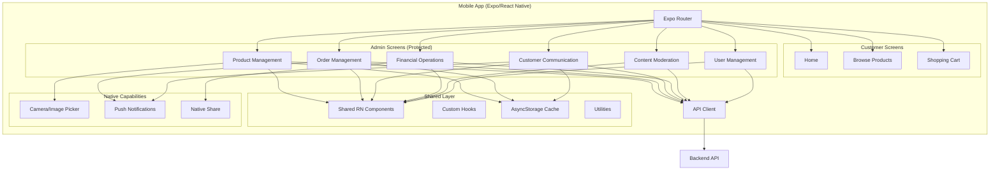

# Admin Dashboard Design Document

## Overview

The Admin Dashboard is a comprehensive mobile-native interface that enables the seller to manage all aspects of their e-commerce store from their mobile device. Built with React Native, TypeScript, and Expo, the dashboard is integrated into the existing mobile application and provides six core functional domains: Product Management, Order Management, Customer Communication, Financial Operations, Content Moderation, and User Management.

The design follows a modular architecture with clear separation of concerns, leveraging React Native's component model for UI, Expo Router for navigation, and AsyncStorage for local data persistence. The interface prioritizes mobile-first UX patterns, touch-optimized interactions, native capabilities (camera, push notifications), and offline functionality to enable the seller to operate their business effectively from anywhere.

### Key Design Principles

1. **Mobile-First**: All interfaces are designed for touch interaction with mobile-optimized layouts and gestures
2. **Modularity**: Each functional domain is implemented as an independent module with its own screens, components, state, and API interactions
3. **Reusability**: Common UI patterns (lists, forms, modals, bottom sheets) are abstracted into shared React Native components
4. **Type Safety**: Full TypeScript coverage ensures compile-time validation and improved developer experience
5. **Performance**: FlatList virtualization, image optimization, and optimistic updates ensure smooth 60fps interactions
6. **Offline-First**: Local caching with AsyncStorage enables viewing data and queuing actions when offline
7. **Native Integration**: Leverages device capabilities including camera, push notifications, and native sharing

## Architecture

### High-Level Architecture



### Technology Stack

**Core Framework**
- React Native 0.81.5
- Expo SDK ~54.0.0
- TypeScript 5.3.3

**Navigation**
- Expo Router ~6.0.23 (file-based routing)
- React Navigation (underlying)

**State Management**
- React Context API for global state
- Custom hooks for local state
- AsyncStorage for persistence

**UI Components**
- React Native core components (View, Text, ScrollView, FlatList, etc.)
- Styled Components for styling
- Custom component library extending existing mobile/components

**Native Capabilities**
- expo-image-picker for camera/photo access
- expo-notifications for push notifications
- expo-sharing for native share functionality
- @react-native-async-storage/async-storage for offline storage

**API Communication**
- Axios for HTTP requests
- WebSocket for real-time messaging
- Optimistic updates for better UX

**Testing**
- Jest for unit tests
- React Native Testing Library for component tests
- fast-check for property-based testing

### Application Structure

```
mobile/
├── app/
│   ├── (tabs)/                    # Customer-facing tabs
│   │   ├── home.tsx
│   │   ├── browse.tsx
│   │   └── cart.tsx
│   ├── (admin)/                   # Protected admin routes
│   │   ├── _layout.tsx            # Admin auth guard
│   │   ├── (tabs)/                # Admin bottom tabs
│   │   │   ├── products.tsx       # Products tab
│   │   │   ├── orders.tsx         # Orders tab
│   │   │   ├── messages.tsx       # Messages tab
│   │   │   └── finance.tsx        # Finance tab
│   │   ├── moderation/            # Stack screens
│   │   │   ├── index.tsx          # Moderation dashboard
│   │   │   ├── reports.tsx        # Customer reports
│   │   │   ├── reviews.tsx        # Product reviews
│   │   │   └── tickets.tsx        # Support tickets
│   │   ├── users/                 # Stack screens
│   │   │   ├── index.tsx          # User list
│   │   │   └── [id].tsx           # User details
│   │   ├── product/
│   │   │   ├── [id].tsx           # Product details/edit
│   │   │   └── new.tsx            # Add new product
│   │   ├── order/
│   │   │   └── [id].tsx           # Order details
│   │   └── message/
│   │       └── [threadId].tsx     # Message thread
│   ├── _layout.tsx                # Root layout
│   └── index.tsx                  # App entry
├── components/                    # Shared UI components
│   ├── admin/                     # Admin-specific components
│   │   ├── ProductListItem.tsx
│   │   ├── OrderCard.tsx
│   │   ├── MessageThreadItem.tsx
│   │   ├── StatCard.tsx
│   │   └── ActionButton.tsx
│   ├── common/                    # Basic components
│   │   ├── Button.tsx
│   │   ├── Input.tsx
│   │   ├── Card.tsx
│   │   └── Badge.tsx
│   ├── layout/                    # Layout components
│   │   ├── ScreenContainer.tsx
│   │   ├── Header.tsx
│   │   └── BottomSheet.tsx
│   └── forms/                     # Form components
│       ├── FormField.tsx
│       ├── ImagePicker.tsx
│       └── DatePicker.tsx
├── services/                      # API and business logic
│   ├── api/
│   │   ├── products.ts
│   │   ├── orders.ts
│   │   ├── messages.ts
│   │   ├── finance.ts
│   │   └── users.ts
│   ├── cache/
│   │   └── storage.ts             # AsyncStorage wrapper
│   ├── notifications/
│   │   └── pushNotifications.ts
│   └── sync/
│       └── offlineQueue.ts        # Offline action queue
├── hooks/                         # Custom React hooks
│   ├── useProducts.ts
│   ├── useOrders.ts
│   ├── useMessages.ts
│   ├── useOfflineSync.ts
│   └── usePushNotifications.ts
├── context/                       # React context providers
│   ├── AuthContext.tsx
│   ├── AdminContext.tsx
│   └── OfflineContext.tsx
├── types/                         # TypeScript type definitions
│   ├── admin.ts
│   ├── product.ts
│   ├── order.ts
│   └── message.ts
└── utils/                         # Utility functions
    ├── formatting.ts
    └── validation.ts
```

### Navigation Structure

The application uses Expo Router with protected admin routes and bottom tabs for primary navigation:

```
Root:
├── (tabs)/                        # Customer app
│   ├── home
│   ├── browse
│   └── cart
└── (admin)/                       # Admin dashboard (protected)
    ├── (tabs)/                    # Admin bottom tabs
    │   ├── products               → Product List (FlatList)
    │   ├── orders                 → Order List (FlatList)
    │   ├── messages               → Message Threads (FlatList)
    │   └── finance                → Financial Overview
    └── Stack Screens:
        ├── /product/new           → Add New Product
        ├── /product/[id]          → Edit Product
        ├── /order/[id]            → Order Details
        ├── /message/[threadId]    → Message Thread
        ├── /moderation            → Moderation Dashboard
        ├── /moderation/reports    → Customer Reports
        ├── /moderation/reviews    → Product Reviews
        ├── /moderation/tickets    → Support Tickets
        ├── /users                 → User List
        └── /users/[id]            → User Details
```

## Components and Interfaces

### Core Layout Components

#### AdminTabNavigator
Primary navigation using bottom tabs for main admin feature modules.

```typescript
// Location: app/(admin)/(tabs)/_layout.tsx
// Uses Expo Router (tabs) layout
// Features:
// - 4 primary tabs: Products, Orders, Messages, Finance
// - Badge indicators for unread messages and pending orders
// - Icon-based navigation with labels (Expo Vector Icons)
// - Active tab highlighting with theme colors
// - Tab bar hidden on detail screens
```

#### ScreenContainer
Wrapper component for consistent screen layout across all admin screens.

```typescript
// Location: components/layout/ScreenContainer.tsx
interface ScreenContainerProps {
  children: React.ReactNode;
  scrollable?: boolean;
  refreshControl?: RefreshControlProps;
  loading?: boolean;
}

// Features:
// - SafeAreaView integration for notch/status bar
// - Optional ScrollView or View
// - Pull-to-refresh support
// - Loading state with ActivityIndicator
// - Consistent padding and spacing from theme
// - Keyboard-aware scrolling
```

#### Header
Custom header component for stack screens with mobile-optimized actions.

```typescript
// Location: components/layout/Header.tsx
interface HeaderProps {
  title: string;
  showBack?: boolean;
  rightAction?: {
    icon: string;
    onPress: () => void;
    label?: string;
  };
}

// Features:
// - Back button navigation with Expo Router
// - Title display with truncation
// - Optional right action button (icon + optional label)
// - Status bar styling
// - Touch-optimized button sizes (44x44pt minimum)
```

### Data Display Components

#### ProductListItem
Mobile-optimized list item for product display in FlatList.

```typescript
// Location: components/admin/ProductListItem.tsx
interface ProductListItemProps {
  product: Product;
  onPress: () => void;
}

// Features:
// - Product image thumbnail (optimized for mobile)
// - Product name, price, stock level
// - Status badges (Featured, Discounted, Out of Stock)
// - Touch feedback with Pressable
// - Swipe actions for quick edit/delete
```

#### OrderCard
Card component for displaying order information.

```typescript
// Location: components/admin/OrderCard.tsx
interface OrderCardProps {
  order: Order;
  onPress: () => void;
}

// Features:
// - Order number, customer name, date
// - Total amount with currency formatting
// - Status badge with color coding
// - Touch feedback
// - Compact mobile layout
```

#### MessageThreadItem
List item for message threads with unread indicators.

```typescript
// Location: components/admin/MessageThreadItem.tsx
interface MessageThreadItemProps {
  thread: MessageThread;
  onPress: () => void;
}

// Features:
// - Customer name and avatar
// - Last message preview (truncated)
// - Timestamp with relative formatting
// - Unread badge indicator
// - Touch feedback
// - Swipe to mark as read
```

### Form Components

#### ImagePicker
Native image picker component for product photos.

```typescript
// Location: components/forms/ImagePicker.tsx
interface ImagePickerProps {
  images: string[];
  onImagesChange: (images: string[]) => void;
  maxImages?: number;
}

// Features:
// - Camera capture using expo-image-picker
// - Photo library selection
// - Multiple image support
// - Image preview grid
// - Remove image functionality
// - Image compression for upload
// - Permission handling
```

#### FormField
Reusable form input component with validation.

```typescript
// Location: components/forms/FormField.tsx
interface FormFieldProps {
  label: string;
  value: string;
  onChangeText: (text: string) => void;
  error?: string;
  multiline?: boolean;
  keyboardType?: KeyboardTypeOptions;
}

// Features:
// - Label and input field
// - Error message display
// - Validation state styling
// - Keyboard type configuration
// - Multiline support for descriptions
// - Touch-optimized input sizing
```

#### BottomSheet
Modal bottom sheet for actions and forms.

```typescript
// Location: components/layout/BottomSheet.tsx
interface BottomSheetProps {
  visible: boolean;
  onClose: () => void;
  children: React.ReactNode;
  title?: string;
}

// Features:
// - Slide-up animation
// - Backdrop with dismiss on tap
// - Drag-to-dismiss gesture
// - Safe area handling
// - Keyboard avoidance
```

## Data Models

### Product

```typescript
interface Product {
  id: string;
  name: string;
  description: string;
  price: number;
  images: string[];
  stock: number;
  category: string;
  featured: boolean;
  favorite: boolean;
  discounted: boolean;
  discountAmount?: number;
  discountPercentage?: number;
  status: 'active' | 'inactive' | 'out_of_stock';
  createdAt: Date;
  updatedAt: Date;
}
```

### Order

```typescript
interface Order {
  id: string;
  orderNumber: string;
  customerId: string;
  customerName: string;
  customerEmail: string;
  items: OrderItem[];
  totalAmount: number;
  status: 'pending' | 'accepted' | 'in_fulfillment' | 'shipped' | 'delivered';
  shippingAddress: Address;
  trackingNumber?: string;
  paymentStatus: 'pending' | 'completed' | 'failed' | 'refunded';
  createdAt: Date;
  updatedAt: Date;
}

interface OrderItem {
  productId: string;
  productName: string;
  quantity: number;
  price: number;
  packed: boolean;
}

interface Address {
  street: string;
  city: string;
  state: string;
  zipCode: string;
  country: string;
}
```

### Message

```typescript
interface MessageThread {
  id: string;
  customerId: string;
  customerName: string;
  lastMessage: string;
  lastMessageAt: Date;
  unreadCount: number;
  messages: Message[];
}

interface Message {
  id: string;
  threadId: string;
  senderId: string;
  senderType: 'customer' | 'seller';
  content: string;
  createdAt: Date;
  read: boolean;
}
```

### Financial

```typescript
interface RefundRequest {
  orderId: string;
  type: 'full' | 'partial';
  amount?: number;
  reason: string;
}

interface Transaction {
  id: string;
  orderId: string;
  amount: number;
  type: 'payment' | 'refund';
  paymentMethod: string;
  transactionId: string;
  processingFee: number;
  status: 'pending' | 'completed' | 'failed';
  createdAt: Date;
}

interface FinancialSummary {
  totalRevenue: number;
  pendingPayments: number;
  refundedAmount: number;
  period: 'day' | 'week' | 'month' | 'year';
}
```

### Moderation

```typescript
interface Report {
  id: string;
  type: 'product' | 'review' | 'user';
  reportedContentId: string;
  reportedContent: string;
  reporterId: string;
  reporterName: string;
  description: string;
  evidence?: string[];
  status: 'pending' | 'resolved' | 'dismissed';
  createdAt: Date;
}

interface Review {
  id: string;
  productId: string;
  productName: string;
  customerId: string;
  customerName: string;
  rating: number;
  content: string;
  flagged: boolean;
  sellerResponse?: string;
  createdAt: Date;
}

interface SupportTicket {
  id: string;
  customerId: string;
  customerName: string;
  subject: string;
  description: string;
  priority: 'low' | 'medium' | 'high';
  status: 'open' | 'in_progress' | 'resolved' | 'closed';
  createdAt: Date;
  updatedAt: Date;
}
```

### User Management

```typescript
interface UserAccount {
  id: string;
  name: string;
  email: string;
  registrationDate: Date;
  status: 'active' | 'suspended' | 'blocked';
  suspensionReason?: string;
  suspensionEndDate?: Date;
  totalOrders: number;
  totalSpending: number;
  lastActivity: Date;
}

interface AccountAction {
  id: string;
  userId: string;
  action: 'suspend' | 'block' | 'reactivate';
  reason: string;
  performedBy: string;
  performedAt: Date;
}
```

## Correctness Properties

*A property is a characteristic or behavior that should hold true across all valid executions of a system-essentially, a formal statement about what the system should do. Properties serve as the bridge between human-readable specifications and machine-verifiable correctness guarantees.*

### Property 1: Product List Consistency

*For any* product list displayed in the admin dashboard, the list should contain all products from the backend that match the current filter criteria, and each product should display accurate information including name, price, stock level, and status.

**Validates: Requirements 1.1, 1.8**

### Property 2: Product Image Upload

*For any* product image captured via camera or selected from photo library, the image should be successfully uploaded to the backend and associated with the correct product, and the product's image list should reflect the addition.

**Validates: Requirements 1.9**

### Property 3: Product Update Persistence

*For any* product update submitted through the admin dashboard, the changes should be persisted to the backend and immediately reflected in the product list view without requiring a manual refresh.

**Validates: Requirements 1.10**

### Property 4: Offline Product Caching

*For any* product data viewed while online, the data should be cached locally using AsyncStorage, and when the device goes offline, the cached data should remain accessible for viewing.

**Validates: Requirements 1.11**

### Property 5: Order Status Transition

*For any* order with "Pending" status, when the seller accepts the order, the status should transition to "Accepted", a push notification should be sent to the customer, and the order should no longer appear in the pending orders filter.

**Validates: Requirements 2.4, 2.5, 2.11**

### Property 6: Order Search Accuracy

*For any* search query entered in the order search bar, the results should include all orders where the order number, customer name, or date matches the query, and exclude all orders that don't match.

**Validates: Requirements 2.10**

### Property 7: Message Thread Ordering

*For any* list of message threads displayed in the admin dashboard, the threads should be ordered by the timestamp of the last message, with the most recent conversations appearing first.

**Validates: Requirements 3.1, 3.2**

### Property 8: Message Delivery

*For any* message sent by the seller through the admin dashboard, the message should be delivered to the customer, appear in the conversation view with the correct sender type, and trigger a push notification to the customer.

**Validates: Requirements 3.5**

### Property 9: Real-time Message Updates

*For any* message thread open in the admin dashboard, when a new message arrives from the customer, the message should appear in the conversation view without requiring a manual refresh, and the seller should receive a push notification if the app is in the background.

**Validates: Requirements 3.6, 3.12**

### Property 10: Refund Amount Validation

*For any* partial refund request, the refund amount entered by the seller should be less than or equal to the order's total amount, and the system should reject refund amounts that exceed the order total.

**Validates: Requirements 4.4**

### Property 11: Financial Report Export

*For any* financial report exported through the admin dashboard, the exported file should contain accurate transaction data for the selected time period, and the native share functionality should allow the seller to save or share the file.

**Validates: Requirements 4.8**

### Property 12: Review Response Visibility

*For any* review where the seller submits a public response, the response should be associated with the correct review, visible to customers viewing the product, and persistently stored in the backend.

**Validates: Requirements 5.6**

### Property 13: Report Status Update

*For any* customer report that the seller resolves, the report status should change from "Pending" to "Resolved", a push notification should be sent to the customer who submitted the report, and the report should no longer appear in the pending reports list.

**Validates: Requirements 5.10, 5.11**

### Property 14: Account Suspension Duration

*For any* user account suspended by the seller with a specified duration, the account should remain suspended until the suspension end date, and after the end date, the account should automatically return to "Active" status.

**Validates: Requirements 6.5, 6.6**

### Property 15: Account Action Audit Trail

*For any* account action performed by the seller (suspend, block, reactivate), the action should be recorded in the audit log with the correct timestamp, reason, and action type, and the audit log should be accessible for review.

**Validates: Requirements 6.10**

### Property 16: Offline Data Sync

*For any* action queued while the device is offline (product update, order status change, message send), when network connectivity is restored, the queued actions should be synchronized to the backend in the order they were performed, and the local cache should be updated with the server response.

**Validates: Requirements 1.12, 2.12, 3.11**

### Property 17: Push Notification Delivery

*For any* event that triggers a push notification (new order, new message, new report), the notification should be delivered to the seller's device with the correct title, body, and deep link to the relevant screen in the admin dashboard.

**Validates: Requirements 2.11, 3.6, 5.11**

### Property 18: Touch Target Sizing

*For any* interactive element in the admin dashboard (buttons, list items, form inputs), the touch target should be at least 44x44 points to ensure comfortable touch interaction on mobile devices.

**Validates: Mobile UX best practices**

### Property 19: FlatList Virtualization

*For any* list view in the admin dashboard (products, orders, messages), the list should use FlatList with proper virtualization to maintain 60fps scrolling performance even with hundreds of items.

**Validates: Performance requirements**

### Property 20: Image Optimization

*For any* product image uploaded through the admin dashboard, the image should be compressed to a reasonable file size (< 2MB) before upload to minimize bandwidth usage and storage costs while maintaining acceptable visual quality.

**Validates: Requirements 1.9, Performance requirements**

## Error Handling

### Network Errors

**Offline Detection**
- Monitor network connectivity using NetInfo
- Display offline indicator in UI
- Queue actions for later sync
- Show cached data with staleness indicator

**Request Failures**
- Retry failed requests with exponential backoff
- Display user-friendly error messages
- Provide manual retry option
- Log errors for debugging

**Timeout Handling**
- Set reasonable timeouts for API requests (30s)
- Show loading indicators during requests
- Allow user to cancel long-running operations

### Validation Errors

**Form Validation**
- Validate inputs before submission
- Display inline error messages
- Highlight invalid fields
- Prevent submission until valid

**Business Logic Errors**
- Handle backend validation errors
- Display specific error messages from API
- Guide user to correct the issue

### Permission Errors

**Camera/Photo Library**
- Request permissions before access
- Handle permission denial gracefully
- Show instructions to enable permissions in settings
- Provide alternative upload methods

**Push Notifications**
- Request notification permissions on first launch
- Handle permission denial
- Allow user to enable notifications later
- Degrade gracefully without notifications

### Data Errors

**Missing Data**
- Handle null/undefined values safely
- Display empty states with helpful messages
- Provide actions to populate data

**Corrupted Cache**
- Detect corrupted AsyncStorage data
- Clear corrupted cache
- Refetch from backend
- Log errors for investigation

## Testing Strategy

### Unit Testing

**Component Tests**
- Test individual React Native components in isolation
- Verify rendering with different props
- Test user interactions (press, swipe, input)
- Mock dependencies (API, navigation, storage)
- Use React Native Testing Library

**Hook Tests**
- Test custom hooks (useProducts, useOrders, etc.)
- Verify state updates
- Test side effects
- Mock API responses

**Service Tests**
- Test API client functions
- Test cache operations
- Test offline queue logic
- Mock network responses

### Property-Based Testing

**Configuration**
- Use fast-check library (already in package.json)
- Run minimum 100 iterations per property test
- Tag each test with feature name and property number
- Format: `Feature: admin-dashboard, Property {N}: {property_text}`

**Property Test Coverage**
- Implement property tests for all 20 correctness properties
- Generate random test data (products, orders, messages)
- Verify properties hold across all generated inputs
- Test edge cases (empty lists, large datasets, special characters)

**Example Property Test Structure**

```typescript
// Feature: admin-dashboard, Property 1: Product List Consistency
describe('Product List Consistency', () => {
  it('should display all products matching filter criteria', () => {
    fc.assert(
      fc.property(
        fc.array(productArbitrary),
        fc.constantFrom('all', 'featured', 'discounted'),
        (products, filter) => {
          const filtered = filterProducts(products, filter);
          const displayed = renderProductList(filtered);
          
          // Property: displayed list matches filtered products
          expect(displayed.length).toBe(filtered.length);
          filtered.forEach((product, index) => {
            expect(displayed[index].name).toBe(product.name);
            expect(displayed[index].price).toBe(product.price);
          });
        }
      ),
      { numRuns: 100 }
    );
  });
});
```

### Integration Testing

**Screen Tests**
- Test complete screen flows
- Verify navigation between screens
- Test data loading and display
- Test user interactions end-to-end

**Offline Sync Tests**
- Test offline action queuing
- Test sync on reconnection
- Test conflict resolution
- Test cache invalidation

### Manual Testing

**Device Testing**
- Test on iOS and Android devices
- Test on different screen sizes
- Test with slow network conditions
- Test with limited storage

**UX Testing**
- Verify touch targets are comfortable
- Test gesture interactions (swipe, long-press)
- Verify animations are smooth
- Test with real product data

**Accessibility Testing**
- Test with screen readers
- Verify color contrast
- Test keyboard navigation
- Verify focus management

### Performance Testing

**Metrics**
- Monitor FPS during scrolling (target: 60fps)
- Measure time to interactive (target: < 2s)
- Monitor memory usage
- Track bundle size

**Optimization**
- Profile with React Native Performance Monitor
- Optimize FlatList rendering
- Lazy load images
- Minimize re-renders

## Deployment Considerations

### Build Configuration

**Expo Build**
- Configure app.json for admin features
- Set up push notification credentials
- Configure deep linking for notifications
- Set up app icons and splash screens

**Environment Variables**
- API endpoint URLs
- Feature flags for admin access
- Analytics keys
- Error tracking configuration

### App Store Requirements

**iOS**
- Request camera permission in Info.plist
- Request photo library permission
- Request notification permission
- Provide permission usage descriptions

**Android**
- Request camera permission in AndroidManifest.xml
- Request storage permission
- Request notification permission
- Configure notification channels

### Security

**Authentication**
- Implement admin role verification
- Protect admin routes with auth guard
- Store auth tokens securely
- Implement token refresh

**Data Protection**
- Encrypt sensitive data in AsyncStorage
- Use HTTPS for all API requests
- Validate all user inputs
- Sanitize data before display

### Monitoring

**Error Tracking**
- Integrate error tracking service (Sentry)
- Log critical errors
- Track crash rates
- Monitor API failures

**Analytics**
- Track admin feature usage
- Monitor performance metrics
- Track user flows
- Identify bottlenecks

### Updates

**Over-the-Air Updates**
- Use Expo Updates for quick fixes
- Test updates before publishing
- Monitor update adoption
- Rollback capability for issues

**App Store Updates**
- Plan for major version updates
- Maintain backward compatibility
- Communicate changes to users
- Test thoroughly before release
