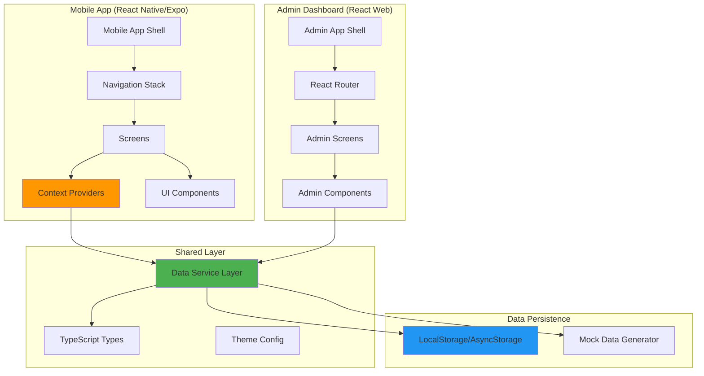
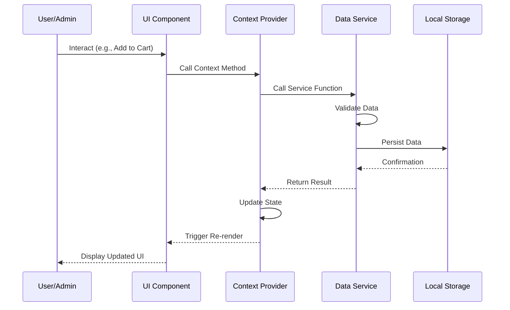
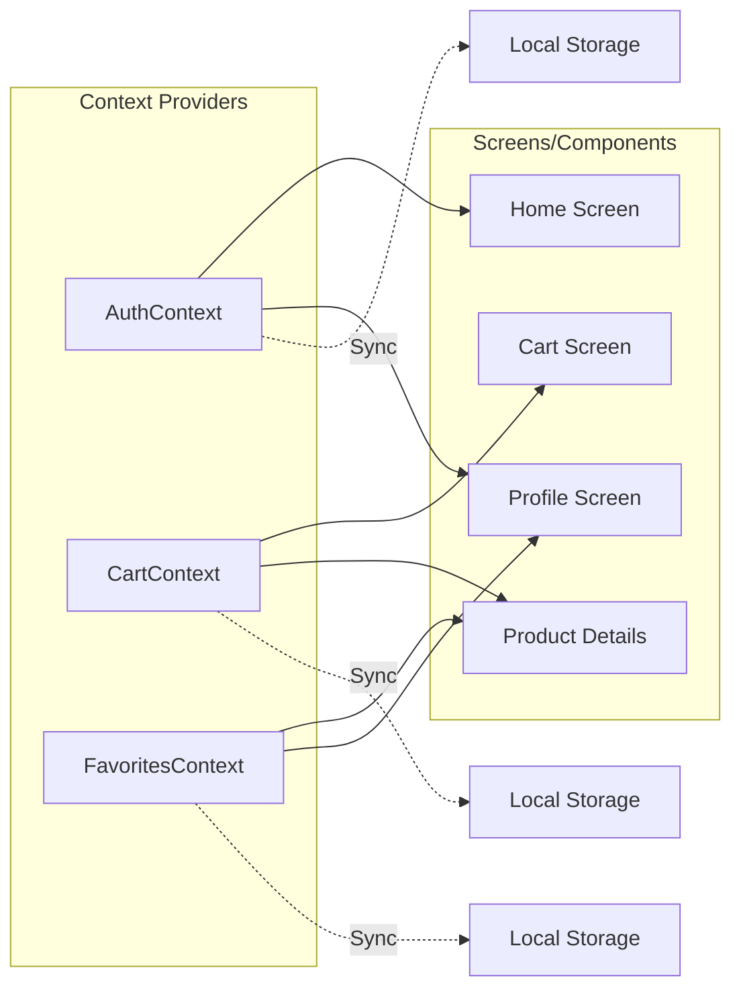
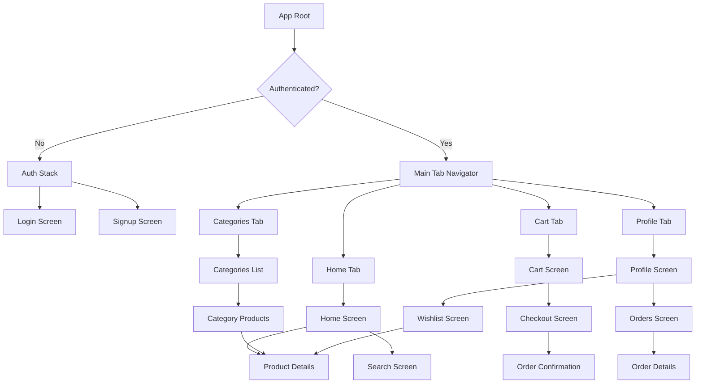
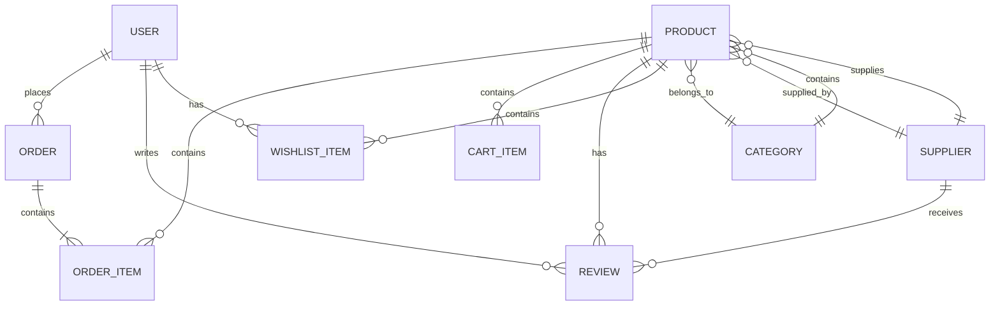
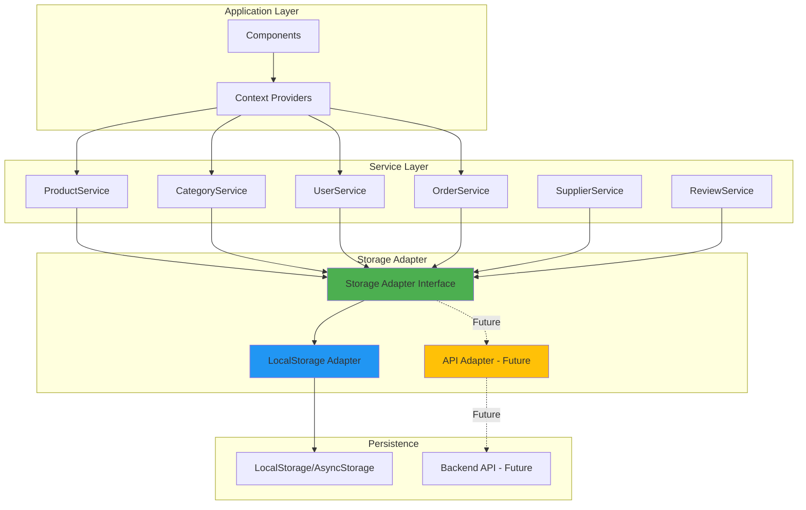

# Design Document: AfroChinaTrade E-Commerce Platform

## Overview

AfroChinaTrade is a frontend-first e-commerce platform consisting of two main applications:

1. **Mobile App** (React Native/Expo): Customer-facing application for browsing products, managing cart, placing orders, and tracking purchases
2. **Admin Dashboard** (React Web): Administrative interface for managing products, categories, orders, users, and suppliers

The platform uses a **backend-agnostic architecture** with a centralized Data Service Layer that abstracts all data operations. Initially, data persists to local storage (AsyncStorage for mobile, localStorage for web), but the service layer is designed to seamlessly swap to REST API calls in the future without changing application code.

### Key Design Principles

- **Frontend-First Architecture**: Full functionality without backend dependency
- **Backend Agnostic**: Service layer designed for easy API integration
- **Type Safety**: Comprehensive TypeScript interfaces throughout
- **State Management**: React Context API for global state
- **Component Reusability**: Shared component library for consistency
- **Offline-First**: Local storage enables offline browsing and cart management

## Architecture

### High-Level Component Diagram



### Data Flow Architecture



### State Management Architecture

The platform uses React Context API for global state management with three primary contexts:

1. **AuthContext**: Manages user/admin authentication state
2. **CartContext**: Manages shopping cart state (mobile app only)
3. **FavoritesContext**: Manages wishlist state (mobile app only)




### Mobile App Navigation Structure



## Components and Interfaces

### Mobile App Screen Hierarchy


#### 1. Home Screen
- **Purpose**: Display featured products and provide quick access to search
- **Components**: Header, SearchBar, ProductGrid, ProductCard
- **State**: Featured products list, loading state
- **Context**: AuthContext (user info), FavoritesContext (wishlist status)
- **Navigation**: Navigate to ProductDetails, Search, Categories

#### 2. Product Details Screen
- **Purpose**: Display comprehensive product information
- **Components**: ImageCarousel, ProductInfo, RatingDisplay, AddToCartButton, AddToFavoritesButton, ReviewsList
- **State**: Product data, selected quantity, reviews
- **Context**: CartContext (add to cart), FavoritesContext (toggle favorite)
- **Navigation**: Navigate back, navigate to SupplierProfile

#### 3. Search Screen
- **Purpose**: Search and filter products
- **Components**: SearchBar, FilterPanel, ProductGrid, ProductCard
- **State**: Search query, active filters, search results
- **Context**: None (local state only)
- **Navigation**: Navigate to ProductDetails

#### 4. Categories Screen
- **Purpose**: Browse products by category
- **Components**: CategoryCard, CategoryGrid
- **State**: Categories list
- **Context**: None
- **Navigation**: Navigate to CategoryProducts

#### 5. Category Products Screen
- **Purpose**: Display all products in a category
- **Components**: Header, ProductGrid, ProductCard
- **State**: Category data, products list
- **Context**: FavoritesContext
- **Navigation**: Navigate to ProductDetails, navigate back

#### 6. Cart Screen
- **Purpose**: Review and manage cart items
- **Components**: CartItemCard, CartSummary, CheckoutButton
- **State**: None (uses CartContext)
- **Context**: CartContext (cart items, update quantity, remove item)
- **Navigation**: Navigate to Checkout, navigate to ProductDetails

#### 7. Checkout Screen
- **Purpose**: Collect delivery information and confirm order
- **Components**: OrderSummary, DeliveryForm, PlaceOrderButton
- **State**: Delivery information, form validation errors
- **Context**: CartContext (cart items), AuthContext (user info)
- **Navigation**: Navigate to OrderConfirmation

#### 8. Order Confirmation Screen
- **Purpose**: Display order success message
- **Components**: SuccessIcon, OrderSummary, ViewOrderButton
- **State**: Order data
- **Context**: None
- **Navigation**: Navigate to OrderDetails, navigate to Home

#### 9. Profile Screen
- **Purpose**: Display user information and access account features
- **Components**: UserInfo, MenuList, LogoutButton
- **State**: None (uses AuthContext)
- **Context**: AuthContext (user data, logout)
- **Navigation**: Navigate to Orders, Wishlist, Settings

#### 10. Orders Screen
- **Purpose**: Display order history
- **Components**: OrderCard, OrderList
- **State**: Orders list, loading state
- **Context**: AuthContext (user ID)
- **Navigation**: Navigate to OrderDetails

#### 11. Order Details Screen
- **Purpose**: Display detailed order information
- **Components**: OrderHeader, OrderItemsList, OrderStatus, DeliveryInfo
- **State**: Order data
- **Context**: None
- **Navigation**: Navigate back

#### 12. Wishlist Screen
- **Purpose**: Display saved favorite products
- **Components**: ProductGrid, ProductCard, EmptyState
- **State**: None (uses FavoritesContext)
- **Context**: FavoritesContext (wishlist items)
- **Navigation**: Navigate to ProductDetails


### Admin Dashboard Screen Hierarchy

#### 1. Dashboard Screen
- **Purpose**: Display key platform metrics and statistics
- **Components**: StatCard, RecentOrdersList, QuickActions
- **State**: Analytics data (total products, orders, users, revenue)
- **Data**: Aggregated from Data Service
- **Navigation**: Quick links to Products, Orders, Users

#### 2. Products List Screen
- **Purpose**: Display and manage all products
- **Components**: DataTable, SearchBar, FilterDropdown, ActionButtons
- **State**: Products list, search query, filters, pagination
- **Data**: Products from Data Service
- **Navigation**: Navigate to CreateProduct, EditProduct

#### 3. Create/Edit Product Screen
- **Purpose**: Form for creating or editing products
- **Components**: ProductForm, ImageUploader, CategorySelector, SupplierSelector
- **State**: Form data, validation errors, loading state
- **Data**: Categories and Suppliers from Data Service
- **Navigation**: Navigate back to Products List

#### 4. Categories List Screen
- **Purpose**: Display and manage categories
- **Components**: DataTable, CreateCategoryButton, ActionButtons
- **State**: Categories list, product counts per category
- **Data**: Categories from Data Service
- **Navigation**: Navigate to CreateCategory, EditCategory

#### 5. Create/Edit Category Screen
- **Purpose**: Form for creating or editing categories
- **Components**: CategoryForm
- **State**: Form data, validation errors
- **Data**: None
- **Navigation**: Navigate back to Categories List

#### 6. Orders List Screen
- **Purpose**: Display and manage all orders
- **Components**: DataTable, StatusFilter, DateRangePicker, OrderStatusBadge
- **State**: Orders list, filters, pagination
- **Data**: Orders from Data Service
- **Navigation**: Navigate to OrderDetails

#### 7. Order Details Screen
- **Purpose**: View and update order information
- **Components**: OrderInfo, CustomerInfo, OrderItemsTable, StatusUpdateDropdown
- **State**: Order data, status update loading
- **Data**: Order from Data Service
- **Navigation**: Navigate back to Orders List

#### 8. Users List Screen
- **Purpose**: Display and manage users
- **Components**: DataTable, SearchBar, UserStatusBadge, ActionButtons
- **State**: Users list, search query, pagination
- **Data**: Users from Data Service
- **Navigation**: Navigate to UserDetails

#### 9. User Details Screen
- **Purpose**: View user information and manage account status
- **Components**: UserInfo, OrderHistory, BlockUserButton, UnblockUserButton
- **State**: User data, user orders
- **Data**: User and Orders from Data Service
- **Navigation**: Navigate back to Users List

#### 10. Suppliers List Screen
- **Purpose**: Display and manage suppliers
- **Components**: DataTable, VerificationBadge, RatingDisplay, ActionButtons
- **State**: Suppliers list, pagination
- **Data**: Suppliers from Data Service
- **Navigation**: Navigate to CreateSupplier, EditSupplier

#### 11. Create/Edit Supplier Screen
- **Purpose**: Form for creating or editing suppliers
- **Components**: SupplierForm, VerificationToggle
- **State**: Form data, validation errors
- **Data**: None
- **Navigation**: Navigate back to Suppliers List


### Reusable Component Library

#### Mobile App Components

**ProductCard**
- Props: product (Product), onPress, showFavoriteButton
- Displays: Product image, name, price, rating, supplier name
- Actions: Navigate to product details, toggle favorite

**Button**
- Props: title, onPress, variant (primary/secondary/outline), disabled, loading
- Variants: Primary (brand color), Secondary (gray), Outline (border only)

**Input**
- Props: value, onChangeText, placeholder, secureTextEntry, error, label
- Features: Error message display, label, validation state styling

**SearchBar**
- Props: value, onChangeText, placeholder, onSubmit
- Features: Search icon, clear button, debounced input

**RatingDisplay**
- Props: rating (number), reviewCount, size
- Displays: Star icons (filled/half/empty), review count text

**CartItemCard**
- Props: cartItem (CartItem), onUpdateQuantity, onRemove
- Displays: Product image, name, price, quantity selector, remove button

**CategoryCard**
- Props: category (Category), onPress
- Displays: Category name, product count, icon/image

**OrderCard**
- Props: order (Order), onPress
- Displays: Order ID, date, status badge, total price, item count

#### Admin Dashboard Components

**DataTable**
- Props: columns, data, onRowClick, pagination, loading
- Features: Sortable columns, pagination controls, loading state, empty state

**StatCard**
- Props: title, value, icon, trend (optional)
- Displays: Metric title, large value, icon, optional trend indicator

**Modal**
- Props: isOpen, onClose, title, children, actions
- Features: Overlay, close button, header, footer with action buttons

**Form**
- Props: fields, onSubmit, initialValues, validationSchema
- Features: Field rendering, validation, error display, submit handling

**ActionButton**
- Props: icon, label, onClick, variant (edit/delete/view)
- Variants: Edit (blue), Delete (red), View (gray)

**StatusBadge**
- Props: status, variant
- Variants: Success (green), Warning (yellow), Error (red), Info (blue)

**ConfirmDialog**
- Props: isOpen, onConfirm, onCancel, title, message, confirmText, cancelText
- Features: Warning icon, action buttons, overlay


## Data Models

### TypeScript Interfaces

```typescript
// Core Entities

interface Product {
  id: string;
  name: string;
  description: string;
  price: number;
  images: string[];
  categoryId: string;
  supplierId: string;
  rating: number;
  reviewCount: number;
  stock: number;
  createdAt: string;
  updatedAt: string;
}

interface Category {
  id: string;
  name: string;
  description: string;
  imageUrl?: string;
  createdAt: string;
  updatedAt: string;
}

interface User {
  id: string;
  name: string;
  email: string;
  password: string; // Hashed in production
  phone?: string;
  address?: string;
  status: 'active' | 'blocked';
  createdAt: string;
  updatedAt: string;
}

interface Admin {
  id: string;
  name: string;
  email: string;
  password: string; // Hashed in production
  role: 'admin' | 'super_admin';
  createdAt: string;
}

interface Supplier {
  id: string;
  name: string;
  email: string;
  phone: string;
  address: string;
  verified: boolean;
  rating: number;
  reviewCount: number;
  createdAt: string;
  updatedAt: string;
}

interface Order {
  id: string;
  userId: string;
  items: OrderItem[];
  totalAmount: number;
  status: 'pending' | 'processing' | 'shipped' | 'delivered' | 'cancelled';
  deliveryAddress: DeliveryAddress;
  createdAt: string;
  updatedAt: string;
}

interface OrderItem {
  productId: string;
  productName: string;
  productImage: string;
  quantity: number;
  price: number;
  subtotal: number;
}

interface DeliveryAddress {
  fullName: string;
  phone: string;
  address: string;
  city: string;
  state: string;
  zipCode: string;
}

interface CartItem {
  productId: string;
  product: Product;
  quantity: number;
}

interface Review {
  id: string;
  productId: string;
  userId: string;
  userName: string;
  rating: number;
  comment: string;
  createdAt: string;
}

interface WishlistItem {
  productId: string;
  addedAt: string;
}

// Context State Types

interface AuthState {
  user: User | null;
  admin: Admin | null;
  isAuthenticated: boolean;
  isLoading: boolean;
}

interface CartState {
  items: CartItem[];
  totalItems: number;
  totalAmount: number;
}

interface FavoritesState {
  productIds: string[];
}

// Service Response Types

interface ServiceResponse<T> {
  success: boolean;
  data?: T;
  error?: string;
}

interface PaginatedResponse<T> {
  data: T[];
  total: number;
  page: number;
  pageSize: number;
  totalPages: number;
}

// Filter and Search Types

interface ProductFilters {
  categoryId?: string;
  supplierId?: string;
  minPrice?: number;
  maxPrice?: number;
  searchQuery?: string;
}

interface OrderFilters {
  status?: Order['status'];
  startDate?: string;
  endDate?: string;
  userId?: string;
}

// Analytics Types

interface DashboardStats {
  totalProducts: number;
  totalOrders: number;
  totalUsers: number;
  totalRevenue: number;
  recentOrders: Order[];
}
```

### Data Relationships



### Data Validation Rules

**Product Validation**
- name: Required, 3-200 characters
- description: Required, 10-2000 characters
- price: Required, positive number, max 2 decimal places
- images: Required, at least 1 image URL
- categoryId: Required, must exist in categories
- supplierId: Required, must exist in suppliers
- stock: Required, non-negative integer

**Category Validation**
- name: Required, 2-100 characters, unique
- description: Required, 10-500 characters

**User Validation**
- name: Required, 2-100 characters
- email: Required, valid email format, unique
- password: Required, minimum 8 characters
- phone: Optional, valid phone format
- status: Required, enum value

**Order Validation**
- userId: Required, must exist
- items: Required, at least 1 item
- totalAmount: Required, positive number
- status: Required, enum value
- deliveryAddress: Required, all fields must be present

**Supplier Validation**
- name: Required, 2-200 characters
- email: Required, valid email format, unique
- phone: Required, valid phone format
- address: Required, 10-500 characters
- verified: Required, boolean


## Data Service Layer Design

### Service Architecture

The Data Service Layer provides a unified interface for all data operations, abstracting the underlying storage mechanism. This design enables seamless transition from local storage to REST API without changing application code.



### Storage Adapter Interface

The Storage Adapter provides a consistent interface that can be implemented by different storage backends:

```typescript
interface StorageAdapter {
  // Generic CRUD operations
  get<T>(key: string): Promise<T | null>;
  set<T>(key: string, value: T): Promise<void>;
  remove(key: string): Promise<void>;
  clear(): Promise<void>;
  getAllKeys(): Promise<string[]>;
  
  // Batch operations
  multiGet<T>(keys: string[]): Promise<Record<string, T>>;
  multiSet(items: Record<string, any>): Promise<void>;
}

// LocalStorage implementation
class LocalStorageAdapter implements StorageAdapter {
  async get<T>(key: string): Promise<T | null> {
    const item = localStorage.getItem(key);
    return item ? JSON.parse(item) : null;
  }
  
  async set<T>(key: string, value: T): Promise<void> {
    localStorage.setItem(key, JSON.stringify(value));
  }
  
  async remove(key: string): Promise<void> {
    localStorage.removeItem(key);
  }
  
  async clear(): Promise<void> {
    localStorage.clear();
  }
  
  async getAllKeys(): Promise<string[]> {
    return Object.keys(localStorage);
  }
  
  async multiGet<T>(keys: string[]): Promise<Record<string, T>> {
    const result: Record<string, T> = {};
    keys.forEach(key => {
      const item = localStorage.getItem(key);
      if (item) result[key] = JSON.parse(item);
    });
    return result;
  }
  
  async multiSet(items: Record<string, any>): Promise<void> {
    Object.entries(items).forEach(([key, value]) => {
      localStorage.setItem(key, JSON.stringify(value));
    });
  }
}

// Future API implementation
class APIAdapter implements StorageAdapter {
  private baseUrl: string;
  
  constructor(baseUrl: string) {
    this.baseUrl = baseUrl;
  }
  
  async get<T>(key: string): Promise<T | null> {
    const response = await fetch(`${this.baseUrl}/${key}`);
    return response.ok ? response.json() : null;
  }
  
  // ... other methods call REST endpoints
}
```


### Service Function Signatures

#### ProductService

```typescript
class ProductService {
  private storage: StorageAdapter;
  private PRODUCTS_KEY = 'products';
  
  // Create
  async createProduct(product: Omit<Product, 'id' | 'createdAt' | 'updatedAt'>): Promise<ServiceResponse<Product>>;
  
  // Read
  async getProduct(id: string): Promise<ServiceResponse<Product>>;
  async getAllProducts(): Promise<ServiceResponse<Product[]>>;
  async getProductsByCategory(categoryId: string): Promise<ServiceResponse<Product[]>>;
  async getProductsBySupplier(supplierId: string): Promise<ServiceResponse<Product[]>>;
  async searchProducts(query: string, filters?: ProductFilters): Promise<ServiceResponse<Product[]>>;
  async getFeaturedProducts(limit?: number): Promise<ServiceResponse<Product[]>>;
  
  // Update
  async updateProduct(id: string, updates: Partial<Product>): Promise<ServiceResponse<Product>>;
  async updateProductStock(id: string, quantity: number): Promise<ServiceResponse<Product>>;
  
  // Delete
  async deleteProduct(id: string): Promise<ServiceResponse<void>>;
  
  // Utility
  async getProductCount(): Promise<number>;
  async validateProduct(product: Partial<Product>): Promise<{ valid: boolean; errors: string[] }>;
}
```

#### CategoryService

```typescript
class CategoryService {
  private storage: StorageAdapter;
  private CATEGORIES_KEY = 'categories';
  
  // Create
  async createCategory(category: Omit<Category, 'id' | 'createdAt' | 'updatedAt'>): Promise<ServiceResponse<Category>>;
  
  // Read
  async getCategory(id: string): Promise<ServiceResponse<Category>>;
  async getAllCategories(): Promise<ServiceResponse<Category[]>>;
  async getCategoryWithProductCount(id: string): Promise<ServiceResponse<Category & { productCount: number }>>;
  
  // Update
  async updateCategory(id: string, updates: Partial<Category>): Promise<ServiceResponse<Category>>;
  
  // Delete
  async deleteCategory(id: string): Promise<ServiceResponse<void>>;
  
  // Utility
  async getCategoryCount(): Promise<number>;
  async validateCategory(category: Partial<Category>): Promise<{ valid: boolean; errors: string[] }>;
}
```

#### UserService

```typescript
class UserService {
  private storage: StorageAdapter;
  private USERS_KEY = 'users';
  
  // Create
  async createUser(user: Omit<User, 'id' | 'createdAt' | 'updatedAt'>): Promise<ServiceResponse<User>>;
  async registerUser(email: string, password: string, name: string): Promise<ServiceResponse<User>>;
  
  // Read
  async getUser(id: string): Promise<ServiceResponse<User>>;
  async getAllUsers(): Promise<ServiceResponse<User[]>>;
  async getUserByEmail(email: string): Promise<ServiceResponse<User>>;
  async searchUsers(query: string): Promise<ServiceResponse<User[]>>;
  
  // Update
  async updateUser(id: string, updates: Partial<User>): Promise<ServiceResponse<User>>;
  async updateUserStatus(id: string, status: User['status']): Promise<ServiceResponse<User>>;
  
  // Delete
  async deleteUser(id: string): Promise<ServiceResponse<void>>;
  
  // Authentication
  async login(email: string, password: string): Promise<ServiceResponse<User>>;
  async logout(): Promise<ServiceResponse<void>>;
  
  // Utility
  async getUserCount(): Promise<number>;
  async validateUser(user: Partial<User>): Promise<{ valid: boolean; errors: string[] }>;
  async validateEmail(email: string): boolean;
}
```

#### OrderService

```typescript
class OrderService {
  private storage: StorageAdapter;
  private ORDERS_KEY = 'orders';
  
  // Create
  async createOrder(order: Omit<Order, 'id' | 'createdAt' | 'updatedAt'>): Promise<ServiceResponse<Order>>;
  async placeOrder(userId: string, items: CartItem[], deliveryAddress: DeliveryAddress): Promise<ServiceResponse<Order>>;
  
  // Read
  async getOrder(id: string): Promise<ServiceResponse<Order>>;
  async getAllOrders(): Promise<ServiceResponse<Order[]>>;
  async getOrdersByUser(userId: string): Promise<ServiceResponse<Order[]>>;
  async getOrdersByStatus(status: Order['status']): Promise<ServiceResponse<Order[]>>;
  async filterOrders(filters: OrderFilters): Promise<ServiceResponse<Order[]>>;
  
  // Update
  async updateOrder(id: string, updates: Partial<Order>): Promise<ServiceResponse<Order>>;
  async updateOrderStatus(id: string, status: Order['status']): Promise<ServiceResponse<Order>>;
  
  // Delete
  async deleteOrder(id: string): Promise<ServiceResponse<void>>;
  
  // Utility
  async getOrderCount(): Promise<number>;
  async getTotalRevenue(): Promise<number>;
  async getRecentOrders(limit: number): Promise<ServiceResponse<Order[]>>;
  async validateOrder(order: Partial<Order>): Promise<{ valid: boolean; errors: string[] }>;
}
```

#### SupplierService

```typescript
class SupplierService {
  private storage: StorageAdapter;
  private SUPPLIERS_KEY = 'suppliers';
  
  // Create
  async createSupplier(supplier: Omit<Supplier, 'id' | 'createdAt' | 'updatedAt'>): Promise<ServiceResponse<Supplier>>;
  
  // Read
  async getSupplier(id: string): Promise<ServiceResponse<Supplier>>;
  async getAllSuppliers(): Promise<ServiceResponse<Supplier[]>>;
  async getVerifiedSuppliers(): Promise<ServiceResponse<Supplier[]>>;
  
  // Update
  async updateSupplier(id: string, updates: Partial<Supplier>): Promise<ServiceResponse<Supplier>>;
  async updateSupplierVerification(id: string, verified: boolean): Promise<ServiceResponse<Supplier>>;
  async updateSupplierRating(id: string): Promise<ServiceResponse<Supplier>>;
  
  // Delete
  async deleteSupplier(id: string): Promise<ServiceResponse<void>>;
  
  // Utility
  async getSupplierCount(): Promise<number>;
  async validateSupplier(supplier: Partial<Supplier>): Promise<{ valid: boolean; errors: string[] }>;
}
```

#### ReviewService

```typescript
class ReviewService {
  private storage: StorageAdapter;
  private REVIEWS_KEY = 'reviews';
  
  // Create
  async createReview(review: Omit<Review, 'id' | 'createdAt'>): Promise<ServiceResponse<Review>>;
  
  // Read
  async getReview(id: string): Promise<ServiceResponse<Review>>;
  async getReviewsByProduct(productId: string): Promise<ServiceResponse<Review[]>>;
  async getReviewsByUser(userId: string): Promise<ServiceResponse<Review[]>>;
  
  // Update
  async updateReview(id: string, updates: Partial<Review>): Promise<ServiceResponse<Review>>;
  
  // Delete
  async deleteReview(id: string): Promise<ServiceResponse<void>>;
  
  // Utility
  async calculateProductRating(productId: string): Promise<number>;
  async calculateSupplierRating(supplierId: string): Promise<number>;
}
```

#### AnalyticsService

```typescript
class AnalyticsService {
  private productService: ProductService;
  private orderService: OrderService;
  private userService: UserService;
  
  async getDashboardStats(): Promise<ServiceResponse<DashboardStats>>;
  async getRevenueByPeriod(startDate: string, endDate: string): Promise<number>;
  async getTopProducts(limit: number): Promise<ServiceResponse<Product[]>>;
  async getTopSuppliers(limit: number): Promise<ServiceResponse<Supplier[]>>;
}
```


### LocalStorage Implementation Strategy

#### Storage Keys Structure

```typescript
const STORAGE_KEYS = {
  PRODUCTS: 'afrochinatrade:products',
  CATEGORIES: 'afrochinatrade:categories',
  USERS: 'afrochinatrade:users',
  ADMINS: 'afrochinatrade:admins',
  ORDERS: 'afrochinatrade:orders',
  SUPPLIERS: 'afrochinatrade:suppliers',
  REVIEWS: 'afrochinatrade:reviews',
  CART: 'afrochinatrade:cart',
  WISHLIST: 'afrochinatrade:wishlist',
  AUTH: 'afrochinatrade:auth',
  INITIALIZED: 'afrochinatrade:initialized'
};
```

#### Data Serialization and Parsing

```typescript
class DataSerializer {
  // Serialize data to JSON string
  static serialize<T>(data: T): string {
    try {
      return JSON.stringify(data, null, 2);
    } catch (error) {
      throw new Error(`Serialization failed: ${error.message}`);
    }
  }
  
  // Parse JSON string to typed object
  static parse<T>(jsonString: string): T {
    try {
      return JSON.parse(jsonString);
    } catch (error) {
      throw new Error(`Parsing failed: ${error.message}`);
    }
  }
  
  // Pretty print for debugging
  static prettyPrint<T>(data: T): string {
    return JSON.stringify(data, null, 2);
  }
  
  // Validate JSON structure
  static isValidJSON(jsonString: string): boolean {
    try {
      JSON.parse(jsonString);
      return true;
    } catch {
      return false;
    }
  }
}
```

#### ID Generation

```typescript
class IDGenerator {
  // Generate unique ID using timestamp and random string
  static generate(prefix?: string): string {
    const timestamp = Date.now().toString(36);
    const randomStr = Math.random().toString(36).substring(2, 9);
    return prefix ? `${prefix}_${timestamp}_${randomStr}` : `${timestamp}_${randomStr}`;
  }
  
  // Generate product ID
  static generateProductId(): string {
    return this.generate('prod');
  }
  
  // Generate order ID
  static generateOrderId(): string {
    return this.generate('ord');
  }
  
  // Generate user ID
  static generateUserId(): string {
    return this.generate('usr');
  }
  
  // Generate category ID
  static generateCategoryId(): string {
    return this.generate('cat');
  }
  
  // Generate supplier ID
  static generateSupplierId(): string {
    return this.generate('sup');
  }
  
  // Generate review ID
  static generateReviewId(): string {
    return this.generate('rev');
  }
}
```

#### Error Handling Patterns

```typescript
class ServiceError extends Error {
  constructor(
    message: string,
    public code: string,
    public statusCode: number = 500
  ) {
    super(message);
    this.name = 'ServiceError';
  }
}

// Error codes
const ERROR_CODES = {
  NOT_FOUND: 'NOT_FOUND',
  VALIDATION_ERROR: 'VALIDATION_ERROR',
  DUPLICATE_ENTRY: 'DUPLICATE_ENTRY',
  STORAGE_FULL: 'STORAGE_FULL',
  PARSE_ERROR: 'PARSE_ERROR',
  UNAUTHORIZED: 'UNAUTHORIZED',
  FORBIDDEN: 'FORBIDDEN'
};

// Error handling wrapper
async function handleServiceOperation<T>(
  operation: () => Promise<T>
): Promise<ServiceResponse<T>> {
  try {
    const data = await operation();
    return { success: true, data };
  } catch (error) {
    if (error instanceof ServiceError) {
      return { success: false, error: error.message };
    }
    return { success: false, error: 'An unexpected error occurred' };
  }
}

// Storage quota check
function checkStorageQuota(): void {
  if (typeof navigator !== 'undefined' && navigator.storage && navigator.storage.estimate) {
    navigator.storage.estimate().then(estimate => {
      const percentUsed = (estimate.usage / estimate.quota) * 100;
      if (percentUsed > 90) {
        console.warn('Storage quota nearly full:', percentUsed.toFixed(2) + '%');
      }
    });
  }
}
```


### Mock Data Generation Strategy

```typescript
class MockDataGenerator {
  // Generate mock products
  static generateProducts(count: number, categories: Category[], suppliers: Supplier[]): Product[] {
    const products: Product[] = [];
    const productNames = [
      'Wireless Bluetooth Headphones', 'Smart Watch Pro', 'USB-C Cable 2m',
      'Portable Power Bank 20000mAh', 'LED Desk Lamp', 'Mechanical Keyboard',
      'Gaming Mouse RGB', 'Phone Case Premium', 'Screen Protector Glass',
      'Laptop Stand Aluminum', 'Webcam HD 1080p', 'Microphone USB',
      // ... more product names
    ];
    
    for (let i = 0; i < count; i++) {
      const category = categories[Math.floor(Math.random() * categories.length)];
      const supplier = suppliers[Math.floor(Math.random() * suppliers.length)];
      
      products.push({
        id: IDGenerator.generateProductId(),
        name: productNames[i % productNames.length] + ` ${i + 1}`,
        description: `High-quality ${productNames[i % productNames.length].toLowerCase()} with excellent features and durability. Perfect for daily use.`,
        price: Math.floor(Math.random() * 50000) + 1000, // 1000-51000
        images: [
          `https://picsum.photos/seed/${i}/400/400`,
          `https://picsum.photos/seed/${i + 1000}/400/400`
        ],
        categoryId: category.id,
        supplierId: supplier.id,
        rating: Math.floor(Math.random() * 20 + 30) / 10, // 3.0-5.0
        reviewCount: Math.floor(Math.random() * 200),
        stock: Math.floor(Math.random() * 100) + 10,
        createdAt: new Date(Date.now() - Math.random() * 90 * 24 * 60 * 60 * 1000).toISOString(),
        updatedAt: new Date().toISOString()
      });
    }
    
    return products;
  }
  
  // Generate mock categories
  static generateCategories(): Category[] {
    const categoryData = [
      { name: 'Electronics', description: 'Electronic devices and accessories' },
      { name: 'Fashion', description: 'Clothing, shoes, and accessories' },
      { name: 'Home & Garden', description: 'Home improvement and garden supplies' },
      { name: 'Sports & Outdoors', description: 'Sports equipment and outdoor gear' },
      { name: 'Beauty & Health', description: 'Beauty products and health items' },
      { name: 'Toys & Games', description: 'Toys, games, and entertainment' },
      { name: 'Books & Media', description: 'Books, movies, and music' },
      { name: 'Automotive', description: 'Car parts and accessories' },
      { name: 'Office Supplies', description: 'Office equipment and stationery' },
      { name: 'Food & Beverages', description: 'Food items and drinks' }
    ];
    
    return categoryData.map((cat, index) => ({
      id: IDGenerator.generateCategoryId(),
      name: cat.name,
      description: cat.description,
      imageUrl: `https://picsum.photos/seed/cat${index}/300/200`,
      createdAt: new Date(Date.now() - Math.random() * 180 * 24 * 60 * 60 * 1000).toISOString(),
      updatedAt: new Date().toISOString()
    }));
  }
  
  // Generate mock suppliers
  static generateSuppliers(): Supplier[] {
    const supplierNames = [
      'TechHub China', 'Global Electronics Ltd', 'Fashion Forward Co',
      'HomeStyle Imports', 'SportsPro International', 'Beauty Essentials',
      'Toy World Suppliers', 'Book Distributors Inc', 'Auto Parts Direct',
      'Office Solutions Ltd'
    ];
    
    return supplierNames.map((name, index) => ({
      id: IDGenerator.generateSupplierId(),
      name,
      email: `contact@${name.toLowerCase().replace(/\s+/g, '')}.com`,
      phone: `+234${Math.floor(Math.random() * 9000000000 + 1000000000)}`,
      address: `${index + 1} Trade Center, Lagos, Nigeria`,
      verified: Math.random() > 0.3, // 70% verified
      rating: Math.floor(Math.random() * 15 + 35) / 10, // 3.5-5.0
      reviewCount: Math.floor(Math.random() * 500),
      createdAt: new Date(Date.now() - Math.random() * 365 * 24 * 60 * 60 * 1000).toISOString(),
      updatedAt: new Date().toISOString()
    }));
  }
  
  // Generate mock users
  static generateUsers(count: number): User[] {
    const users: User[] = [];
    const firstNames = ['John', 'Jane', 'Michael', 'Sarah', 'David', 'Emily', 'James', 'Emma'];
    const lastNames = ['Smith', 'Johnson', 'Williams', 'Brown', 'Jones', 'Garcia', 'Miller', 'Davis'];
    
    for (let i = 0; i < count; i++) {
      const firstName = firstNames[Math.floor(Math.random() * firstNames.length)];
      const lastName = lastNames[Math.floor(Math.random() * lastNames.length)];
      
      users.push({
        id: IDGenerator.generateUserId(),
        name: `${firstName} ${lastName}`,
        email: `${firstName.toLowerCase()}.${lastName.toLowerCase()}${i}@example.com`,
        password: 'hashed_password_123', // In production, use proper hashing
        phone: `+234${Math.floor(Math.random() * 9000000000 + 1000000000)}`,
        address: `${i + 1} Main Street, Lagos, Nigeria`,
        status: Math.random() > 0.1 ? 'active' : 'blocked', // 90% active
        createdAt: new Date(Date.now() - Math.random() * 365 * 24 * 60 * 60 * 1000).toISOString(),
        updatedAt: new Date().toISOString()
      });
    }
    
    return users;
  }
  
  // Generate mock orders
  static generateOrders(count: number, users: User[], products: Product[]): Order[] {
    const orders: Order[] = [];
    const statuses: Order['status'][] = ['pending', 'processing', 'shipped', 'delivered', 'cancelled'];
    
    for (let i = 0; i < count; i++) {
      const user = users[Math.floor(Math.random() * users.length)];
      const itemCount = Math.floor(Math.random() * 4) + 1; // 1-5 items
      const items: OrderItem[] = [];
      
      for (let j = 0; j < itemCount; j++) {
        const product = products[Math.floor(Math.random() * products.length)];
        const quantity = Math.floor(Math.random() * 3) + 1;
        items.push({
          productId: product.id,
          productName: product.name,
          productImage: product.images[0],
          quantity,
          price: product.price,
          subtotal: product.price * quantity
        });
      }
      
      const totalAmount = items.reduce((sum, item) => sum + item.subtotal, 0);
      
      orders.push({
        id: IDGenerator.generateOrderId(),
        userId: user.id,
        items,
        totalAmount,
        status: statuses[Math.floor(Math.random() * statuses.length)],
        deliveryAddress: {
          fullName: user.name,
          phone: user.phone || '+2341234567890',
          address: user.address || 'Default Address',
          city: 'Lagos',
          state: 'Lagos State',
          zipCode: '100001'
        },
        createdAt: new Date(Date.now() - Math.random() * 90 * 24 * 60 * 60 * 1000).toISOString(),
        updatedAt: new Date().toISOString()
      });
    }
    
    return orders;
  }
  
  // Initialize all mock data
  static async initializeMockData(storage: StorageAdapter): Promise<void> {
    const categories = this.generateCategories();
    const suppliers = this.generateSuppliers();
    const products = this.generateProducts(50, categories, suppliers);
    const users = this.generateUsers(20);
    const orders = this.generateOrders(30, users, products);
    
    await storage.set(STORAGE_KEYS.CATEGORIES, categories);
    await storage.set(STORAGE_KEYS.SUPPLIERS, suppliers);
    await storage.set(STORAGE_KEYS.PRODUCTS, products);
    await storage.set(STORAGE_KEYS.USERS, users);
    await storage.set(STORAGE_KEYS.ORDERS, orders);
    await storage.set(STORAGE_KEYS.INITIALIZED, true);
    
    console.log('Mock data initialized successfully');
  }
}
```


## Context Providers Design

### AuthContext

```typescript
interface AuthContextValue {
  // State
  user: User | null;
  admin: Admin | null;
  isAuthenticated: boolean;
  isLoading: boolean;
  
  // Methods
  login: (email: string, password: string) => Promise<ServiceResponse<User>>;
  logout: () => Promise<void>;
  register: (name: string, email: string, password: string) => Promise<ServiceResponse<User>>;
  updateProfile: (updates: Partial<User>) => Promise<ServiceResponse<User>>;
  
  // Admin methods
  adminLogin: (email: string, password: string) => Promise<ServiceResponse<Admin>>;
  adminLogout: () => Promise<void>;
}

// Implementation
const AuthContext = createContext<AuthContextValue | undefined>(undefined);

export const AuthProvider: React.FC<{ children: React.ReactNode }> = ({ children }) => {
  const [user, setUser] = useState<User | null>(null);
  const [admin, setAdmin] = useState<Admin | null>(null);
  const [isLoading, setIsLoading] = useState(true);
  
  const userService = new UserService(new LocalStorageAdapter());
  
  // Load auth state from storage on mount
  useEffect(() => {
    const loadAuthState = async () => {
      const storage = new LocalStorageAdapter();
      const authData = await storage.get<{ user?: User; admin?: Admin }>(STORAGE_KEYS.AUTH);
      
      if (authData?.user) setUser(authData.user);
      if (authData?.admin) setAdmin(authData.admin);
      
      setIsLoading(false);
    };
    
    loadAuthState();
  }, []);
  
  // Sync auth state to storage
  useEffect(() => {
    const syncAuthState = async () => {
      const storage = new LocalStorageAdapter();
      await storage.set(STORAGE_KEYS.AUTH, { user, admin });
    };
    
    if (!isLoading) {
      syncAuthState();
    }
  }, [user, admin, isLoading]);
  
  const login = async (email: string, password: string): Promise<ServiceResponse<User>> => {
    const response = await userService.login(email, password);
    if (response.success && response.data) {
      setUser(response.data);
    }
    return response;
  };
  
  const logout = async (): Promise<void> => {
    setUser(null);
    await userService.logout();
  };
  
  const register = async (name: string, email: string, password: string): Promise<ServiceResponse<User>> => {
    const response = await userService.registerUser(email, password, name);
    if (response.success && response.data) {
      setUser(response.data);
    }
    return response;
  };
  
  const updateProfile = async (updates: Partial<User>): Promise<ServiceResponse<User>> => {
    if (!user) {
      return { success: false, error: 'No user logged in' };
    }
    
    const response = await userService.updateUser(user.id, updates);
    if (response.success && response.data) {
      setUser(response.data);
    }
    return response;
  };
  
  const adminLogin = async (email: string, password: string): Promise<ServiceResponse<Admin>> => {
    // Admin login logic
    // For mock implementation, check against predefined admin credentials
    const mockAdmin: Admin = {
      id: 'admin_1',
      name: 'Admin User',
      email: 'admin@afrochinatrade.com',
      password: 'admin123',
      role: 'admin',
      createdAt: new Date().toISOString()
    };
    
    if (email === mockAdmin.email && password === mockAdmin.password) {
      setAdmin(mockAdmin);
      return { success: true, data: mockAdmin };
    }
    
    return { success: false, error: 'Invalid credentials' };
  };
  
  const adminLogout = async (): Promise<void> => {
    setAdmin(null);
  };
  
  const value: AuthContextValue = {
    user,
    admin,
    isAuthenticated: !!user || !!admin,
    isLoading,
    login,
    logout,
    register,
    updateProfile,
    adminLogin,
    adminLogout
  };
  
  return <AuthContext.Provider value={value}>{children}</AuthContext.Provider>;
};

export const useAuth = () => {
  const context = useContext(AuthContext);
  if (!context) {
    throw new Error('useAuth must be used within AuthProvider');
  }
  return context;
};
```


### CartContext

```typescript
interface CartContextValue {
  // State
  items: CartItem[];
  totalItems: number;
  totalAmount: number;
  
  // Methods
  addToCart: (product: Product, quantity?: number) => void;
  removeFromCart: (productId: string) => void;
  updateQuantity: (productId: string, quantity: number) => void;
  clearCart: () => void;
  getCartItem: (productId: string) => CartItem | undefined;
  isInCart: (productId: string) => boolean;
}

const CartContext = createContext<CartContextValue | undefined>(undefined);

export const CartProvider: React.FC<{ children: React.ReactNode }> = ({ children }) => {
  const [items, setItems] = useState<CartItem[]>([]);
  
  // Load cart from storage on mount
  useEffect(() => {
    const loadCart = async () => {
      const storage = new LocalStorageAdapter();
      const cartData = await storage.get<CartItem[]>(STORAGE_KEYS.CART);
      if (cartData) setItems(cartData);
    };
    
    loadCart();
  }, []);
  
  // Sync cart to storage
  useEffect(() => {
    const syncCart = async () => {
      const storage = new LocalStorageAdapter();
      await storage.set(STORAGE_KEYS.CART, items);
    };
    
    syncCart();
  }, [items]);
  
  const addToCart = (product: Product, quantity: number = 1) => {
    setItems(prevItems => {
      const existingItem = prevItems.find(item => item.productId === product.id);
      
      if (existingItem) {
        return prevItems.map(item =>
          item.productId === product.id
            ? { ...item, quantity: item.quantity + quantity }
            : item
        );
      }
      
      return [...prevItems, { productId: product.id, product, quantity }];
    });
  };
  
  const removeFromCart = (productId: string) => {
    setItems(prevItems => prevItems.filter(item => item.productId !== productId));
  };
  
  const updateQuantity = (productId: string, quantity: number) => {
    if (quantity <= 0) {
      removeFromCart(productId);
      return;
    }
    
    setItems(prevItems =>
      prevItems.map(item =>
        item.productId === productId ? { ...item, quantity } : item
      )
    );
  };
  
  const clearCart = () => {
    setItems([]);
  };
  
  const getCartItem = (productId: string): CartItem | undefined => {
    return items.find(item => item.productId === productId);
  };
  
  const isInCart = (productId: string): boolean => {
    return items.some(item => item.productId === productId);
  };
  
  const totalItems = items.reduce((sum, item) => sum + item.quantity, 0);
  const totalAmount = items.reduce((sum, item) => sum + item.product.price * item.quantity, 0);
  
  const value: CartContextValue = {
    items,
    totalItems,
    totalAmount,
    addToCart,
    removeFromCart,
    updateQuantity,
    clearCart,
    getCartItem,
    isInCart
  };
  
  return <CartContext.Provider value={value}>{children}</CartContext.Provider>;
};

export const useCart = () => {
  const context = useContext(CartContext);
  if (!context) {
    throw new Error('useCart must be used within CartProvider');
  }
  return context;
};
```

### FavoritesContext

```typescript
interface FavoritesContextValue {
  // State
  productIds: string[];
  
  // Methods
  addToFavorites: (productId: string) => void;
  removeFromFavorites: (productId: string) => void;
  toggleFavorite: (productId: string) => void;
  isFavorite: (productId: string) => boolean;
  clearFavorites: () => void;
}

const FavoritesContext = createContext<FavoritesContextValue | undefined>(undefined);

export const FavoritesProvider: React.FC<{ children: React.ReactNode }> = ({ children }) => {
  const [productIds, setProductIds] = useState<string[]>([]);
  
  // Load favorites from storage on mount
  useEffect(() => {
    const loadFavorites = async () => {
      const storage = new LocalStorageAdapter();
      const favoritesData = await storage.get<string[]>(STORAGE_KEYS.WISHLIST);
      if (favoritesData) setProductIds(favoritesData);
    };
    
    loadFavorites();
  }, []);
  
  // Sync favorites to storage
  useEffect(() => {
    const syncFavorites = async () => {
      const storage = new LocalStorageAdapter();
      await storage.set(STORAGE_KEYS.WISHLIST, productIds);
    };
    
    syncFavorites();
  }, [productIds]);
  
  const addToFavorites = (productId: string) => {
    setProductIds(prev => {
      if (prev.includes(productId)) return prev;
      return [...prev, productId];
    });
  };
  
  const removeFromFavorites = (productId: string) => {
    setProductIds(prev => prev.filter(id => id !== productId));
  };
  
  const toggleFavorite = (productId: string) => {
    if (productIds.includes(productId)) {
      removeFromFavorites(productId);
    } else {
      addToFavorites(productId);
    }
  };
  
  const isFavorite = (productId: string): boolean => {
    return productIds.includes(productId);
  };
  
  const clearFavorites = () => {
    setProductIds([]);
  };
  
  const value: FavoritesContextValue = {
    productIds,
    addToFavorites,
    removeFromFavorites,
    toggleFavorite,
    isFavorite,
    clearFavorites
  };
  
  return <FavoritesContext.Provider value={value}>{children}</FavoritesContext.Provider>;
};

export const useFavorites = () => {
  const context = useContext(FavoritesContext);
  if (!context) {
    throw new Error('useFavorites must be used within FavoritesProvider');
  }
  return context;
};
```

### Context Provider Composition

```typescript
// App root with all providers
export const AppProviders: React.FC<{ children: React.ReactNode }> = ({ children }) => {
  return (
    <AuthProvider>
      <CartProvider>
        <FavoritesProvider>
          {children}
        </FavoritesProvider>
      </CartProvider>
    </AuthProvider>
  );
};
```


## Theme and Styling

### Theme Configuration

```typescript
// Brand colors for AfroChinaTrade
export const theme = {
  colors: {
    primary: '#E63946',      // Red - representing African vitality
    secondary: '#FFD700',    // Gold - representing Chinese prosperity
    accent: '#2A9D8F',       // Teal - representing trade and connection
    
    background: '#FFFFFF',
    surface: '#F8F9FA',
    card: '#FFFFFF',
    
    text: {
      primary: '#212529',
      secondary: '#6C757D',
      disabled: '#ADB5BD',
      inverse: '#FFFFFF'
    },
    
    border: '#DEE2E6',
    divider: '#E9ECEF',
    
    success: '#28A745',
    warning: '#FFC107',
    error: '#DC3545',
    info: '#17A2B8',
    
    // Status colors
    status: {
      pending: '#FFC107',
      processing: '#17A2B8',
      shipped: '#6F42C1',
      delivered: '#28A745',
      cancelled: '#DC3545'
    }
  },
  
  spacing: {
    xs: 4,
    sm: 8,
    md: 16,
    lg: 24,
    xl: 32,
    xxl: 48
  },
  
  typography: {
    fontFamily: {
      regular: 'System',
      medium: 'System',
      bold: 'System'
    },
    fontSize: {
      xs: 12,
      sm: 14,
      md: 16,
      lg: 18,
      xl: 20,
      xxl: 24,
      xxxl: 32
    },
    fontWeight: {
      regular: '400',
      medium: '500',
      semibold: '600',
      bold: '700'
    },
    lineHeight: {
      tight: 1.2,
      normal: 1.5,
      relaxed: 1.75
    }
  },
  
  borderRadius: {
    sm: 4,
    md: 8,
    lg: 12,
    xl: 16,
    full: 9999
  },
  
  shadows: {
    sm: '0 1px 2px rgba(0, 0, 0, 0.05)',
    md: '0 4px 6px rgba(0, 0, 0, 0.1)',
    lg: '0 10px 15px rgba(0, 0, 0, 0.1)',
    xl: '0 20px 25px rgba(0, 0, 0, 0.15)'
  },
  
  breakpoints: {
    mobile: 320,
    tablet: 768,
    desktop: 1024,
    wide: 1440
  }
};

export type Theme = typeof theme;
```

### Styled Components Examples

```typescript
// Mobile App - Button Component
import styled from 'styled-components/native';

export const PrimaryButton = styled.TouchableOpacity<{ disabled?: boolean }>`
  background-color: ${props => props.disabled ? props.theme.colors.text.disabled : props.theme.colors.primary};
  padding: ${props => props.theme.spacing.md}px ${props => props.theme.spacing.lg}px;
  border-radius: ${props => props.theme.borderRadius.md}px;
  align-items: center;
  justify-content: center;
`;

export const ButtonText = styled.Text`
  color: ${props => props.theme.colors.text.inverse};
  font-size: ${props => props.theme.typography.fontSize.md}px;
  font-weight: ${props => props.theme.typography.fontWeight.semibold};
`;

// Mobile App - Card Component
export const Card = styled.View`
  background-color: ${props => props.theme.colors.card};
  border-radius: ${props => props.theme.borderRadius.lg}px;
  padding: ${props => props.theme.spacing.md}px;
  shadow-color: #000;
  shadow-offset: 0px 2px;
  shadow-opacity: 0.1;
  shadow-radius: 4px;
  elevation: 3;
`;

// Admin Dashboard - Button Component
import styled from 'styled-components';

export const AdminButton = styled.button<{ variant?: 'primary' | 'secondary' | 'danger' }>`
  padding: ${props => props.theme.spacing.sm}px ${props => props.theme.spacing.md}px;
  border-radius: ${props => props.theme.borderRadius.md}px;
  font-size: ${props => props.theme.typography.fontSize.sm}px;
  font-weight: ${props => props.theme.typography.fontWeight.medium};
  border: none;
  cursor: pointer;
  transition: all 0.2s;
  
  background-color: ${props => {
    switch (props.variant) {
      case 'danger': return props.theme.colors.error;
      case 'secondary': return props.theme.colors.text.secondary;
      default: return props.theme.colors.primary;
    }
  }};
  
  color: ${props => props.theme.colors.text.inverse};
  
  &:hover {
    opacity: 0.9;
    transform: translateY(-1px);
  }
  
  &:disabled {
    opacity: 0.5;
    cursor: not-allowed;
  }
`;

// Admin Dashboard - Table Component
export const Table = styled.table`
  width: 100%;
  border-collapse: collapse;
  background-color: ${props => props.theme.colors.card};
  border-radius: ${props => props.theme.borderRadius.lg}px;
  overflow: hidden;
  box-shadow: ${props => props.theme.shadows.md};
`;

export const TableHeader = styled.th`
  padding: ${props => props.theme.spacing.md}px;
  text-align: left;
  background-color: ${props => props.theme.colors.surface};
  font-weight: ${props => props.theme.typography.fontWeight.semibold};
  color: ${props => props.theme.colors.text.primary};
  border-bottom: 2px solid ${props => props.theme.colors.border};
`;

export const TableRow = styled.tr`
  &:hover {
    background-color: ${props => props.theme.colors.surface};
  }
  
  &:not(:last-child) {
    border-bottom: 1px solid ${props => props.theme.colors.divider};
  }
`;

export const TableCell = styled.td`
  padding: ${props => props.theme.spacing.md}px;
  color: ${props => props.theme.colors.text.primary};
`;
```


## Correctness Properties

*A property is a characteristic or behavior that should hold true across all valid executions of a system—essentially, a formal statement about what the system should do. Properties serve as the bridge between human-readable specifications and machine-verifiable correctness guarantees.*

### Property 1: Product Navigation Preserves Identity

*For any* product in the system, when a user selects that product to view details, the navigation should pass the correct product ID and the details screen should display information for that specific product.

**Validates: Requirements 1.2**

### Property 2: Product Details Completeness

*For any* product, the rendered product details view should contain all required fields: name, price, description, at least one image, supplier name, and rating information.

**Validates: Requirements 1.3, 1.6, 1.7**

### Property 3: Category Filtering Correctness

*For any* category, when a user selects that category, the displayed products should only include products where the categoryId matches the selected category's ID.

**Validates: Requirements 1.4, 1.5**

### Property 4: Search Results Matching

*For any* search query, all returned products should have the search term appearing in either the product name or description (case-insensitive).

**Validates: Requirements 2.2**

### Property 5: Multi-Filter Conjunction

*For any* combination of filters (category, price range, supplier), the displayed products should match ALL selected filter criteria simultaneously.

**Validates: Requirements 2.4**

### Property 6: Cart Addition Idempotence

*For any* product and cart state, adding the same product multiple times should increase the quantity rather than creating duplicate cart entries.

**Validates: Requirements 3.1**

### Property 7: Cart Total Calculation

*For any* cart state, the total amount should equal the sum of (product price × quantity) for all items in the cart.

**Validates: Requirements 3.3, 3.6**

### Property 8: Cart Item Removal

*For any* product in the cart, removing that product should result in the cart no longer containing any item with that product ID.

**Validates: Requirements 3.4**

### Property 9: Cart Persistence Round-Trip

*For any* cart state, saving the cart to local storage and then loading it should produce an equivalent cart state with the same items and quantities.

**Validates: Requirements 3.5**

### Property 10: Wishlist Toggle Idempotence

*For any* product, toggling favorite twice (add then remove) should return the wishlist to its original state.

**Validates: Requirements 4.1, 4.3**

### Property 11: Wishlist Persistence Round-Trip

*For any* wishlist state, saving the wishlist to local storage and then loading it should produce an equivalent wishlist with the same product IDs.

**Validates: Requirements 4.4**

### Property 12: Wishlist Indicator Consistency

*For any* product that exists in the wishlist, the product card should display a visual favorite indicator, and for any product not in the wishlist, the indicator should not be displayed.

**Validates: Requirements 4.5**

### Property 13: Authentication State Persistence

*For any* authenticated user, saving the auth state to local storage and then loading it should restore the same user information and authenticated status.

**Validates: Requirements 5.3, 5.4, 5.5**

### Property 14: Logout Clears Authentication

*For any* authenticated user, performing logout should result in the auth context having no user and isAuthenticated being false.

**Validates: Requirements 5.6**

### Property 15: Order Creation Clears Cart

*For any* non-empty cart, successfully creating an order should result in an empty cart.

**Validates: Requirements 6.3**

### Property 16: Order User Association

*For any* authenticated user, all orders displayed on the orders screen should have a userId matching the authenticated user's ID.

**Validates: Requirements 6.4**

### Property 17: Order Details Completeness

*For any* order, the order details view should contain all required information: order ID, products list, quantities, total price, order status, and delivery address.

**Validates: Requirements 6.5, 10.2**

### Property 18: Order Persistence Round-Trip

*For any* order, creating the order and then retrieving it by ID should return an order with equivalent data.

**Validates: Requirements 6.6**

### Property 19: Protected Route Access Control

*For any* unauthenticated user, attempting to access protected screens (Profile, Orders) should be prevented or redirect to login.

**Validates: Requirements 7.5**

### Property 20: CRUD Create-Read Round-Trip

*For any* valid entity (Product, Category, User, Order, Supplier), creating the entity via the data service and then reading it by ID should return an entity with equivalent data.

**Validates: Requirements 8.3, 9.3, 15.6**

### Property 21: CRUD Update Persistence

*For any* existing entity and any valid updates, updating the entity via the data service and then reading it should return the entity with the updated fields.

**Validates: Requirements 8.5, 9.5, 10.4, 11.3, 11.4, 12.3**

### Property 22: CRUD Delete Removal

*For any* existing entity, deleting the entity via the data service should result in subsequent read attempts returning null or an error indicating the entity does not exist.

**Validates: Requirements 8.6, 9.6**

### Property 23: List Display Completeness

*For any* entity type (Products, Categories, Orders, Users, Suppliers), the list screen should display all entities of that type that exist in the data service.

**Validates: Requirements 8.1, 9.1, 10.1, 11.1, 12.1**

### Property 24: Edit Form Pre-Population

*For any* existing entity, opening the edit form should pre-populate all form fields with the entity's current values.

**Validates: Requirements 8.4, 9.4**

### Property 25: User Search Matching

*For any* search query, all returned users should have the search term appearing in either the user's name or email (case-insensitive).

**Validates: Requirements 11.5**

### Property 26: Supplier Rating Calculation

*For any* supplier, the displayed rating should equal the average rating of all products supplied by that supplier.

**Validates: Requirements 12.4**

### Property 27: Dashboard Statistics Accuracy

*For any* point in time, the dashboard statistics should accurately reflect the current data: product count should equal the number of products, order count should equal the number of orders, user count should equal the number of users, and total revenue should equal the sum of all order totals.

**Validates: Requirements 13.2, 13.3, 13.4, 13.5, 13.6**

### Property 28: Admin Authentication Success

*For any* valid admin credentials, submitting them via the admin login should result in the admin context being populated with the admin's information and isAuthenticated being true.

**Validates: Requirements 14.2**

### Property 29: Admin Authentication Failure

*For any* invalid admin credentials, submitting them via the admin login should result in an error response and the admin context remaining unauthenticated.

**Validates: Requirements 14.3**

### Property 30: Admin Authentication Persistence

*For any* authenticated admin, saving the auth state to local storage and then loading it should restore the same admin information and authenticated status.

**Validates: Requirements 14.4**

### Property 31: Admin Logout Clears Authentication

*For any* authenticated admin, performing logout should result in the admin context having no admin and isAuthenticated being false.

**Validates: Requirements 14.5**

### Property 32: Data Serialization Round-Trip

*For any* valid data object (Product, Category, User, Order, Supplier), serializing it to JSON and then parsing the JSON should produce an object with equivalent data.

**Validates: Requirements 15.4, 21.5**

### Property 33: Service Error Handling

*For any* invalid operation (e.g., reading non-existent entity, creating entity with invalid data), the data service should return a ServiceResponse with success: false and a descriptive error message.

**Validates: Requirements 15.5, 22.2**

### Property 34: Unique ID Generation

*For any* two entities created via the data service (regardless of type), their generated IDs should be different.

**Validates: Requirements 15.6**

### Property 35: Validation Rejection

*For any* entity with invalid data (e.g., missing required fields, invalid email format, negative price), attempting to create or update that entity should fail validation and return appropriate error messages.

**Validates: Requirements 15.7, 22.1, 22.4, 22.5**

### Property 36: Mock Data Generation Completeness

*For any* generated mock entity (Product, Category, Supplier), the entity should have all required fields populated with valid values.

**Validates: Requirements 16.1, 16.2, 16.3**

### Property 37: Context Storage Synchronization

*For any* state change in a context (Auth, Cart, Favorites), the corresponding local storage key should be updated to reflect the new state.

**Validates: Requirements 17.5**

### Property 38: Parse Error Handling

*For any* invalid JSON string, attempting to parse it should return an error with a descriptive message rather than throwing an unhandled exception.

**Validates: Requirements 21.3**


## Error Handling

### Error Handling Strategy

The platform implements a comprehensive error handling strategy across all layers:

#### Service Layer Error Handling

All data service operations return a `ServiceResponse<T>` type that encapsulates both success and error states:

```typescript
interface ServiceResponse<T> {
  success: boolean;
  data?: T;
  error?: string;
}
```

**Error Categories:**

1. **Validation Errors**: Data fails validation rules before persistence
   - Missing required fields
   - Invalid data formats (email, phone, etc.)
   - Business rule violations (negative prices, etc.)

2. **Not Found Errors**: Requested entity does not exist
   - Reading non-existent product/category/user/order
   - Updating or deleting non-existent entity

3. **Storage Errors**: Issues with local storage operations
   - Storage quota exceeded
   - Parse errors from corrupted data
   - Permission denied

4. **Authentication Errors**: Authentication and authorization failures
   - Invalid credentials
   - Expired sessions
   - Unauthorized access attempts

5. **Duplicate Entry Errors**: Attempting to create entity with duplicate unique field
   - Duplicate email addresses
   - Duplicate category names

**Error Handling Pattern:**

```typescript
async function handleServiceOperation<T>(
  operation: () => Promise<T>
): Promise<ServiceResponse<T>> {
  try {
    const data = await operation();
    return { success: true, data };
  } catch (error) {
    if (error instanceof ServiceError) {
      return { success: false, error: error.message };
    }
    if (error instanceof ValidationError) {
      return { success: false, error: `Validation failed: ${error.message}` };
    }
    // Log unexpected errors for debugging
    console.error('Unexpected error:', error);
    return { success: false, error: 'An unexpected error occurred' };
  }
}
```

#### UI Layer Error Handling

**Mobile App:**
- Display toast notifications for transient errors
- Show inline error messages for form validation
- Display error screens for critical failures
- Provide retry mechanisms for failed operations

**Admin Dashboard:**
- Display notification banners for operation results
- Show inline validation errors on forms
- Display modal dialogs for critical errors
- Provide detailed error messages for debugging

#### Validation Error Messages

Validation errors should be specific and actionable:

```typescript
const VALIDATION_MESSAGES = {
  REQUIRED_FIELD: (field: string) => `${field} is required`,
  INVALID_EMAIL: 'Please enter a valid email address',
  INVALID_PHONE: 'Please enter a valid phone number',
  MIN_LENGTH: (field: string, min: number) => `${field} must be at least ${min} characters`,
  MAX_LENGTH: (field: string, max: number) => `${field} must not exceed ${max} characters`,
  POSITIVE_NUMBER: (field: string) => `${field} must be a positive number`,
  MIN_VALUE: (field: string, min: number) => `${field} must be at least ${min}`,
  MAX_VALUE: (field: string, max: number) => `${field} must not exceed ${max}`,
  INVALID_FORMAT: (field: string) => `${field} has an invalid format`,
  DUPLICATE_ENTRY: (field: string) => `A record with this ${field} already exists`
};
```

#### Graceful Degradation

The platform should gracefully handle edge cases:

1. **Empty States**: Display helpful messages when lists are empty
2. **Offline Mode**: Allow browsing cached data when offline
3. **Storage Full**: Warn users and suggest clearing old data
4. **Missing Images**: Display placeholder images for broken image URLs
5. **Slow Operations**: Show loading indicators for operations taking >500ms

#### Error Logging

For development and debugging:

```typescript
class ErrorLogger {
  static log(error: Error, context: string): void {
    const errorLog = {
      timestamp: new Date().toISOString(),
      context,
      message: error.message,
      stack: error.stack,
      userAgent: navigator.userAgent
    };
    
    console.error('Error Log:', errorLog);
    
    // In production, send to error tracking service
    // this.sendToErrorTracking(errorLog);
  }
}
```


## Testing Strategy

### Dual Testing Approach

The platform employs a comprehensive testing strategy combining unit tests and property-based tests:

**Unit Tests**: Verify specific examples, edge cases, and error conditions
**Property Tests**: Verify universal properties across all inputs

Both approaches are complementary and necessary for comprehensive coverage. Unit tests catch concrete bugs and validate specific scenarios, while property tests verify general correctness across a wide range of inputs.

### Testing Layers

#### 1. Data Service Layer Testing

**Unit Tests:**
- Test specific CRUD operations with known data
- Test error handling for invalid inputs
- Test edge cases (empty lists, null values, etc.)
- Test ID generation uniqueness
- Test validation rules for each entity type

**Property Tests:**
- Round-trip properties for serialization/deserialization
- CRUD operation properties (create-read, update-read, delete-read)
- Unique ID generation across multiple entities
- Validation rejection for invalid data
- Filter and search result correctness

**Example Property Test:**
```typescript
// Feature: afrochinatrade-ecommerce-platform, Property 32: Data Serialization Round-Trip
describe('Data Serialization', () => {
  it('should preserve data through serialize-parse round-trip', () => {
    fc.assert(
      fc.property(
        fc.record({
          id: fc.string(),
          name: fc.string(),
          price: fc.float({ min: 0, max: 1000000 }),
          description: fc.string()
        }),
        (product) => {
          const serialized = DataSerializer.serialize(product);
          const parsed = DataSerializer.parse(serialized);
          expect(parsed).toEqual(product);
        }
      ),
      { numRuns: 100 }
    );
  });
});
```

#### 2. Context Provider Testing

**Unit Tests:**
- Test initial state
- Test specific state transitions
- Test storage synchronization
- Test error handling

**Property Tests:**
- Cart operations maintain correct totals
- Wishlist toggle idempotence
- Authentication state persistence
- Context-storage synchronization

**Example Property Test:**
```typescript
// Feature: afrochinatrade-ecommerce-platform, Property 7: Cart Total Calculation
describe('CartContext', () => {
  it('should calculate correct total for any cart state', () => {
    fc.assert(
      fc.property(
        fc.array(
          fc.record({
            productId: fc.string(),
            product: fc.record({
              id: fc.string(),
              price: fc.float({ min: 0, max: 100000 })
            }),
            quantity: fc.integer({ min: 1, max: 10 })
          })
        ),
        (cartItems) => {
          const expectedTotal = cartItems.reduce(
            (sum, item) => sum + item.product.price * item.quantity,
            0
          );
          
          // Test that CartContext calculates the same total
          const { result } = renderHook(() => useCart(), {
            wrapper: CartProvider
          });
          
          act(() => {
            cartItems.forEach(item => {
              result.current.addToCart(item.product, item.quantity);
            });
          });
          
          expect(result.current.totalAmount).toBeCloseTo(expectedTotal, 2);
        }
      ),
      { numRuns: 100 }
    );
  });
});
```

#### 3. Component Testing

**Unit Tests:**
- Test component rendering with specific props
- Test user interactions (button clicks, form submissions)
- Test conditional rendering
- Test navigation triggers
- Test error state display

**Property Tests:**
- Product card displays all required information
- Form validation rejects invalid inputs
- Search results match query
- Filter results match criteria

**Example Unit Test:**
```typescript
describe('ProductCard', () => {
  it('should display product information', () => {
    const product = {
      id: '1',
      name: 'Test Product',
      price: 1000,
      images: ['image.jpg'],
      rating: 4.5
    };
    
    const { getByText, getByRole } = render(<ProductCard product={product} />);
    
    expect(getByText('Test Product')).toBeInTheDocument();
    expect(getByText('₦1,000')).toBeInTheDocument();
    expect(getByRole('img')).toHaveAttribute('src', 'image.jpg');
  });
});
```

#### 4. Integration Testing

**Unit Tests:**
- Test complete user flows (browse → add to cart → checkout)
- Test admin workflows (create product → edit → delete)
- Test authentication flows
- Test data persistence across app restarts

**Property Tests:**
- End-to-end order creation flow
- Multi-step form submission
- Navigation state preservation

### Property-Based Testing Configuration

**Library Selection:**
- **JavaScript/TypeScript**: fast-check
- **React Native**: fast-check with React Native Testing Library
- **React Web**: fast-check with React Testing Library

**Configuration:**
- Minimum 100 iterations per property test
- Seed-based reproducibility for failed tests
- Shrinking enabled to find minimal failing cases
- Timeout: 10 seconds per property test

**Property Test Tagging:**

Each property test must reference its design document property:

```typescript
// Feature: afrochinatrade-ecommerce-platform, Property 20: CRUD Create-Read Round-Trip
describe('ProductService CRUD', () => {
  it('should retrieve created product with equivalent data', () => {
    // Test implementation
  });
});
```

### Test Coverage Goals

- **Data Service Layer**: 90% code coverage, all properties tested
- **Context Providers**: 85% code coverage, all state transitions tested
- **Components**: 80% code coverage, critical paths tested
- **Integration**: All major user flows tested

### Testing Best Practices

1. **Arrange-Act-Assert Pattern**: Structure all tests clearly
2. **Test Isolation**: Each test should be independent
3. **Mock External Dependencies**: Mock storage, navigation, etc.
4. **Descriptive Test Names**: Use clear, descriptive test names
5. **Test Data Builders**: Use factories for creating test data
6. **Avoid Test Duplication**: Don't write unit tests for scenarios covered by property tests
7. **Focus Unit Tests**: Use unit tests for specific examples and edge cases, not exhaustive input coverage

### Continuous Integration

Tests should run automatically on:
- Every commit (pre-commit hook)
- Every pull request
- Before deployment

**CI Pipeline:**
1. Lint code
2. Type check with TypeScript
3. Run unit tests
4. Run property tests
5. Generate coverage report
6. Build application

### Manual Testing Checklist

In addition to automated tests, perform manual testing for:
- Visual design consistency
- Responsive layout on different screen sizes
- Touch interactions on mobile devices
- Accessibility with screen readers
- Performance on low-end devices
- Offline functionality

