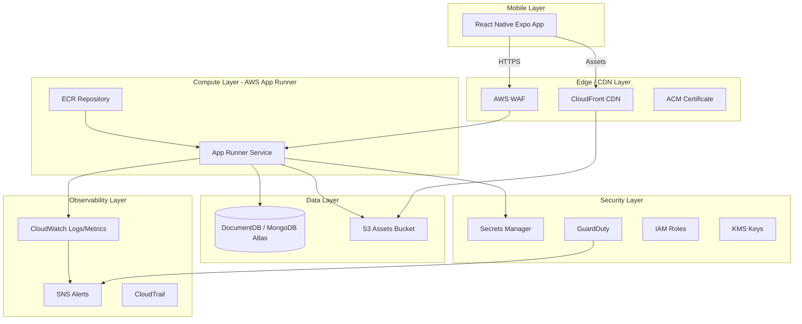
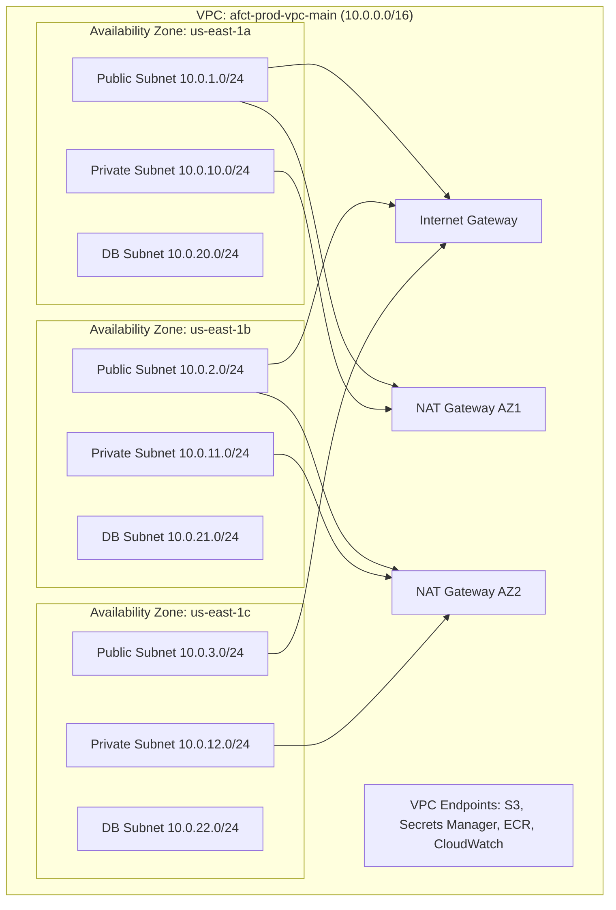

# AWS Deployment Infrastructure Design

## Overview

AfroChinaTrade is a fintech/trade platform requiring a professional, secure, and scalable AWS architecture. This design document covers the complete AWS deployment infrastructure for the platform, which consists of:

- **Mobile Frontend**: React Native Expo application (iOS and Android) distributed via App Store and Google Play
- **Backend API**: Node.js/Express application with MongoDB, deployed on AWS App Runner
- **Static Assets**: S3 with CloudFront CDN for media files and product images
- **Security Infrastructure**: IAM, Secrets Manager, GuardDuty, WAF, VPC, and CloudWatch

> **Important Note on Database Technology**: The current backend uses MongoDB (via Mongoose ODM) rather than MySQL/PostgreSQL as stated in the requirements. This design addresses MongoDB Atlas as the primary database with Amazon DocumentDB as an AWS-native alternative. All RDS-specific requirements are mapped to equivalent MongoDB/DocumentDB capabilities.

### Design Principles

1. **Least Privilege**: Every service has only the permissions it needs
2. **Defense in Depth**: Multiple security layers (WAF -> App Runner -> VPC -> Security Groups -> DB)
3. **Infrastructure as Code**: All resources defined in AWS CDK (TypeScript) for reproducibility
4. **Observability First**: Structured logging, metrics, and alerting from day one
5. **Financial Data Integrity**: ACID-compliant transactions with full audit trails

### Resource Naming Convention

All AWS resources follow this naming pattern:

```
{project}-{environment}-{resource-type}-{descriptor}
```

Examples:
- `afct-prod-ecr-backend` - ECR repository for production backend
- `afct-prod-apprunner-api` - App Runner service
- `afct-prod-vpc-main` - Main VPC
- `afct-prod-sg-apprunner` - Security group for App Runner
- `afct-prod-secret-db-credentials` - Secrets Manager secret for DB
- `afct-prod-s3-assets` - S3 bucket for static assets
- `afct-prod-cloudfront-cdn` - CloudFront distribution

Environments: `dev`, `staging`, `prod`
## Architecture

### High-Level System Architecture



### VPC Network Architecture



### Deployment Sequencing

Resources must be deployed in this order to satisfy dependencies:

1. **Foundation** (no dependencies): KMS keys, IAM roles, VPC, subnets, security groups
2. **Storage** (depends on KMS, VPC): S3 buckets, DocumentDB cluster, Secrets Manager secrets
3. **Compute** (depends on ECR, Secrets Manager, VPC): ECR repository, App Runner service
4. **Edge** (depends on S3, App Runner, ACM): CloudFront distribution, WAF web ACL
5. **Observability** (depends on all): CloudWatch dashboards, alarms, SNS topics
6. **Security Monitoring** (depends on all): GuardDuty, AWS Config, CloudTrail
