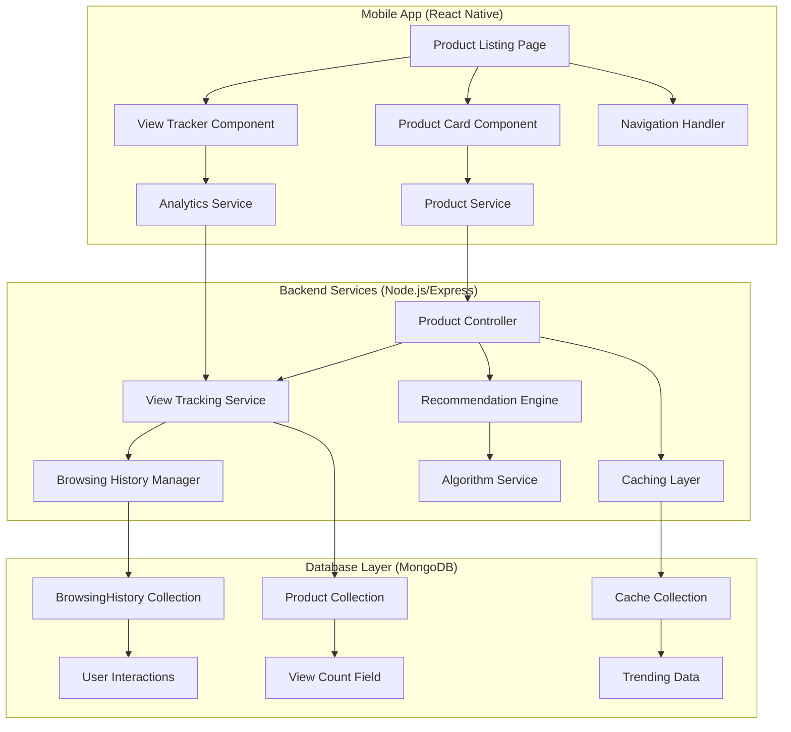
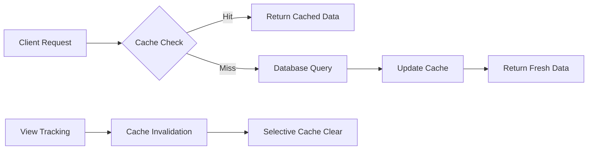
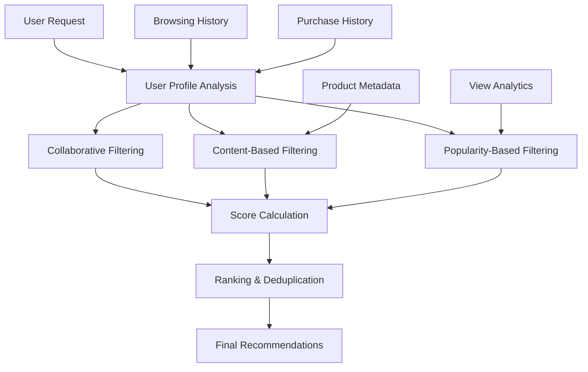
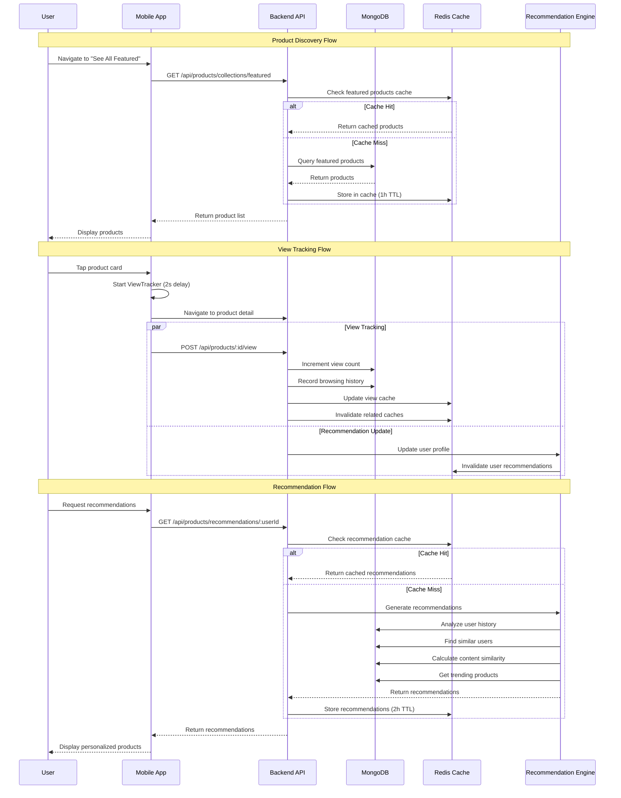

# Enhanced Product Discovery System - Design Document

## Overview

The Enhanced Product Discovery system provides comprehensive product listing capabilities with view tracking, browsing history, and personalized recommendations for the customer mobile app. This system extends the existing React Native mobile app and Node.js/Express backend with MongoDB to support dynamic product collections, user engagement tracking, and data-driven recommendations.

### Key Features

- Dynamic product listing page with collection-based navigation
- Real-time view tracking and trending product calculations
- Personalized recommendation engine based on browsing and purchase history
- Optimized caching strategy for performance
- Mobile-first UI components with seamless navigation integration

## Architecture

### System Components



### Data Flow Architecture

1. **Product Discovery Flow**: User navigates → Collection determined → Products fetched → View tracking initiated
2. **View Tracking Flow**: Product viewed → View count incremented → Browsing history updated → Cache invalidated
3. **Recommendation Flow**: User history analyzed → Similar products identified → Personalized list generated → Results cached

## Components and Interfaces

### Mobile App Components

#### ProductListingPage Component
```typescript
interface ProductListingPageProps {
  navigationSource: NavigationSource;
  collectionType: CollectionType;
  initialFilters?: ProductFilters;
}

type NavigationSource = 
  | 'home_featured' 
  | 'home_recommended' 
  | 'home_all' 
  | 'home_trending' 
  | 'home_seller_favorites';

type CollectionType = 
  | 'featured' 
  | 'recommended' 
  | 'all' 
  | 'trending' 
  | 'seller_favorites';
```

#### ViewTracker Component
```typescript
interface ViewTrackerProps {
  productId: string;
  userId?: string;
  onViewTracked?: (productId: string) => void;
}

interface ViewTrackingService {
  trackView(productId: string, userId?: string): Promise<void>;
  getViewCount(productId: string): Promise<number>;
}
```

### Backend Interfaces

#### Product Collection Service
```typescript
interface ProductCollectionService {
  getFeaturedProducts(limit: number, page: number): Promise<ProductResponse>;
  getRecommendedProducts(userId: string, limit: number): Promise<ProductResponse>;
  getAllProducts(filters: ProductFilters, pagination: Pagination): Promise<ProductResponse>;
  getTrendingProducts(timeframe: string, limit: number): Promise<ProductResponse>;
  getSellerFavorites(limit: number, page: number): Promise<ProductResponse>;
}
```

#### Recommendation Engine Interface
```typescript
interface RecommendationEngine {
  generateRecommendations(userId: string, options: RecommendationOptions): Promise<Product[]>;
  updateUserProfile(userId: string, interaction: UserInteraction): Promise<void>;
  getRecommendationScore(userId: string, productId: string): Promise<number>;
}
```

## Data Models

### Enhanced Product Model
```typescript
interface IProduct extends Document {
  // Existing fields...
  name: string;
  description: string;
  price: number;
  currency: string;
  images: string[];
  category: string;
  subcategory?: string;
  supplierId: mongoose.Types.ObjectId;
  rating: number;
  reviewCount: number;
  stock: number;
  tags: string[];
  specifications: Map<string, string>;
  policies?: ProductPolicies;
  discount: number;
  isNewProduct: boolean;
  isFeatured: boolean;
  isActive: boolean;
  
  // New fields for enhanced discovery
  viewCount: number;                    // Total view count
  isSellerFavorite: boolean;           // Admin-tagged seller favorite
  trendingScore: number;               // Calculated trending score
  lastViewedAt?: Date;                 // Last view timestamp
  createdAt: Date;
  updatedAt: Date;
}
```

### BrowsingHistory Model
```typescript
interface IBrowsingHistory extends Document {
  userId: mongoose.Types.ObjectId;
  productId: mongoose.Types.ObjectId;
  interactionType: 'view' | 'cart_add' | 'wishlist_add' | 'purchase';
  sessionId?: string;
  timestamp: Date;
  deviceInfo?: {
    platform: string;
    userAgent?: string;
  };
  metadata?: {
    viewDuration?: number;            // Time spent viewing (seconds)
    scrollDepth?: number;             // Percentage scrolled
    imageViews?: number;              // Number of images viewed
  };
}
```

### ProductViewCache Model
```typescript
interface IProductViewCache extends Document {
  productId: mongoose.Types.ObjectId;
  hourlyViews: Map<string, number>;    // Hour-based view counts
  dailyViews: Map<string, number>;     // Day-based view counts
  weeklyViews: Map<string, number>;    // Week-based view counts
  totalViews: number;
  lastUpdated: Date;
  trendingScore: number;
}
```

### RecommendationCache Model
```typescript
interface IRecommendationCache extends Document {
  userId: mongoose.Types.ObjectId;
  recommendations: {
    productId: mongoose.Types.ObjectId;
    score: number;
    reason: string;
  }[];
  generatedAt: Date;
  expiresAt: Date;
  version: number;
}
```
## API Endpoints

### Product Collection Endpoints

#### GET /api/products/collections/:type
Retrieve products by collection type with pagination and filtering.

**Parameters:**
- `type`: Collection type (featured, recommended, all, trending, seller-favorites)
- `page`: Page number (default: 1)
- `limit`: Items per page (default: 20, max: 50)
- `userId`: User ID for personalized collections (required for recommended)

**Query Parameters:**
```typescript
interface CollectionQueryParams {
  page?: number;
  limit?: number;
  userId?: string;
  category?: string;
  minPrice?: number;
  maxPrice?: number;
  sortBy?: 'newest' | 'price_asc' | 'price_desc' | 'rating' | 'trending';
  timeframe?: '1h' | '24h' | '7d' | '30d'; // For trending collections
}
```

**Response:**
```typescript
interface CollectionResponse {
  status: 'success' | 'error';
  data: {
    products: Product[];
    pagination: {
      page: number;
      limit: number;
      total: number;
      pages: number;
      hasNext: boolean;
      hasPrev: boolean;
    };
    metadata: {
      collectionType: string;
      generatedAt: string;
      cached: boolean;
    };
  };
}
```

#### GET /api/products/trending
Get trending products with configurable timeframe.

**Query Parameters:**
- `timeframe`: '1h' | '24h' | '7d' | '30d' (default: '24h')
- `limit`: Number of products (default: 20, max: 50)
- `category`: Filter by category

#### GET /api/products/recommendations/:userId
Get personalized recommendations for a user.

**Query Parameters:**
- `limit`: Number of recommendations (default: 20, max: 50)
- `excludeCart`: Exclude items in user's cart (default: true)
- `includeReasons`: Include recommendation reasons (default: false)

### View Tracking Endpoints

#### POST /api/products/:productId/view
Track a product view and increment view count.

**Request Body:**
```typescript
interface ViewTrackingRequest {
  userId?: string;
  sessionId?: string;
  metadata?: {
    viewDuration?: number;
    scrollDepth?: number;
    imageViews?: number;
  };
}
```

**Response:**
```typescript
interface ViewTrackingResponse {
  status: 'success' | 'error';
  data: {
    productId: string;
    newViewCount: number;
    tracked: boolean;
  };
}
```

#### GET /api/products/:productId/analytics
Get view analytics for a specific product (admin only).

**Response:**
```typescript
interface ProductAnalyticsResponse {
  status: 'success' | 'error';
  data: {
    productId: string;
    totalViews: number;
    uniqueViews: number;
    viewsByTimeframe: {
      hourly: Record<string, number>;
      daily: Record<string, number>;
      weekly: Record<string, number>;
    };
    trendingScore: number;
    averageViewDuration: number;
  };
}
```

### Browsing History Endpoints

#### GET /api/users/:userId/browsing-history
Get user's browsing history with pagination.

**Query Parameters:**
- `page`: Page number (default: 1)
- `limit`: Items per page (default: 20, max: 100)
- `interactionType`: Filter by interaction type
- `startDate`: Filter from date
- `endDate`: Filter to date

#### POST /api/users/:userId/browsing-history
Add entry to user's browsing history.

**Request Body:**
```typescript
interface BrowsingHistoryEntry {
  productId: string;
  interactionType: 'view' | 'cart_add' | 'wishlist_add' | 'purchase';
  sessionId?: string;
  metadata?: Record<string, any>;
}
```

## View Tracking Implementation

### Client-Side View Tracking

#### ViewTracker Component
```typescript
import React, { useEffect, useRef } from 'react';
import { useViewTracking } from '../hooks/useViewTracking';

interface ViewTrackerProps {
  productId: string;
  userId?: string;
  threshold?: number; // Minimum time to consider a view (ms)
  onViewTracked?: (productId: string) => void;
}

export const ViewTracker: React.FC<ViewTrackerProps> = ({
  productId,
  userId,
  threshold = 2000, // 2 seconds
  onViewTracked
}) => {
  const { trackView } = useViewTracking();
  const viewStartTime = useRef<number>();
  const hasTracked = useRef(false);

  useEffect(() => {
    viewStartTime.current = Date.now();
    
    const timer = setTimeout(() => {
      if (!hasTracked.current) {
        const viewDuration = Date.now() - (viewStartTime.current || 0);
        trackView(productId, userId, { viewDuration });
        hasTracked.current = true;
        onViewTracked?.(productId);
      }
    }, threshold);

    return () => {
      clearTimeout(timer);
    };
  }, [productId, userId, threshold, trackView, onViewTracked]);

  return null; // This is a tracking component, no UI
};
```

#### useViewTracking Hook
```typescript
import { useCallback } from 'react';
import { analyticsService } from '../services/AnalyticsService';

interface ViewMetadata {
  viewDuration?: number;
  scrollDepth?: number;
  imageViews?: number;
}

export const useViewTracking = () => {
  const trackView = useCallback(async (
    productId: string, 
    userId?: string, 
    metadata?: ViewMetadata
  ) => {
    try {
      await analyticsService.trackProductView(productId, userId, metadata);
    } catch (error) {
      console.error('Failed to track view:', error);
      // Fail silently to not disrupt user experience
    }
  }, []);

  return { trackView };
};
```

### Server-Side View Tracking Service

#### ViewTrackingService
```typescript
import { Product, BrowsingHistory, ProductViewCache } from '../models';
import { CacheService } from './CacheService';

export class ViewTrackingService {
  private cacheService: CacheService;

  constructor() {
    this.cacheService = new CacheService();
  }

  async trackProductView(
    productId: string, 
    userId?: string, 
    sessionId?: string,
    metadata?: ViewMetadata
  ): Promise<{ success: boolean; newViewCount: number }> {
    try {
      // Check if this is a unique view (prevent spam)
      const isUniqueView = await this.isUniqueView(productId, userId, sessionId);
      
      if (!isUniqueView) {
        const currentCount = await this.getViewCount(productId);
        return { success: false, newViewCount: currentCount };
      }

      // Update product view count atomically
      const updatedProduct = await Product.findByIdAndUpdate(
        productId,
        { 
          $inc: { viewCount: 1 },
          $set: { lastViewedAt: new Date() }
        },
        { new: true }
      );

      if (!updatedProduct) {
        throw new Error('Product not found');
      }

      // Update view cache for trending calculations
      await this.updateViewCache(productId);

      // Record browsing history if user is authenticated
      if (userId) {
        await this.recordBrowsingHistory(userId, productId, 'view', sessionId, metadata);
      }

      // Invalidate relevant caches
      await this.invalidateProductCaches(productId, updatedProduct.category);

      return { success: true, newViewCount: updatedProduct.viewCount };
    } catch (error) {
      console.error('Error tracking product view:', error);
      throw error;
    }
  }

  private async isUniqueView(
    productId: string, 
    userId?: string, 
    sessionId?: string
  ): Promise<boolean> {
    const timeWindow = 30 * 60 * 1000; // 30 minutes
    const cutoffTime = new Date(Date.now() - timeWindow);

    const query: any = {
      productId,
      interactionType: 'view',
      timestamp: { $gte: cutoffTime }
    };

    if (userId) {
      query.userId = userId;
    } else if (sessionId) {
      query.sessionId = sessionId;
    } else {
      // If no user or session, allow the view
      return true;
    }

    const existingView = await BrowsingHistory.findOne(query);
    return !existingView;
  }

  private async updateViewCache(productId: string): Promise<void> {
    const now = new Date();
    const hourKey = `${now.getFullYear()}-${now.getMonth()}-${now.getDate()}-${now.getHours()}`;
    const dayKey = `${now.getFullYear()}-${now.getMonth()}-${now.getDate()}`;
    const weekKey = `${now.getFullYear()}-${Math.floor(now.getDate() / 7)}`;

    await ProductViewCache.findOneAndUpdate(
      { productId },
      {
        $inc: {
          totalViews: 1,
          [`hourlyViews.${hourKey}`]: 1,
          [`dailyViews.${dayKey}`]: 1,
          [`weeklyViews.${weekKey}`]: 1
        },
        $set: { lastUpdated: now }
      },
      { upsert: true }
    );
  }

  private async recordBrowsingHistory(
    userId: string,
    productId: string,
    interactionType: string,
    sessionId?: string,
    metadata?: ViewMetadata
  ): Promise<void> {
    await BrowsingHistory.create({
      userId,
      productId,
      interactionType,
      sessionId,
      timestamp: new Date(),
      metadata
    });
  }

  private async invalidateProductCaches(productId: string, category: string): Promise<void> {
    const cacheKeys = [
      `trending:24h`,
      `trending:7d`,
      `category:${category}`,
      `product:${productId}`
    ];

    await Promise.all(
      cacheKeys.map(key => this.cacheService.delete(key))
    );
  }

  async getViewCount(productId: string): Promise<number> {
    const product = await Product.findById(productId).select('viewCount');
    return product?.viewCount || 0;
  }
}
```

## Caching Strategy

### Cache Architecture



### Cache Implementation

#### CacheService
```typescript
import Redis from 'ioredis';

export class CacheService {
  private redis: Redis;
  private defaultTTL = 3600; // 1 hour

  constructor() {
    this.redis = new Redis(process.env.REDIS_URL || 'redis://localhost:6379');
  }

  async get<T>(key: string): Promise<T | null> {
    try {
      const cached = await this.redis.get(key);
      return cached ? JSON.parse(cached) : null;
    } catch (error) {
      console.error('Cache get error:', error);
      return null;
    }
  }

  async set(key: string, value: any, ttl: number = this.defaultTTL): Promise<void> {
    try {
      await this.redis.setex(key, ttl, JSON.stringify(value));
    } catch (error) {
      console.error('Cache set error:', error);
    }
  }

  async delete(key: string): Promise<void> {
    try {
      await this.redis.del(key);
    } catch (error) {
      console.error('Cache delete error:', error);
    }
  }

  async deletePattern(pattern: string): Promise<void> {
    try {
      const keys = await this.redis.keys(pattern);
      if (keys.length > 0) {
        await this.redis.del(...keys);
      }
    } catch (error) {
      console.error('Cache delete pattern error:', error);
    }
  }

  // Cache keys for different data types
  static keys = {
    trending: (timeframe: string) => `trending:${timeframe}`,
    recommendations: (userId: string) => `recommendations:${userId}`,
    categoryProducts: (category: string, page: number) => `category:${category}:page:${page}`,
    featuredProducts: (page: number) => `featured:page:${page}`,
    productDetails: (productId: string) => `product:${productId}`,
    userHistory: (userId: string) => `history:${userId}`
  };
}
```

### Cache Strategy by Data Type

#### Product Collections Caching
```typescript
export class ProductCollectionService {
  private cacheService: CacheService;
  private cacheTTL = {
    trending: 1800,      // 30 minutes
    featured: 3600,      // 1 hour
    recommendations: 7200, // 2 hours
    category: 1800,      // 30 minutes
    all: 900            // 15 minutes
  };

  async getFeaturedProducts(page: number, limit: number): Promise<ProductResponse> {
    const cacheKey = CacheService.keys.featuredProducts(page);
    
    // Try cache first
    let cached = await this.cacheService.get<ProductResponse>(cacheKey);
    if (cached) {
      return { ...cached, metadata: { ...cached.metadata, cached: true } };
    }

    // Fetch from database
    const products = await Product.find({ isFeatured: true, isActive: true })
      .skip((page - 1) * limit)
      .limit(limit)
      .sort({ createdAt: -1 })
      .populate('supplierId', 'name email verified rating');

    const total = await Product.countDocuments({ isFeatured: true, isActive: true });

    const response: ProductResponse = {
      status: 'success',
      data: {
        products,
        pagination: {
          page,
          limit,
          total,
          pages: Math.ceil(total / limit),
          hasNext: page < Math.ceil(total / limit),
          hasPrev: page > 1
        },
        metadata: {
          collectionType: 'featured',
          generatedAt: new Date().toISOString(),
          cached: false
        }
      }
    };

    // Cache the result
    await this.cacheService.set(cacheKey, response, this.cacheTTL.featured);

    return response;
  }

  async getTrendingProducts(timeframe: string, limit: number): Promise<ProductResponse> {
    const cacheKey = CacheService.keys.trending(timeframe);
    
    let cached = await this.cacheService.get<ProductResponse>(cacheKey);
    if (cached) {
      return { ...cached, metadata: { ...cached.metadata, cached: true } };
    }

    // Calculate trending products based on timeframe
    const trendingProducts = await this.calculateTrendingProducts(timeframe, limit);

    const response: ProductResponse = {
      status: 'success',
      data: {
        products: trendingProducts,
        pagination: {
          page: 1,
          limit,
          total: trendingProducts.length,
          pages: 1,
          hasNext: false,
          hasPrev: false
        },
        metadata: {
          collectionType: 'trending',
          generatedAt: new Date().toISOString(),
          cached: false
        }
      }
    };

    await this.cacheService.set(cacheKey, response, this.cacheTTL.trending);
    return response;
  }

  private async calculateTrendingProducts(timeframe: string, limit: number): Promise<Product[]> {
    const timeframeDays = {
      '1h': 1/24,
      '24h': 1,
      '7d': 7,
      '30d': 30
    };

    const days = timeframeDays[timeframe as keyof typeof timeframeDays] || 1;
    const cutoffDate = new Date(Date.now() - days * 24 * 60 * 60 * 1000);

    // Aggregate view counts within timeframe
    const trendingData = await BrowsingHistory.aggregate([
      {
        $match: {
          interactionType: 'view',
          timestamp: { $gte: cutoffDate }
        }
      },
      {
        $group: {
          _id: '$productId',
          viewCount: { $sum: 1 },
          uniqueUsers: { $addToSet: '$userId' }
        }
      },
      {
        $addFields: {
          uniqueUserCount: { $size: '$uniqueUsers' },
          trendingScore: {
            $multiply: [
              '$viewCount',
              { $add: [1, { $divide: ['$uniqueUserCount', 10] }] }
            ]
          }
        }
      },
      {
        $sort: { trendingScore: -1 }
      },
      {
        $limit: limit
      }
    ]);

    const productIds = trendingData.map(item => item._id);
    
    const products = await Product.find({
      _id: { $in: productIds },
      isActive: true
    }).populate('supplierId', 'name email verified rating');

    // Sort products by trending score
    const productMap = new Map(products.map(p => [p._id.toString(), p]));
    return trendingData
      .map(item => productMap.get(item._id.toString()))
      .filter(Boolean) as Product[];
  }
}
```
## Recommendation Engine Design

### Recommendation Algorithm

The recommendation engine uses a hybrid approach combining collaborative filtering, content-based filtering, and popularity-based recommendations.

#### Algorithm Components



#### RecommendationEngine Implementation

```typescript
export class RecommendationEngine {
  private cacheService: CacheService;
  private weights = {
    collaborative: 0.4,
    contentBased: 0.35,
    popularity: 0.25
  };

  constructor() {
    this.cacheService = new CacheService();
  }

  async generateRecommendations(
    userId: string, 
    options: RecommendationOptions = {}
  ): Promise<RecommendationResult[]> {
    const {
      limit = 20,
      excludeCart = true,
      includeReasons = false,
      categories = []
    } = options;

    // Check cache first
    const cacheKey = CacheService.keys.recommendations(userId);
    let cached = await this.cacheService.get<RecommendationResult[]>(cacheKey);
    
    if (cached && cached.length >= limit) {
      return cached.slice(0, limit);
    }

    // Get user profile
    const userProfile = await this.buildUserProfile(userId);
    
    if (!userProfile.hasActivity) {
      // Fallback to featured products for new users
      return this.getFallbackRecommendations(limit, categories);
    }

    // Generate recommendations using different algorithms
    const [collaborative, contentBased, popularity] = await Promise.all([
      this.getCollaborativeRecommendations(userProfile, limit * 2),
      this.getContentBasedRecommendations(userProfile, limit * 2),
      this.getPopularityBasedRecommendations(userProfile, limit * 2)
    ]);

    // Combine and score recommendations
    const combinedRecommendations = this.combineRecommendations(
      collaborative,
      contentBased,
      popularity,
      userProfile
    );

    // Filter and rank
    let finalRecommendations = await this.filterRecommendations(
      combinedRecommendations,
      userId,
      excludeCart,
      categories
    );

    finalRecommendations = finalRecommendations
      .sort((a, b) => b.score - a.score)
      .slice(0, limit);

    // Add reasons if requested
    if (includeReasons) {
      finalRecommendations = finalRecommendations.map(rec => ({
        ...rec,
        reason: this.generateReason(rec, userProfile)
      }));
    }

    // Cache results
    await this.cacheService.set(cacheKey, finalRecommendations, 7200); // 2 hours

    return finalRecommendations;
  }

  private async buildUserProfile(userId: string): Promise<UserProfile> {
    const [browsingHistory, purchaseHistory] = await Promise.all([
      BrowsingHistory.find({ userId })
        .populate('productId')
        .sort({ timestamp: -1 })
        .limit(100),
      Order.find({ userId, status: 'completed' })
        .populate('items.productId')
        .sort({ createdAt: -1 })
        .limit(50)
    ]);

    const profile: UserProfile = {
      userId,
      hasActivity: browsingHistory.length > 0 || purchaseHistory.length > 0,
      viewedProducts: browsingHistory.map(h => h.productId),
      purchasedProducts: purchaseHistory.flatMap(order => 
        order.items.map(item => item.productId)
      ),
      categoryPreferences: this.calculateCategoryPreferences(browsingHistory, purchaseHistory),
      priceRange: this.calculatePriceRange(browsingHistory, purchaseHistory),
      brandPreferences: this.calculateBrandPreferences(browsingHistory, purchaseHistory),
      recentActivity: browsingHistory.slice(0, 20).map(h => h.productId)
    };

    return profile;
  }

  private async getCollaborativeRecommendations(
    userProfile: UserProfile, 
    limit: number
  ): Promise<RecommendationCandidate[]> {
    // Find users with similar viewing patterns
    const similarUsers = await this.findSimilarUsers(userProfile.userId, userProfile.viewedProducts);
    
    if (similarUsers.length === 0) {
      return [];
    }

    // Get products viewed by similar users but not by current user
    const viewedProductIds = userProfile.viewedProducts.map(p => p._id.toString());
    
    const recommendations = await BrowsingHistory.aggregate([
      {
        $match: {
          userId: { $in: similarUsers.map(u => u.userId) },
          productId: { $nin: userProfile.viewedProducts.map(p => p._id) },
          interactionType: { $in: ['view', 'purchase'] }
        }
      },
      {
        $group: {
          _id: '$productId',
          score: { $sum: 1 },
          interactions: { $push: '$interactionType' }
        }
      },
      {
        $lookup: {
          from: 'products',
          localField: '_id',
          foreignField: '_id',
          as: 'product'
        }
      },
      {
        $unwind: '$product'
      },
      {
        $match: {
          'product.isActive': true,
          'product.stock': { $gt: 0 }
        }
      },
      {
        $sort: { score: -1 }
      },
      {
        $limit: limit
      }
    ]);

    return recommendations.map(rec => ({
      productId: rec._id,
      product: rec.product,
      score: rec.score * this.weights.collaborative,
      algorithm: 'collaborative',
      confidence: Math.min(rec.score / 10, 1) // Normalize confidence
    }));
  }

  private async getContentBasedRecommendations(
    userProfile: UserProfile, 
    limit: number
  ): Promise<RecommendationCandidate[]> {
    const viewedProductIds = userProfile.viewedProducts.map(p => p._id);
    
    // Build content similarity query based on user preferences
    const categoryFilter = Object.keys(userProfile.categoryPreferences).length > 0 
      ? { category: { $in: Object.keys(userProfile.categoryPreferences) } }
      : {};

    const priceFilter = userProfile.priceRange.min && userProfile.priceRange.max
      ? { 
          price: { 
            $gte: userProfile.priceRange.min * 0.7, 
            $lte: userProfile.priceRange.max * 1.3 
          } 
        }
      : {};

    const products = await Product.find({
      _id: { $nin: viewedProductIds },
      isActive: true,
      stock: { $gt: 0 },
      ...categoryFilter,
      ...priceFilter
    })
    .limit(limit * 3)
    .populate('supplierId');

    // Calculate content similarity scores
    const recommendations = products.map(product => {
      let score = 0;
      
      // Category preference score
      const categoryScore = userProfile.categoryPreferences[product.category] || 0;
      score += categoryScore * 0.4;
      
      // Price preference score
      if (userProfile.priceRange.min && userProfile.priceRange.max) {
        const priceScore = this.calculatePriceScore(
          product.price, 
          userProfile.priceRange.min, 
          userProfile.priceRange.max
        );
        score += priceScore * 0.3;
      }
      
      // Rating score
      score += (product.rating / 5) * 0.2;
      
      // Popularity score
      score += Math.min(product.viewCount / 1000, 1) * 0.1;

      return {
        productId: product._id,
        product,
        score: score * this.weights.contentBased,
        algorithm: 'content-based',
        confidence: score
      };
    });

    return recommendations
      .sort((a, b) => b.score - a.score)
      .slice(0, limit);
  }

  private async getPopularityBasedRecommendations(
    userProfile: UserProfile, 
    limit: number
  ): Promise<RecommendationCandidate[]> {
    const viewedProductIds = userProfile.viewedProducts.map(p => p._id);
    
    // Get trending products from the last 7 days
    const cutoffDate = new Date(Date.now() - 7 * 24 * 60 * 60 * 1000);
    
    const trendingProducts = await Product.find({
      _id: { $nin: viewedProductIds },
      isActive: true,
      stock: { $gt: 0 },
      lastViewedAt: { $gte: cutoffDate }
    })
    .sort({ viewCount: -1, rating: -1 })
    .limit(limit)
    .populate('supplierId');

    return trendingProducts.map((product, index) => ({
      productId: product._id,
      product,
      score: (limit - index) / limit * this.weights.popularity,
      algorithm: 'popularity',
      confidence: Math.min(product.viewCount / 100, 1)
    }));
  }

  private combineRecommendations(
    collaborative: RecommendationCandidate[],
    contentBased: RecommendationCandidate[],
    popularity: RecommendationCandidate[]
  ): Map<string, RecommendationCandidate> {
    const combined = new Map<string, RecommendationCandidate>();

    // Combine all recommendations, summing scores for duplicates
    [collaborative, contentBased, popularity].forEach(recommendations => {
      recommendations.forEach(rec => {
        const key = rec.productId.toString();
        const existing = combined.get(key);
        
        if (existing) {
          existing.score += rec.score;
          existing.confidence = Math.max(existing.confidence, rec.confidence);
          existing.algorithm = `${existing.algorithm}, ${rec.algorithm}`;
        } else {
          combined.set(key, { ...rec });
        }
      });
    });

    return combined;
  }

  private async filterRecommendations(
    recommendations: Map<string, RecommendationCandidate>,
    userId: string,
    excludeCart: boolean,
    categories: string[]
  ): Promise<RecommendationResult[]> {
    let filtered = Array.from(recommendations.values());

    // Filter by categories if specified
    if (categories.length > 0) {
      filtered = filtered.filter(rec => 
        categories.includes(rec.product.category)
      );
    }

    // Exclude cart items if requested
    if (excludeCart) {
      const cartItems = await Cart.findOne({ userId }).select('items.productId');
      if (cartItems) {
        const cartProductIds = cartItems.items.map(item => item.productId.toString());
        filtered = filtered.filter(rec => 
          !cartProductIds.includes(rec.productId.toString())
        );
      }
    }

    return filtered.map(rec => ({
      productId: rec.productId,
      product: rec.product,
      score: rec.score,
      confidence: rec.confidence,
      algorithm: rec.algorithm
    }));
  }

  private async getFallbackRecommendations(
    limit: number, 
    categories: string[]
  ): Promise<RecommendationResult[]> {
    const filter: any = { isFeatured: true, isActive: true, stock: { $gt: 0 } };
    
    if (categories.length > 0) {
      filter.category = { $in: categories };
    }

    const products = await Product.find(filter)
      .sort({ rating: -1, viewCount: -1 })
      .limit(limit)
      .populate('supplierId');

    return products.map((product, index) => ({
      productId: product._id,
      product,
      score: (limit - index) / limit,
      confidence: 0.5,
      algorithm: 'fallback-featured'
    }));
  }

  private generateReason(
    recommendation: RecommendationResult, 
    userProfile: UserProfile
  ): string {
    const algorithms = recommendation.algorithm.split(', ');
    
    if (algorithms.includes('collaborative')) {
      return 'Customers with similar interests also viewed this';
    }
    
    if (algorithms.includes('content-based')) {
      const category = recommendation.product.category;
      if (userProfile.categoryPreferences[category]) {
        return `Based on your interest in ${category}`;
      }
      return 'Matches your preferences';
    }
    
    if (algorithms.includes('popularity')) {
      return 'Trending now';
    }
    
    return 'Featured product';
  }

  // Helper methods for user profile building
  private calculateCategoryPreferences(
    browsingHistory: any[], 
    purchaseHistory: any[]
  ): Record<string, number> {
    const preferences: Record<string, number> = {};
    
    // Weight purchases higher than views
    browsingHistory.forEach(item => {
      const category = item.productId?.category;
      if (category) {
        preferences[category] = (preferences[category] || 0) + 1;
      }
    });
    
    purchaseHistory.forEach(order => {
      order.items.forEach((item: any) => {
        const category = item.productId?.category;
        if (category) {
          preferences[category] = (preferences[category] || 0) + 3; // Higher weight
        }
      });
    });
    
    // Normalize scores
    const maxScore = Math.max(...Object.values(preferences));
    if (maxScore > 0) {
      Object.keys(preferences).forEach(key => {
        preferences[key] = preferences[key] / maxScore;
      });
    }
    
    return preferences;
  }

  private calculatePriceRange(
    browsingHistory: any[], 
    purchaseHistory: any[]
  ): { min: number; max: number; average: number } {
    const prices: number[] = [];
    
    browsingHistory.forEach(item => {
      if (item.productId?.price) {
        prices.push(item.productId.price);
      }
    });
    
    purchaseHistory.forEach(order => {
      order.items.forEach((item: any) => {
        if (item.productId?.price) {
          prices.push(item.productId.price);
        }
      });
    });
    
    if (prices.length === 0) {
      return { min: 0, max: 0, average: 0 };
    }
    
    prices.sort((a, b) => a - b);
    const min = prices[Math.floor(prices.length * 0.1)]; // 10th percentile
    const max = prices[Math.floor(prices.length * 0.9)]; // 90th percentile
    const average = prices.reduce((sum, price) => sum + price, 0) / prices.length;
    
    return { min, max, average };
  }

  private calculateBrandPreferences(
    browsingHistory: any[], 
    purchaseHistory: any[]
  ): Record<string, number> {
    const preferences: Record<string, number> = {};
    
    // Extract brand from supplier information
    browsingHistory.forEach(item => {
      const brand = item.productId?.supplierId?.name;
      if (brand) {
        preferences[brand] = (preferences[brand] || 0) + 1;
      }
    });
    
    purchaseHistory.forEach(order => {
      order.items.forEach((item: any) => {
        const brand = item.productId?.supplierId?.name;
        if (brand) {
          preferences[brand] = (preferences[brand] || 0) + 3;
        }
      });
    });
    
    return preferences;
  }

  private async findSimilarUsers(
    userId: string, 
    viewedProducts: any[]
  ): Promise<{ userId: string; similarity: number }[]> {
    const viewedProductIds = viewedProducts.map(p => p._id);
    
    // Find users who viewed similar products
    const similarUsers = await BrowsingHistory.aggregate([
      {
        $match: {
          userId: { $ne: userId },
          productId: { $in: viewedProductIds },
          interactionType: 'view'
        }
      },
      {
        $group: {
          _id: '$userId',
          commonProducts: { $addToSet: '$productId' },
          totalViews: { $sum: 1 }
        }
      },
      {
        $addFields: {
          similarity: {
            $divide: [
              { $size: '$commonProducts' },
              { $add: [viewedProductIds.length, '$totalViews'] }
            ]
          }
        }
      },
      {
        $match: {
          similarity: { $gte: 0.1 } // Minimum 10% similarity
        }
      },
      {
        $sort: { similarity: -1 }
      },
      {
        $limit: 50
      }
    ]);

    return similarUsers.map(user => ({
      userId: user._id,
      similarity: user.similarity
    }));
  }

  private calculatePriceScore(
    productPrice: number, 
    userMinPrice: number, 
    userMaxPrice: number
  ): number {
    const userAverage = (userMinPrice + userMaxPrice) / 2;
    const userRange = userMaxPrice - userMinPrice;
    
    if (userRange === 0) return 1;
    
    const distance = Math.abs(productPrice - userAverage);
    const normalizedDistance = distance / (userRange / 2);
    
    return Math.max(0, 1 - normalizedDistance);
  }
}

// Type definitions for recommendation system
interface UserProfile {
  userId: string;
  hasActivity: boolean;
  viewedProducts: any[];
  purchasedProducts: any[];
  categoryPreferences: Record<string, number>;
  priceRange: { min: number; max: number; average: number };
  brandPreferences: Record<string, number>;
  recentActivity: any[];
}

interface RecommendationCandidate {
  productId: any;
  product: any;
  score: number;
  algorithm: string;
  confidence: number;
}

interface RecommendationResult {
  productId: any;
  product: any;
  score: number;
  confidence: number;
  algorithm: string;
  reason?: string;
}

interface RecommendationOptions {
  limit?: number;
  excludeCart?: boolean;
  includeReasons?: boolean;
  categories?: string[];
}
```
## Mobile App Navigation and UI Components

### Navigation Integration

#### Enhanced Navigation Structure
```typescript
// Navigation types for product collections
type ProductCollectionRoute = {
  'product-listing': {
    source: NavigationSource;
    collectionType: CollectionType;
    title?: string;
    filters?: ProductFilters;
  };
};

// Navigation source tracking
enum NavigationSource {
  HOME_FEATURED = 'home_featured',
  HOME_RECOMMENDED = 'home_recommended', 
  HOME_ALL = 'home_all',
  HOME_TRENDING = 'home_trending',
  HOME_SELLER_FAVORITES = 'home_seller_favorites',
  SEARCH_RESULTS = 'search_results',
  CATEGORY_BROWSE = 'category_browse'
}
```

#### Updated Home Screen Integration
```typescript
// Enhanced SectionHeader component with navigation
interface SectionHeaderProps {
  title: string;
  subtitle?: string;
  actionText?: string;
  onActionPress?: () => void;
  navigationSource?: NavigationSource; // New prop
  collectionType?: CollectionType;     // New prop
}

export const SectionHeader: React.FC<SectionHeaderProps> = ({
  title,
  subtitle,
  actionText = "See All",
  onActionPress,
  navigationSource,
  collectionType
}) => {
  const router = useRouter();
  
  const handleActionPress = () => {
    if (onActionPress) {
      onActionPress();
    } else if (navigationSource && collectionType) {
      router.push({
        pathname: '/product-listing',
        params: {
          source: navigationSource,
          collectionType,
          title
        }
      });
    }
  };

  // ... rest of component
};
```

### Enhanced Product Card Component

#### ProductCard with View Tracking
```typescript
interface ProductCardProps {
  product: Product;
  badge?: string;
  onPress?: (product: Product) => void;
  showViewCount?: boolean;        // New prop
  trackViews?: boolean;          // New prop
  variant?: 'default' | 'compact' | 'featured';
}

export const ProductCard: React.FC<ProductCardProps> = ({
  product,
  badge,
  onPress,
  showViewCount = true,
  trackViews = true,
  variant = 'default'
}) => {
  const { colors, spacing, borderRadius, fontSizes, fonts } = useTheme();
  const [viewCount, setViewCount] = useState(product.viewCount || 0);

  const handlePress = () => {
    onPress?.(product);
    
    // Track view when card is pressed (navigating to detail)
    if (trackViews) {
      // This will be handled by the ViewTracker in the detail page
      // but we can also track card interactions here
      analyticsService.trackProductCardInteraction(product.id, 'tap');
    }
  };

  const formatViewCount = (count: number): string => {
    if (count < 1000) return count.toString();
    if (count < 1000000) return `${(count / 1000).toFixed(1)}K`;
    return `${(count / 1000000).toFixed(1)}M`;
  };

  const styles = StyleSheet.create({
    // ... existing styles
    
    viewCountContainer: {
      position: 'absolute',
      bottom: spacing.sm,
      right: spacing.sm,
      backgroundColor: colors.overlay,
      paddingHorizontal: spacing.xs,
      paddingVertical: spacing.xxs,
      borderRadius: borderRadius.sm,
      flexDirection: 'row',
      alignItems: 'center',
      gap: spacing.xxs,
    },
    viewCountText: {
      fontSize: fontSizes.xs,
      color: colors.textInverse,
      fontFamily: fonts.medium,
    },
    viewCountIcon: {
      opacity: 0.8,
    },
  });

  return (
    <TouchableOpacity style={styles.container} onPress={handlePress}>
      {/* ... existing card content */}
      
      {/* View Count Badge */}
      {showViewCount && viewCount > 0 && (
        <View style={styles.viewCountContainer}>
          <Ionicons 
            name="eye" 
            size={12} 
            color={colors.textInverse} 
            style={styles.viewCountIcon}
          />
          <Text style={styles.viewCountText}>
            {formatViewCount(viewCount)}
          </Text>
        </View>
      )}
    </TouchableOpacity>
  );
};
```

### Product Listing Page Component

#### Main ProductListingPage Component
```typescript
interface ProductListingPageProps {
  source: NavigationSource;
  collectionType: CollectionType;
  title?: string;
  initialFilters?: ProductFilters;
}

export default function ProductListingPage() {
  const { source, collectionType, title } = useLocalSearchParams<{
    source: NavigationSource;
    collectionType: CollectionType;
    title?: string;
  }>();
  
  const router = useRouter();
  const { colors, spacing } = useTheme();
  const { user } = useAuth();
  
  const [products, setProducts] = useState<Product[]>([]);
  const [loading, setLoading] = useState(true);
  const [refreshing, setRefreshing] = useState(false);
  const [pagination, setPagination] = useState({
    page: 1,
    hasNext: false,
    total: 0
  });
  const [filters, setFilters] = useState<ProductFilters>({});

  // Load products based on collection type
  const loadProducts = useCallback(async (page: number = 1, refresh: boolean = false) => {
    try {
      if (refresh) {
        setRefreshing(true);
      } else {
        setLoading(true);
      }

      let response;
      
      switch (collectionType) {
        case 'featured':
          response = await productService.getFeaturedProducts(page, 20);
          break;
        case 'recommended':
          if (user?.id) {
            response = await productService.getRecommendedProducts(user.id, page, 20);
          } else {
            response = await productService.getFeaturedProducts(page, 20);
          }
          break;
        case 'trending':
          response = await productService.getTrendingProducts('24h', page, 20);
          break;
        case 'seller_favorites':
          response = await productService.getSellerFavorites(page, 20);
          break;
        case 'all':
        default:
          response = await productService.getProducts({ page, limit: 20, ...filters });
          break;
      }

      if (response.success && response.data) {
        if (refresh || page === 1) {
          setProducts(response.data.products);
        } else {
          setProducts(prev => [...prev, ...response.data.products]);
        }
        
        setPagination({
          page: response.data.pagination.page,
          hasNext: response.data.pagination.hasNext,
          total: response.data.pagination.total
        });
      }
    } catch (error) {
      console.error('Failed to load products:', error);
      Alert.alert('Error', 'Failed to load products');
    } finally {
      setLoading(false);
      setRefreshing(false);
    }
  }, [collectionType, user?.id, filters]);

  // Initial load
  useEffect(() => {
    loadProducts(1);
  }, [loadProducts]);

  // Handle product press with view tracking
  const handleProductPress = (product: Product) => {
    router.push({
      pathname: '/product-detail/[id]',
      params: { 
        id: product.id,
        source: source // Pass source for analytics
      }
    });
  };

  // Load more products (pagination)
  const handleLoadMore = () => {
    if (pagination.hasNext && !loading) {
      loadProducts(pagination.page + 1);
    }
  };

  // Pull to refresh
  const handleRefresh = () => {
    loadProducts(1, true);
  };

  const getPageTitle = (): string => {
    if (title) return title;
    
    switch (collectionType) {
      case 'featured': return 'Featured Products';
      case 'recommended': return 'Recommended for You';
      case 'trending': return 'Trending Products';
      case 'seller_favorites': return 'Seller Favorites';
      case 'all': return 'All Products';
      default: return 'Products';
    }
  };

  const getPageSubtitle = (): string => {
    const count = pagination.total;
    if (count === 0) return 'No products found';
    if (count === 1) return '1 product';
    return `${count.toLocaleString()} products`;
  };

  const styles = StyleSheet.create({
    container: {
      flex: 1,
      backgroundColor: colors.surface,
    },
    content: {
      flex: 1,
    },
    loadingContainer: {
      flex: 1,
      justifyContent: 'center',
      alignItems: 'center',
      padding: spacing.xl,
    },
    productsGrid: {
      padding: spacing.base,
    },
    productRow: {
      flexDirection: 'row',
      gap: spacing.md,
      marginBottom: spacing.md,
    },
    productColumn: {
      flex: 1,
    },
    loadMoreContainer: {
      padding: spacing.lg,
      alignItems: 'center',
    },
    loadMoreButton: {
      backgroundColor: colors.primary,
      paddingHorizontal: spacing.lg,
      paddingVertical: spacing.md,
      borderRadius: spacing.sm,
    },
    loadMoreText: {
      color: colors.textInverse,
      fontWeight: '600',
    },
    emptyContainer: {
      flex: 1,
      justifyContent: 'center',
      alignItems: 'center',
      padding: spacing.xl,
    },
    emptyText: {
      fontSize: 18,
      fontWeight: '600',
      color: colors.textSecondary,
      marginBottom: spacing.sm,
    },
    emptySubtext: {
      fontSize: 14,
      color: colors.textLight,
      textAlign: 'center',
    },
  });

  if (loading && products.length === 0) {
    return (
      <View style={styles.container}>
        <Header
          title={getPageTitle()}
          subtitle={getPageSubtitle()}
          showBack={true}
          onBackPress={() => router.back()}
        />
        <View style={styles.loadingContainer}>
          <ActivityIndicator size="large" color={colors.primary} />
          <Text style={{ marginTop: spacing.md, color: colors.textSecondary }}>
            Loading products...
          </Text>
        </View>
      </View>
    );
  }

  return (
    <View style={styles.container}>
      <Header
        title={getPageTitle()}
        subtitle={getPageSubtitle()}
        showBack={true}
        onBackPress={() => router.back()}
        showFilter={collectionType === 'all'}
        onFilterPress={() => {/* Open filter modal */}}
      />
      
      <FlatList
        style={styles.content}
        data={products}
        numColumns={2}
        keyExtractor={(item) => item.id}
        renderItem={({ item, index }) => (
          <View style={[styles.productColumn, { marginLeft: index % 2 === 0 ? 0 : spacing.md }]}>
            <ProductCard
              product={item}
              onPress={handleProductPress}
              showViewCount={true}
              trackViews={true}
            />
          </View>
        )}
        contentContainerStyle={styles.productsGrid}
        onEndReached={handleLoadMore}
        onEndReachedThreshold={0.8}
        refreshControl={
          <RefreshControl
            refreshing={refreshing}
            onRefresh={handleRefresh}
            colors={[colors.primary]}
          />
        }
        ListEmptyComponent={
          <View style={styles.emptyContainer}>
            <Text style={styles.emptyText}>No products found</Text>
            <Text style={styles.emptySubtext}>
              Try adjusting your filters or check back later
            </Text>
          </View>
        }
        ListFooterComponent={
          pagination.hasNext ? (
            <View style={styles.loadMoreContainer}>
              {loading ? (
                <ActivityIndicator size="small" color={colors.primary} />
              ) : (
                <TouchableOpacity style={styles.loadMoreButton} onPress={handleLoadMore}>
                  <Text style={styles.loadMoreText}>Load More</Text>
                </TouchableOpacity>
              )}
            </View>
          ) : null
        }
      />
    </View>
  );
}
```

### Enhanced Product Detail Page with View Tracking

#### ProductDetailPage with ViewTracker
```typescript
export default function ProductDetailPage() {
  const { id, source } = useLocalSearchParams<{ id: string; source?: NavigationSource }>();
  const { user } = useAuth();
  const [product, setProduct] = useState<Product | null>(null);
  const [viewTracked, setViewTracked] = useState(false);

  // Track view when component mounts
  useEffect(() => {
    if (product && !viewTracked) {
      // Track view after 2 seconds of viewing
      const timer = setTimeout(() => {
        analyticsService.trackProductView(product.id, user?.id, {
          source,
          timestamp: new Date().toISOString()
        });
        setViewTracked(true);
      }, 2000);

      return () => clearTimeout(timer);
    }
  }, [product, viewTracked, user?.id, source]);

  return (
    <View style={styles.container}>
      {/* ViewTracker component for additional tracking */}
      {product && (
        <ViewTracker
          productId={product.id}
          userId={user?.id}
          threshold={2000}
          onViewTracked={(productId) => {
            console.log('View tracked for product:', productId);
          }}
        />
      )}
      
      {/* Rest of product detail UI */}
    </View>
  );
}
```

## Performance Considerations

### Database Optimization

#### Indexing Strategy
```javascript
// MongoDB indexes for optimal performance

// Product collection indexes
db.products.createIndex({ "isActive": 1, "isFeatured": 1 });
db.products.createIndex({ "isActive": 1, "viewCount": -1 });
db.products.createIndex({ "isActive": 1, "category": 1, "viewCount": -1 });
db.products.createIndex({ "isActive": 1, "isSellerFavorite": 1 });
db.products.createIndex({ "lastViewedAt": -1 });
db.products.createIndex({ "trendingScore": -1 });

// BrowsingHistory collection indexes
db.browsinghistories.createIndex({ "userId": 1, "timestamp": -1 });
db.browsinghistories.createIndex({ "productId": 1, "timestamp": -1 });
db.browsinghistories.createIndex({ "userId": 1, "interactionType": 1, "timestamp": -1 });
db.browsinghistories.createIndex({ "timestamp": -1 }); // For trending calculations

// ProductViewCache collection indexes
db.productviewcaches.createIndex({ "productId": 1 }, { unique: true });
db.productviewcaches.createIndex({ "trendingScore": -1 });
db.productviewcaches.createIndex({ "lastUpdated": -1 });

// RecommendationCache collection indexes
db.recommendationcaches.createIndex({ "userId": 1 }, { unique: true });
db.recommendationcaches.createIndex({ "expiresAt": 1 }, { expireAfterSeconds: 0 });
```

#### Query Optimization Patterns
```typescript
// Optimized trending products query with aggregation pipeline
export class OptimizedTrendingService {
  async getTrendingProducts(timeframe: string, limit: number): Promise<Product[]> {
    const timeframeDays = { '1h': 1/24, '24h': 1, '7d': 7, '30d': 30 };
    const days = timeframeDays[timeframe as keyof typeof timeframeDays] || 1;
    const cutoffDate = new Date(Date.now() - days * 24 * 60 * 60 * 1000);

    // Use aggregation pipeline for better performance
    const pipeline = [
      // Match recent interactions
      {
        $match: {
          interactionType: 'view',
          timestamp: { $gte: cutoffDate }
        }
      },
      // Group by product and calculate metrics
      {
        $group: {
          _id: '$productId',
          viewCount: { $sum: 1 },
          uniqueUsers: { $addToSet: '$userId' },
          avgViewDuration: { $avg: '$metadata.viewDuration' }
        }
      },
      // Calculate trending score
      {
        $addFields: {
          uniqueUserCount: { $size: '$uniqueUsers' },
          trendingScore: {
            $multiply: [
              '$viewCount',
              { $add: [1, { $divide: ['$uniqueUserCount', 10] }] },
              { $cond: [{ $gt: ['$avgViewDuration', 5000] }, 1.2, 1] } // Boost for longer views
            ]
          }
        }
      },
      // Sort by trending score
      { $sort: { trendingScore: -1 } },
      { $limit: limit },
      // Lookup product details
      {
        $lookup: {
          from: 'products',
          localField: '_id',
          foreignField: '_id',
          as: 'product'
        }
      },
      { $unwind: '$product' },
      // Filter active products
      {
        $match: {
          'product.isActive': true,
          'product.stock': { $gt: 0 }
        }
      },
      // Project final result
      {
        $project: {
          _id: '$product._id',
          name: '$product.name',
          price: '$product.price',
          images: '$product.images',
          category: '$product.category',
          rating: '$product.rating',
          viewCount: '$product.viewCount',
          trendingScore: '$trendingScore',
          supplierId: '$product.supplierId'
        }
      }
    ];

    return await BrowsingHistory.aggregate(pipeline);
  }
}
```

### Caching Performance

#### Multi-Level Caching Strategy
```typescript
export class PerformanceCacheService {
  private memoryCache: Map<string, { data: any; expires: number }> = new Map();
  private redis: Redis;
  
  constructor() {
    this.redis = new Redis(process.env.REDIS_URL);
  }

  async get<T>(key: string): Promise<T | null> {
    // Level 1: Memory cache (fastest)
    const memoryResult = this.memoryCache.get(key);
    if (memoryResult && memoryResult.expires > Date.now()) {
      return memoryResult.data;
    }

    // Level 2: Redis cache
    try {
      const redisResult = await this.redis.get(key);
      if (redisResult) {
        const data = JSON.parse(redisResult);
        // Store in memory cache for next access
        this.memoryCache.set(key, {
          data,
          expires: Date.now() + 300000 // 5 minutes in memory
        });
        return data;
      }
    } catch (error) {
      console.error('Redis cache error:', error);
    }

    return null;
  }

  async set(key: string, value: any, ttl: number = 3600): Promise<void> {
    // Store in both levels
    this.memoryCache.set(key, {
      data: value,
      expires: Date.now() + Math.min(ttl * 1000, 300000) // Max 5 min in memory
    });

    try {
      await this.redis.setex(key, ttl, JSON.stringify(value));
    } catch (error) {
      console.error('Redis cache set error:', error);
    }
  }

  // Cleanup memory cache periodically
  startCleanupTimer(): void {
    setInterval(() => {
      const now = Date.now();
      for (const [key, value] of this.memoryCache.entries()) {
        if (value.expires <= now) {
          this.memoryCache.delete(key);
        }
      }
    }, 60000); // Clean every minute
  }
}
```

### Mobile App Performance

#### Optimized Product Loading
```typescript
// Implement virtual scrolling for large product lists
export const VirtualizedProductGrid: React.FC<{
  products: Product[];
  onEndReached: () => void;
}> = ({ products, onEndReached }) => {
  const renderItem = useCallback(({ item, index }: { item: Product; index: number }) => (
    <ProductCard
      key={item.id}
      product={item}
      onPress={handleProductPress}
      showViewCount={true}
    />
  ), []);

  const getItemLayout = useCallback((data: any, index: number) => ({
    length: 280, // Estimated item height
    offset: 280 * index,
    index,
  }), []);

  return (
    <FlatList
      data={products}
      renderItem={renderItem}
      getItemLayout={getItemLayout}
      numColumns={2}
      onEndReached={onEndReached}
      onEndReachedThreshold={0.8}
      removeClippedSubviews={true}
      maxToRenderPerBatch={10}
      windowSize={10}
      initialNumToRender={8}
    />
  );
};

// Image optimization for product cards
export const OptimizedProductImage: React.FC<{
  uri: string;
  width: number;
  height: number;
}> = ({ uri, width, height }) => {
  const [loading, setLoading] = useState(true);
  const [error, setError] = useState(false);

  // Generate optimized image URL based on device pixel ratio
  const optimizedUri = useMemo(() => {
    const pixelRatio = PixelRatio.get();
    const targetWidth = Math.round(width * pixelRatio);
    const targetHeight = Math.round(height * pixelRatio);
    
    // Assuming Cloudinary or similar service for image optimization
    return uri.replace('/upload/', `/upload/w_${targetWidth},h_${targetHeight},c_fill,f_auto,q_auto/`);
  }, [uri, width, height]);

  return (
    <View style={{ width, height, backgroundColor: '#f0f0f0' }}>
      <Image
        source={{ uri: optimizedUri }}
        style={{ width, height }}
        onLoadStart={() => setLoading(true)}
        onLoadEnd={() => setLoading(false)}
        onError={() => setError(true)}
        resizeMode="cover"
      />
      {loading && (
        <View style={StyleSheet.absoluteFill}>
          <ActivityIndicator size="small" color="#666" />
        </View>
      )}
      {error && (
        <View style={[StyleSheet.absoluteFill, { justifyContent: 'center', alignItems: 'center' }]}>
          <Ionicons name="image-outline" size={24} color="#999" />
        </View>
      )}
    </View>
  );
};
```

## Data Flow

### Complete System Data Flow



This comprehensive design document provides the technical foundation for implementing the Enhanced Product Discovery system, covering all aspects from database schema changes to mobile UI components, caching strategies, and performance optimizations.
## Correctness Properties

*A property is a characteristic or behavior that should hold true across all valid executions of a system-essentially, a formal statement about what the system should do. Properties serve as the bridge between human-readable specifications and machine-verifiable correctness guarantees.*

### Property 1: Navigation Source Collection Mapping

*For any* navigation source parameter, the Product Listing Page should display the correct product collection type that corresponds to that navigation source.

**Validates: Requirements 1.1, 7.1**

### Property 2: Featured Products Collection Integrity

*For any* request for featured products, all returned products should have the isFeatured property set to true and isActive set to true.

**Validates: Requirements 1.2**

### Property 3: Recommendation History Dependency

*For any* user with browsing or purchase history, generated recommendations should be influenced by products in that user's interaction history.

**Validates: Requirements 1.3, 6.1, 6.2**

### Property 4: Active Products Only in Collections

*For any* product collection request (except admin views), all returned products should have isActive set to true and stock greater than 0.

**Validates: Requirements 1.4**

### Property 5: Seller Favorites Collection Integrity

*For any* request for seller favorites, all returned products should have the isSellerFavorite property set to true and isActive set to true.

**Validates: Requirements 1.5**

### Property 6: Trending Products Ordering

*For any* trending products collection within a given timeframe, products should be ordered by view count in descending order with no products having zero views.

**Validates: Requirements 1.6, 5.2, 5.3**

### Property 7: View Count Increment Atomicity

*For any* valid product view tracking request, the product's view count should increase by exactly 1 and the change should be persisted to the database.

**Validates: Requirements 2.1, 2.4**

### Property 8: Unique View Tracking Per Session

*For any* user session and product combination, multiple view tracking requests within the session should result in only one view count increment.

**Validates: Requirements 2.2**

### Property 9: View Count Display Consistency

*For any* product card display, the shown view count should match the actual view count stored in the database for that product.

**Validates: Requirements 2.3**

### Property 10: Real-time View Count Updates

*For any* view count update, the change should be immediately reflected in subsequent product collection requests.

**Validates: Requirements 2.5**

### Property 11: Browsing History Recording

*For any* authenticated user product interaction (view or purchase), a corresponding entry should be created in the browsing history with correct user ID, product ID, interaction type, and timestamp.

**Validates: Requirements 3.1, 3.2, 3.3**

### Property 12: Recommendation Engine History Utilization

*For any* user with browsing history, the recommendation engine should generate recommendations that correlate with the user's historical product categories and preferences.

**Validates: Requirements 3.4**

### Property 13: Authenticated User History Restriction

*For any* browsing history recording attempt, entries should only be created for authenticated users with valid user IDs.

**Validates: Requirements 3.5**

### Property 14: Product Model View Count Default

*For any* newly created product, the viewCount property should be initialized to 0 by default.

**Validates: Requirements 4.1**

### Property 15: Browsing History Model Structure

*For any* browsing history entry, it should contain all required fields: userId, productId, interactionType, and timestamp, with correct data types.

**Validates: Requirements 4.2, 4.4**

### Property 16: Database Referential Integrity

*For any* browsing history entry, the userId should reference a valid User document and productId should reference a valid Product document.

**Validates: Requirements 4.5**

### Property 17: Trending Calculation Timeframe Accuracy

*For any* trending products request with a specified timeframe, only views within that timeframe should be considered in the trending score calculation.

**Validates: Requirements 5.1**

### Property 18: Trending Collection Size Limit

*For any* trending products request, the returned collection should contain no more than 50 products.

**Validates: Requirements 5.4**

### Property 19: New User Recommendation Fallback

*For any* user with no browsing or purchase history, recommendation requests should return featured products as fallback recommendations.

**Validates: Requirements 6.3**

### Property 20: Cart Exclusion in Recommendations

*For any* user with items in their cart, those products should not appear in the user's recommendation results.

**Validates: Requirements 6.4**

### Property 21: Recommendation Count Limit

*For any* recommendation request, the returned list should contain no more than 20 products.

**Validates: Requirements 6.5**

### Property 22: Cache Implementation for Collections

*For any* frequently accessed product collection, subsequent identical requests should be served from cache when cache is valid.

**Validates: Requirements 8.1**

### Property 23: Cache Invalidation on View Updates

*For any* view count update, all related cached collections (trending, category-specific) should be invalidated to ensure data consistency.

**Validates: Requirements 8.3**

### Property 24: Pagination Implementation

*For any* paginated product collection request, each page should contain exactly the specified number of products (default 20) except for the last page which may contain fewer.

**Validates: Requirements 8.4**

## Error Handling

### View Tracking Error Handling

The system implements graceful error handling for view tracking to ensure user experience is not disrupted:

- **Network Failures**: View tracking failures should not prevent product detail page loading
- **Database Errors**: Failed view increments should be logged but not throw exceptions to the client
- **Invalid Product IDs**: Attempts to track views for non-existent products should return appropriate error codes
- **Rate Limiting**: Excessive view tracking requests should be throttled to prevent abuse

### Recommendation Engine Error Handling

- **Empty History Fallback**: Users with no history gracefully fall back to featured products
- **Algorithm Failures**: If collaborative filtering fails, content-based recommendations serve as backup
- **Cache Failures**: Recommendation cache misses trigger fresh calculation without user-facing errors
- **Invalid User IDs**: Recommendation requests for non-existent users return empty results with appropriate status

### Collection Loading Error Handling

- **Database Connectivity**: Connection failures return cached results when available
- **Invalid Parameters**: Malformed collection requests return validation errors with clear messages
- **Empty Results**: Collections with no matching products return empty arrays with success status
- **Timeout Handling**: Long-running queries are terminated with timeout errors after 30 seconds

## Testing Strategy

### Dual Testing Approach

The Enhanced Product Discovery system requires both unit testing and property-based testing for comprehensive coverage:

**Unit Tests** focus on:
- Specific navigation scenarios (e.g., "See All Featured" → Featured products)
- Edge cases like empty collections and invalid parameters
- Error conditions and exception handling
- Integration points between components
- Database schema validation and migrations

**Property-Based Tests** focus on:
- Universal properties that hold across all inputs
- View tracking correctness across random product sets
- Recommendation algorithm consistency with various user profiles
- Cache behavior under different access patterns
- Collection integrity across different filter combinations

### Property-Based Testing Configuration

**Testing Framework**: Use `fast-check` for JavaScript/TypeScript property-based testing
**Test Configuration**: Minimum 100 iterations per property test
**Test Tagging**: Each property test references its design document property

Example property test structure:
```typescript
// Feature: enhanced-product-discovery, Property 6: Trending Products Ordering
test('trending products are ordered by view count descending', async () => {
  await fc.assert(fc.asyncProperty(
    fc.array(productGenerator, { minLength: 5, maxLength: 20 }),
    async (products) => {
      // Setup products with random view counts
      const savedProducts = await setupProductsWithViews(products);
      
      // Get trending products
      const trending = await productService.getTrendingProducts('24h', 10);
      
      // Verify ordering
      for (let i = 0; i < trending.length - 1; i++) {
        expect(trending[i].viewCount).toBeGreaterThanOrEqual(trending[i + 1].viewCount);
      }
      
      // Verify no zero-view products
      trending.forEach(product => {
        expect(product.viewCount).toBeGreaterThan(0);
      });
    }
  ), { numRuns: 100 });
});
```

### Integration Testing

**API Endpoint Testing**: Comprehensive testing of all collection endpoints with various parameters
**Mobile App Integration**: End-to-end testing of navigation flows and view tracking
**Performance Testing**: Load testing for caching effectiveness and database performance
**Cache Consistency Testing**: Verification of cache invalidation and data consistency

### Database Testing

**Schema Validation**: Ensure all new models and fields are correctly implemented
**Migration Testing**: Verify existing data is properly migrated with view counts
**Index Performance**: Validate that database indexes provide expected query performance
**Referential Integrity**: Test foreign key constraints and cascading operations

The testing strategy ensures that both specific examples work correctly (unit tests) and that the system behaves correctly across all possible inputs (property-based tests), providing comprehensive validation of the Enhanced Product Discovery system's correctness and reliability.