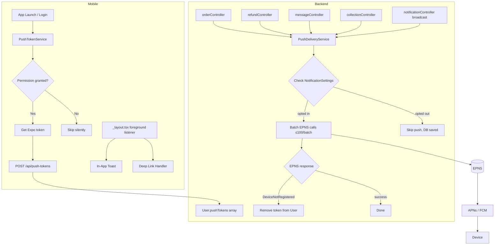

# Design Document: Push Notification System

## Overview

This design adds production-ready push notification delivery to the existing Expo + Node.js/MongoDB e-commerce app. The app already has an in-app notification system (MongoDB-backed, polled by the mobile client). This feature layers EPNS (Expo Push Notification Service) on top of that foundation, adding real-time push delivery to user devices without replacing the existing in-app notification flow.

The key architectural principle is **decoupling**: push delivery is a fire-and-forget side effect that runs after the in-app notification is saved. A push failure never blocks the primary operation (order update, refund status change, etc.).

### Tech Stack

- Mobile: React Native / Expo (`expo-notifications`)
- Backend: Node.js + Express + MongoDB (Mongoose)
- Push delivery: Expo Push Notification Service (EPNS) via `expo-server-sdk` npm package

---

## Architecture



### Flow Summary

1. On app launch/login, `PushTokenService` requests OS permission, obtains an Expo token, and registers it with the backend.
2. When a trigger event fires (order update, refund, message, collection, broadcast), the relevant controller calls `PushDeliveryService.send(...)` after saving the in-app notification.
3. `PushDeliveryService` fetches the target users' push tokens, filters by notification settings, batches into groups of ≤100, and calls EPNS.
4. EPNS errors are handled: `DeviceNotRegistered` tokens are removed; other errors are logged.
5. On the mobile side, `_layout.tsx` holds the foreground notification listener (shows in-app toast) and the background/killed-state response handler (deep links).

---

## Components and Interfaces

### Backend: `PushDeliveryService`

New file: `backend/src/services/PushDeliveryService.ts`

```typescript
interface PushPayload {
  userIds: string[];
  title: string;
  body: string;
  data?: Record<string, any>;
  settingKey?: 'orderUpdates' | 'promotions'; // which setting to check; undefined = only check pushNotifications
}

class PushDeliveryService {
  send(payload: PushPayload): Promise<void>
  private fetchTokens(userIds: string[]): Promise<TokenWithUser[]>
  private filterBySettings(tokens: TokenWithUser[], settingKey?: string): TokenWithUser[]
  private sendBatch(messages: ExpoPushMessage[]): Promise<void>
  private handleTickets(tickets: ExpoPushTicket[], messages: ExpoPushMessage[]): Promise<void>
  private removeInvalidToken(token: string): Promise<void>
}
```

### Backend: Push Token Endpoints

New routes added to the existing notifications/users router:

| Method | Path | Auth | Description |
|--------|------|------|-------------|
| POST | `/api/push-tokens` | required | Register a push token for the current user |
| DELETE | `/api/push-tokens` | required | Remove the push token for the current device |
| POST | `/api/notifications/broadcast` | admin | Send a broadcast push + in-app notification |

### Backend: `notificationController` additions

- `broadcastNotification(req, res)` — admin-only broadcast endpoint
- `registerPushToken(req, res)` — upsert token into `user.pushTokens`
- `removePushToken(req, res)` — remove token from `user.pushTokens`

### Mobile: `PushTokenService`

Extends existing `mobile/services/NotificationService.ts` or lives in a new `mobile/services/PushTokenService.ts`:

```typescript
class PushTokenService {
  register(): Promise<void>       // request permission → get token → POST to backend
  unregister(): Promise<void>     // DELETE token from backend on logout
  private getDeviceId(): string   // stable device identifier via expo-device
}
```

### Mobile: `useNotifications` hook additions

No structural changes needed — the hook already handles in-app notification polling. The foreground push listener and deep link handler live in `_layout.tsx` to ensure they are always mounted.

### Mobile: `_layout.tsx` additions

- `Notifications.setNotificationHandler` — suppress OS banner in foreground, show in-app toast instead
- `addNotificationReceivedListener` — triggers in-app toast
- `addNotificationResponseReceivedListener` — handles background/killed tap → deep link
- `InAppToast` component rendered at root level (overlay)

### Mobile: `InAppToast` component

New file: `mobile/components/InAppToast.tsx`

```typescript
interface ToastProps {
  title: string;
  body: string;
  data?: Record<string, any>;
  onDismiss: () => void;
}
// Auto-dismisses after 4s, tappable for deep link, manual dismiss supported
```

---

## Data Models

### User model — `pushTokens` array addition

The existing `User` model gains a `pushTokens` field. No other model changes are needed.

```typescript
// New subdocument interface
export interface IPushTokenRecord {
  token: string;       // Expo push token string
  deviceId: string;    // stable device identifier
  platform: 'ios' | 'android';
  createdAt: Date;
}

// Added to IUser interface
pushTokens: IPushTokenRecord[];
```

Mongoose schema addition:

```typescript
const PushTokenRecordSchema = new Schema<IPushTokenRecord>({
  token:      { type: String, required: true },
  deviceId:   { type: String, required: true },
  platform:   { type: String, enum: ['ios', 'android'], required: true },
  createdAt:  { type: Date, default: Date.now },
}, { _id: false });

// In UserSchema:
pushTokens: {
  type: [PushTokenRecordSchema],
  default: [],
  validate: {
    validator: (arr: IPushTokenRecord[]) => arr.length <= 10,
    message: 'A user may not have more than 10 push tokens',
  },
},
```

Index: `UserSchema.index({ 'pushTokens.token': 1 })` for fast token lookup during cleanup.

### Notification model — type enum extension

The existing `type` enum needs two new values to support admin alert push notifications:

```typescript
type: 'refund_request' | 'order_update' | 'system' | 'general' | 'promotion'
    | 'price_drop' | 'new_product'
    | 'new_order'          // ← new: admin alert for new order placed
    | 'new_refund_request' // ← new: admin alert for new refund submitted
```

### Push message data payload shapes

These are the `data` objects attached to each push notification type, used for deep linking:

```typescript
// Order update
{ screen: 'order-detail', orderId: string }

// Refund status
{ screen: 'my-refunds', refundId: string }

// Message activity
{ screen: 'message-thread', threadId: string }

// New collection
{ screen: 'collection', collectionId: string }

// Admin — new order
{ screen: 'admin-order', orderId: string }

// Admin — new refund request
{ screen: 'admin-refund', refundId: string }

// Broadcast / fallback
{ screen: 'notifications' }
```

---

## Correctness Properties

*A property is a characteristic or behavior that should hold true across all valid executions of a system — essentially, a formal statement about what the system should do. Properties serve as the bridge between human-readable specifications and machine-verifiable correctness guarantees.*


### Property 1: Token registration upsert

*For any* authenticated user and any new push token (token not already in the user's pushTokens array), calling the registration endpoint should result in the token appearing exactly once in the user's pushTokens array.

**Validates: Requirements 1.4**

### Property 2: Token removal

*For any* user with a non-empty pushTokens array, calling the removal endpoint with a specific token should result in that token no longer appearing in the user's pushTokens array.

**Validates: Requirements 1.6**

### Property 3: Push token record shape

*For any* push token registered for a user, the stored record should contain all four required fields: `token` (non-empty string), `deviceId` (non-empty string), `platform` (one of `ios` or `android`), and `createdAt` (a valid Date).

**Validates: Requirements 2.1, 2.3**

### Property 4: Token uniqueness per user

*For any* user, registering the same token value more than once should result in only one record for that token in the user's pushTokens array.

**Validates: Requirements 2.2**

### Property 5: Token array max-10 invariant

*For any* user, regardless of how many token registration calls are made, the length of the user's pushTokens array should never exceed 10.

**Validates: Requirements 2.4**

### Property 6: Oldest token evicted at cap

*For any* user whose pushTokens array already contains 10 records, registering an 11th token should result in the array still having exactly 10 records, with the previously oldest record (lowest `createdAt`) no longer present.

**Validates: Requirements 2.5**

### Property 7: EPNS message construction

*For any* set of user IDs, title, body, and data payload passed to `PushDeliveryService.send`, every EPNS message constructed should include the `to` field (a valid Expo push token), the `title`, the `body`, and the `data` payload unchanged.

**Validates: Requirements 3.1**

### Property 8: DeviceNotRegistered cleanup — full batch

*For any* batch of push messages where one or more tokens receive a `DeviceNotRegistered` error from EPNS, all tokens that received that error should be removed from the Token_Registry, not just the first one encountered.

**Validates: Requirements 3.2, 13.1, 13.2**

### Property 9: Batching ≤100 per EPNS call

*For any* list of N push tokens passed to `PushDeliveryService`, the service should make exactly `ceil(N / 100)` calls to the EPNS API, each with at most 100 messages.

**Validates: Requirements 3.4**

### Property 10: Push failure does not block in-app notification

*For any* trigger event (order update, refund, message, etc.), even when the EPNS call throws an error, the corresponding in-app notification record should still be saved to the database.

**Validates: Requirements 3.6, 4.5**

### Property 11: pushNotifications=false skips push

*For any* user whose `notificationSettings.pushNotifications` is `false`, calling `PushDeliveryService.send` with that user's ID should result in zero EPNS messages being sent to that user's tokens.

**Validates: Requirements 4.2**

### Property 12: orderUpdates=false skips order push

*For any* user whose `notificationSettings.orderUpdates` is `false`, triggering an order status push for that user should result in zero EPNS messages being sent to that user's tokens.

**Validates: Requirements 4.3**

### Property 13: promotions=false skips promotion and collection push

*For any* user whose `notificationSettings.promotions` is `false`, triggering a collection broadcast or admin broadcast push for that user should result in zero EPNS messages being sent to that user's tokens.

**Validates: Requirements 4.4, 9.1**

### Property 14: Order status transitions trigger push

*For any* order whose status is updated to one of `confirmed`, `processing`, `shipped`, `delivered`, or `cancelled`, `PushDeliveryService.send` should be called with the order's customer ID.

**Validates: Requirements 5.1**

### Property 15: Order push body contains order number and status

*For any* order update push notification, the notification body should contain the order number and a human-readable description of the new status.

**Validates: Requirements 5.2**

### Property 16: Notification data payload shape

*For any* push notification sent by the system, the `data` payload should contain a `screen` field with a recognized route value, plus the relevant entity ID (`orderId`, `refundId`, `threadId`, or `collectionId`) appropriate to the notification type.

**Validates: Requirements 5.3, 6.3, 7.3, 8.5, 9.3**

### Property 17: Refund status transitions trigger push

*For any* refund whose status is updated to `approved` or `rejected`, `PushDeliveryService.send` should be called with the refund's customer ID.

**Validates: Requirements 6.1**

### Property 18: Refund push body contains outcome and amount

*For any* refund status push notification, the notification body should state whether the refund was approved or rejected and include the refund amount.

**Validates: Requirements 6.2**

### Property 19: Message push sent to recipient, not sender

*For any* new message sent in a thread, `PushDeliveryService.send` should be called with the thread recipient's ID, and should not be called with the sender's ID when sender and recipient are the same user.

**Validates: Requirements 7.1, 7.5**

### Property 20: Message push body is fixed summary string

*For any* message activity push notification, the notification body should be exactly `"You have new messages"` and should not contain any message content.

**Validates: Requirements 7.2**

### Property 21: Admin alerts sent to all admin users

*For any* new order placed or new refund request submitted, `PushDeliveryService.send` should be called with the IDs of all users whose role is `admin` or `super_admin`.

**Validates: Requirements 8.1, 8.2**

### Property 22: Admin order push body contains order number and amount

*For any* admin new-order push notification, the notification body should contain the order number and the total order amount.

**Validates: Requirements 8.3**

### Property 23: Admin refund push body contains customer name and amount

*For any* admin new-refund-request push notification, the notification body should contain the customer's name and the refund amount.

**Validates: Requirements 8.4**

### Property 24: Collection push sent only to users with promotions enabled

*For any* new collection published, `PushDeliveryService.send` should only dispatch EPNS messages to users whose `notificationSettings.promotions` is `true`.

**Validates: Requirements 9.1**

### Property 25: Collection push body contains collection name

*For any* new collection push notification, the notification title should contain the collection name.

**Validates: Requirements 9.2**

### Property 26: Broadcast respects promotions setting

*For any* admin broadcast, the set of users who receive the push should be exactly the intersection of the segment filter and users with `notificationSettings.promotions` set to `true`.

**Validates: Requirements 10.2**

### Property 27: Broadcast endpoint is admin-only

*For any* request to the broadcast endpoint made by a user whose role is not `admin` or `super_admin`, the endpoint should return HTTP 403.

**Validates: Requirements 10.3**

### Property 28: Broadcast saves in-app notification for each targeted user

*For any* admin broadcast, every user in the targeted segment should have a new in-app notification of type `promotion` saved to the database, regardless of their push settings.

**Validates: Requirements 10.4**

### Property 29: Broadcast response includes targeted counts

*For any* admin broadcast, the response body should include `usersTargeted` (count of users in segment) and `tokensDispatched` (count of EPNS messages sent).

**Validates: Requirements 10.5**

### Property 30: Toast renders correct title and body

*For any* push notification received in the foreground, the `InAppToast` component should render the notification's title and body text.

**Validates: Requirements 11.1**

### Property 31: Toast auto-dismisses after 4 seconds

*For any* rendered `InAppToast`, after 4000 ms the component should no longer be visible (dismissed state).

**Validates: Requirements 11.2**

### Property 32: Toast supports manual dismissal

*For any* rendered `InAppToast`, calling the dismiss action before the 4-second timeout should immediately remove the toast from view.

**Validates: Requirements 11.3**

### Property 33: Toast tap triggers correct deep link

*For any* `InAppToast` with a `data` payload containing a `screen` field, tapping the toast should invoke the navigation function with the route derived from that `screen` value and the associated entity ID.

**Validates: Requirements 11.4**

### Property 34: Deep link routing covers all supported routes and falls back gracefully

*For any* notification data payload, the deep link handler should navigate to `order-detail/:orderId`, `my-refunds`, `message-thread/:threadId`, `collection/:collectionId`, or `notifications` based on the `screen` field; and for any unrecognized or missing `screen` value, it should navigate to `notifications`.

**Validates: Requirements 12.3, 12.4**

---

## Error Handling

### Backend

| Error scenario | Handling |
|---|---|
| EPNS `DeviceNotRegistered` | Remove token from `user.pushTokens`; log user ID + token |
| EPNS `MessageTooBig` | Log error with token and notification details; skip that message |
| EPNS `MessageRateExceeded` | Log error; do not retry automatically (caller can retry) |
| EPNS network/timeout error | Log error; push delivery fails silently — in-app notification already saved |
| Token registration with invalid body | Return HTTP 400 with validation message |
| Broadcast by non-admin | Return HTTP 403 |
| User has no push tokens | Skip silently; no error returned |

### Mobile

| Error scenario | Handling |
|---|---|
| OS permission denied | `PushTokenService.register()` resolves without error; no token registered |
| Running in Expo Go | Skip registration; log warning to console |
| Backend token registration fails | Log warning; app continues normally |
| Backend token removal fails on logout | Log warning; logout proceeds regardless |
| Deep link with unknown screen | Navigate to `notifications` screen as fallback |
| Toast rendered with missing data | Render with empty body; still dismissible |

---

## Testing Strategy

### Dual Testing Approach

Both unit tests and property-based tests are required. They are complementary:
- Unit tests cover specific examples, integration points, and error conditions.
- Property-based tests verify universal invariants across randomized inputs.

### Property-Based Testing

**Library**: [`fast-check`](https://github.com/dubzzz/fast-check) for both backend (Jest + fast-check) and mobile (Jest + fast-check).

Each property-based test must run a minimum of **100 iterations**.

Each test must include a comment tag in the format:
```
// Feature: push-notification-system, Property N: <property_text>
```

Each correctness property listed above maps to exactly one property-based test.

**Example generators needed**:
- `fc.record({ token: fc.string(), deviceId: fc.string(), platform: fc.constantFrom('ios', 'android') })` — push token record
- `fc.array(pushTokenRecordArb, { minLength: 1, maxLength: 15 })` — token arrays including over-cap scenarios
- `fc.record({ pushNotifications: fc.boolean(), orderUpdates: fc.boolean(), promotions: fc.boolean(), ... })` — notification settings
- `fc.array(fc.string(), { minLength: 1, maxLength: 300 })` — lists of user IDs for batching tests

### Unit Tests

Focus on:
- `PushTokenService.register()` calls the correct API endpoint with the correct payload (Req 1.3)
- `PushTokenService.unregister()` is called on logout (Req 1.5)
- `PushDeliveryService` logs `MessageTooBig`/`MessageRateExceeded` errors (Req 3.3)
- Foreground notification handler returns `shouldShowAlert: false` (Req 11.5)
- `broadcastNotification` endpoint accepts all required parameters (Req 10.1)
- Token removal is logged with user ID and token value (Req 13.3)

### Integration Tests

- Full order status update flow: status change → in-app notification saved → EPNS called with correct payload
- Full broadcast flow: admin POST → in-app notifications created for all targeted users → EPNS called
- Token cap enforcement: insert 11 tokens → verify array length is 10 and oldest is gone
