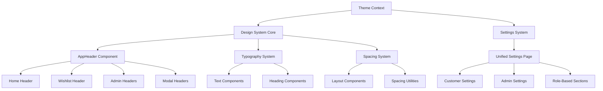
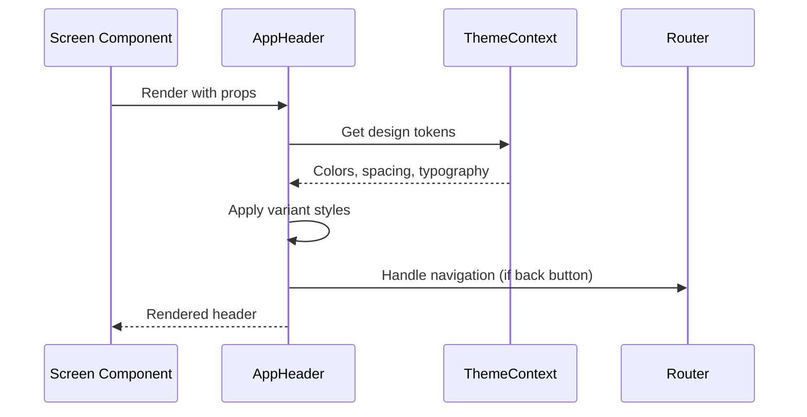
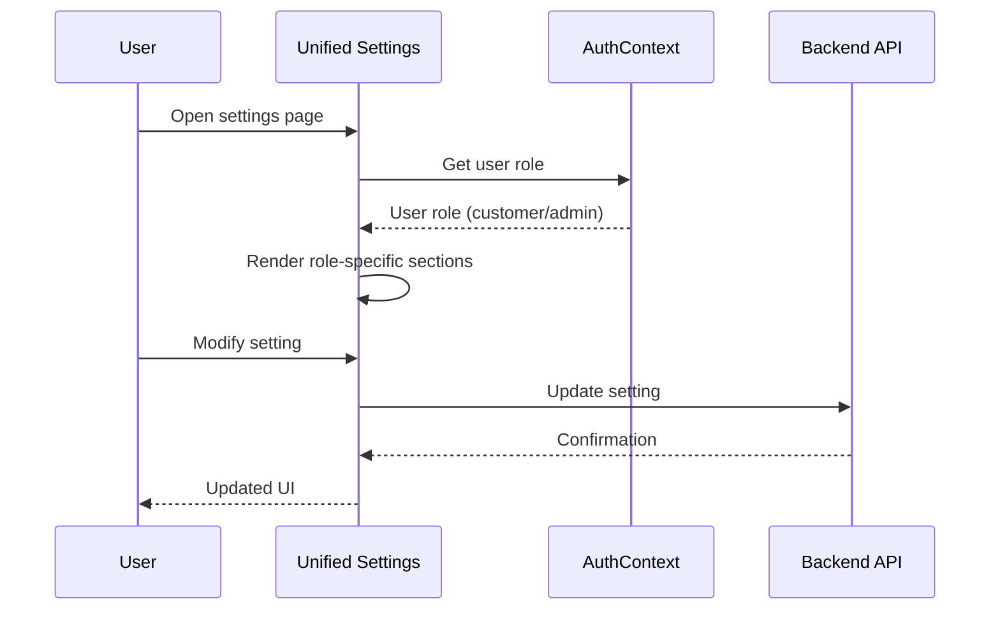

# Design Document: UI Consistency and Settings Consolidation

## Overview

This feature addresses critical UI consistency issues in the AfroChinaTrade mobile app by creating a unified header component system, standardizing spacing and typography, and consolidating duplicate settings pages. The design focuses on eliminating code duplication, establishing a cohesive design system, and improving maintainability while preserving existing functionality.

## Architecture



## Sequence Diagrams

### Header Component Usage Flow



### Settings Consolidation Flow



## Components and Interfaces

### Enhanced AppHeader Component

**Purpose**: Unified header component to replace all inconsistent headers throughout the app

**Interface**:
```typescript
interface AppHeaderProps {
  // Content
  title: string;
  subtitle?: string;
  
  // Navigation
  showBackButton?: boolean;
  onBackPress?: () => void;
  
  // Actions
  rightAction?: React.ReactNode;
  leftAction?: React.ReactNode;
  
  // Styling
  variant?: 'default' | 'large' | 'minimal' | 'centered' | 'logo';
  backgroundColor?: string;
  textColor?: string;
  
  // Layout
  safeArea?: boolean;
  borderBottom?: boolean;
  
  // Custom styles
  style?: ViewStyle;
  titleStyle?: TextStyle;
  subtitleStyle?: TextStyle;
}
```

**Responsibilities**:
- Provide consistent header layout across all screens
- Handle navigation (back button functionality)
- Support multiple visual variants for different use cases
- Integrate with theme system for consistent styling
- Support custom actions and content

### Enhanced Design System

**Purpose**: Centralized design tokens and utilities for consistent spacing and typography

**Interface**:
```typescript
interface DesignSystem {
  // Enhanced spacing scale
  spacing: {
    0: 0, 1: 4, 2: 8, 3: 12, 4: 16, 5: 20, 6: 24, 8: 32, 
    10: 40, 12: 48, 16: 64, 20: 80, 24: 96;
    // Semantic spacing
    tight: 4, snug: 8, normal: 16, relaxed: 24, loose: 32;
    // Component spacing
    cardPadding: 16, screenPadding: 16, sectionSpacing: 24;
  };
  
  // Typography hierarchy
  typography: {
    h1: TypographyStyle, h2: TypographyStyle, h3: TypographyStyle,
    h4: TypographyStyle, h5: TypographyStyle, h6: TypographyStyle,
    body1: TypographyStyle, body2: TypographyStyle,
    subtitle1: TypographyStyle, subtitle2: TypographyStyle,
    caption: TypographyStyle, button: TypographyStyle;
  };
  
  // Utility functions
  getSpacing: (multiplier: number) => number;
  getTypography: (variant: keyof TypographyVariants) => TypographyStyle;
}
```

**Responsibilities**:
- Provide consistent spacing values across all components
- Define typography hierarchy with proper line heights and letter spacing
- Offer utility functions for dynamic spacing calculations
- Support both numeric and semantic spacing names
- Maintain backward compatibility with existing code

### Unified Settings Component

**Purpose**: Single settings page that adapts based on user role, eliminating duplicate code

**Interface**:
```typescript
interface UnifiedSettingsProps {
  userRole: 'customer' | 'admin' | 'super_admin';
}

interface SettingsSection {
  id: string;
  title: string;
  icon: string;
  items: SettingsItem[];
  roles: UserRole[];
  order: number;
}

interface SettingsItem {
  id: string;
  title: string;
  subtitle?: string;
  type: 'navigation' | 'toggle' | 'picker' | 'action';
  value?: any;
  onPress?: () => void;
  onChange?: (value: any) => void;
  roles: UserRole[];
}
```

**Responsibilities**:
- Display role-appropriate settings sections
- Handle navigation to detailed settings pages
- Manage toggle and picker interactions
- Maintain consistent UI across different user roles
- Provide extensible architecture for adding new settings

## Data Models

### Header Configuration Model

```typescript
interface HeaderConfig {
  variant: 'default' | 'large' | 'minimal' | 'centered' | 'logo';
  title: string;
  subtitle?: string;
  showBackButton: boolean;
  rightActions: HeaderAction[];
  leftActions: HeaderAction[];
  styling: {
    backgroundColor?: string;
    textColor?: string;
    borderBottom: boolean;
  };
}

interface HeaderAction {
  id: string;
  type: 'icon' | 'text' | 'badge' | 'custom';
  content: string | React.ReactNode;
  onPress: () => void;
  badge?: {
    count: number;
    color: string;
  };
}
```

**Validation Rules**:
- Title must be non-empty string
- Variant must be one of predefined options
- Actions must have valid onPress handlers
- Badge count must be non-negative integer

### Settings Configuration Model

```typescript
interface SettingsConfig {
  sections: SettingsSection[];
  userRole: UserRole;
  preferences: UserPreferences;
}

interface UserPreferences {
  theme: 'light' | 'dark' | 'system';
  language: string;
  notifications: NotificationSettings;
  privacy: PrivacySettings;
}

interface NotificationSettings {
  push: boolean;
  email: boolean;
  sms: boolean;
  marketing: boolean;
}
```

**Validation Rules**:
- User role must be valid enum value
- Notification settings must be boolean values
- Language must be supported locale code
- Theme must be valid theme option

## Algorithmic Pseudocode

### Header Rendering Algorithm

```pascal
ALGORITHM renderAppHeader(props)
INPUT: props of type AppHeaderProps
OUTPUT: rendered header component

BEGIN
  // Step 1: Get theme tokens
  theme ← getThemeContext()
  
  // Step 2: Determine variant styles
  variantStyles ← getVariantStyles(props.variant)
  
  // Step 3: Compose container styles
  containerStyle ← combineStyles([
    baseContainerStyle,
    variantStyles.container,
    { backgroundColor: props.backgroundColor || theme.colors.background },
    props.style
  ])
  
  // Step 4: Compose text styles
  titleStyle ← combineStyles([
    variantStyles.title,
    { color: props.textColor || theme.colors.text },
    props.titleStyle
  ])
  
  // Step 5: Handle navigation
  handleBackPress ← FUNCTION()
    IF props.onBackPress EXISTS THEN
      props.onBackPress()
    ELSE
      router.back()
    END IF
  END FUNCTION
  
  // Step 6: Render header structure
  RETURN renderHeaderLayout(containerStyle, titleStyle, handleBackPress, props)
END
```

**Preconditions**:
- props.title is non-empty string
- theme context is available and properly initialized
- router is available for navigation

**Postconditions**:
- Returns valid React component
- All styles are properly applied
- Navigation handlers are correctly bound

**Loop Invariants**: N/A (no loops in this algorithm)

### Settings Section Filtering Algorithm

```pascal
ALGORITHM filterSettingsByRole(sections, userRole)
INPUT: sections array of SettingsSection, userRole of type UserRole
OUTPUT: filtered sections array

BEGIN
  filteredSections ← empty array
  
  FOR each section IN sections DO
    ASSERT section.roles is valid array
    
    IF userRole IN section.roles THEN
      filteredItems ← empty array
      
      FOR each item IN section.items DO
        ASSERT item.roles is valid array
        
        IF userRole IN item.roles THEN
          filteredItems.add(item)
        END IF
      END FOR
      
      IF filteredItems.length > 0 THEN
        newSection ← copy(section)
        newSection.items ← filteredItems
        filteredSections.add(newSection)
      END IF
    END IF
  END FOR
  
  // Sort sections by order
  filteredSections.sort(BY section.order)
  
  RETURN filteredSections
END
```

**Preconditions**:
- sections is valid array of SettingsSection objects
- userRole is valid UserRole enum value
- All section and item role arrays are properly initialized

**Postconditions**:
- Returns array containing only sections/items accessible to user role
- Sections are sorted by order property
- Original sections array is not modified

**Loop Invariants**:
- All processed sections contain only items accessible to current user role
- Filtered sections maintain original order relationships

### Design Token Application Algorithm

```pascal
ALGORITHM applyDesignTokens(component, tokens)
INPUT: component object, tokens from design system
OUTPUT: component with applied styling

BEGIN
  // Step 1: Apply spacing tokens
  FOR each spacingProperty IN component.spacingProperties DO
    IF spacingProperty.value IS semantic_name THEN
      component.styles[spacingProperty.key] ← tokens.spacing[spacingProperty.value]
    ELSE IF spacingProperty.value IS multiplier THEN
      component.styles[spacingProperty.key] ← tokens.getSpacing(spacingProperty.value)
    END IF
  END FOR
  
  // Step 2: Apply typography tokens
  FOR each typographyProperty IN component.typographyProperties DO
    typographyStyle ← tokens.getTypography(typographyProperty.variant)
    component.styles[typographyProperty.key] ← typographyStyle
  END FOR
  
  // Step 3: Apply color tokens
  FOR each colorProperty IN component.colorProperties DO
    component.styles[colorProperty.key] ← tokens.colors[colorProperty.value]
  END FOR
  
  RETURN component
END
```

**Preconditions**:
- component has valid styling properties
- tokens object contains all required design system values
- All property references are valid

**Postconditions**:
- Component styles are updated with design system values
- All spacing, typography, and color properties are consistently applied
- Component maintains its original structure

**Loop Invariants**:
- All processed properties have valid design system values applied
- Component structure remains intact throughout processing

## Key Functions with Formal Specifications

### Function 1: createHeaderVariant()

```typescript
function createHeaderVariant(
  variant: HeaderVariant, 
  theme: ThemeContextType
): HeaderStyles
```

**Preconditions:**
- `variant` is valid HeaderVariant enum value
- `theme` is properly initialized ThemeContextType object
- `theme.typography` and `theme.spacing` are available

**Postconditions:**
- Returns valid HeaderStyles object with all required style properties
- All returned styles use theme-consistent values
- Styles are optimized for the specified variant

**Loop Invariants:** N/A (no loops in function)

### Function 2: consolidateSettings()

```typescript
function consolidateSettings(
  customerSettings: SettingsSection[], 
  adminSettings: SettingsSection[]
): SettingsSection[]
```

**Preconditions:**
- `customerSettings` and `adminSettings` are valid arrays
- All sections have unique IDs within their respective arrays
- All sections have valid role assignments

**Postconditions:**
- Returns merged array with no duplicate sections
- All role-specific sections are properly tagged
- Sections maintain their original functionality

**Loop Invariants:**
- All processed sections maintain their role restrictions
- No duplicate section IDs exist in the result

### Function 3: applyConsistentSpacing()

```typescript
function applyConsistentSpacing(
  styles: StyleSheet, 
  spacingSystem: SpacingSystem
): StyleSheet
```

**Preconditions:**
- `styles` is valid StyleSheet object
- `spacingSystem` contains all required spacing values
- All spacing references in styles are valid

**Postconditions:**
- Returns StyleSheet with standardized spacing values
- All spacing properties use design system values
- Original style structure is preserved

**Loop Invariants:**
- All processed spacing properties conform to design system
- Style object structure remains valid throughout processing

## Example Usage

```typescript
// Example 1: Using enhanced AppHeader
const HomeScreen = () => {
  const { cartCount } = useCart();
  
  return (
    <View>
      <AppHeader
        variant="logo"
        title="AfroChinaTrade"
        subtitle="Connecting Africa and China through Trade"
        rightAction={
          <CartButton count={cartCount} onPress={() => router.push('/cart')} />
        }
      />
      {/* Screen content */}
    </View>
  );
};

// Example 2: Using unified settings
const SettingsScreen = () => {
  const { user } = useAuth();
  
  return (
    <UnifiedSettings
      userRole={user.role}
      onNavigate={(route) => router.push(route)}
      onToggle={(setting, value) => updateSetting(setting, value)}
    />
  );
};

// Example 3: Using design system utilities
const CustomComponent = () => {
  const { getSpacing, getTypography, colors } = useTheme();
  
  const styles = StyleSheet.create({
    container: {
      padding: getSpacing(2), // 16px
      marginBottom: getSpacing(3), // 24px
      backgroundColor: colors.surface,
    },
    title: {
      ...getTypography('h3'),
      color: colors.text,
    },
    subtitle: {
      ...getTypography('body2'),
      color: colors.textSecondary,
      marginTop: getSpacing(0.5), // 8px
    },
  });
  
  return (
    <View style={styles.container}>
      <Text style={styles.title}>Title</Text>
      <Text style={styles.subtitle}>Subtitle</Text>
    </View>
  );
};
```

## Correctness Properties

### Universal Quantification Statements

**Property 1: Header Consistency**
```
∀ screen ∈ AppScreens, ∀ header ∈ screen.headers:
  header.spacing ∈ DesignSystem.spacing ∧
  header.typography ∈ DesignSystem.typography ∧
  header.colors ∈ ThemeContext.colors
```

**Property 2: Settings Role Compliance**
```
∀ user ∈ Users, ∀ setting ∈ VisibleSettings(user):
  user.role ∈ setting.allowedRoles ∧
  setting.isAccessible(user.role) = true
```

**Property 3: Design Token Consistency**
```
∀ component ∈ UIComponents, ∀ style ∈ component.styles:
  style.spacing → DesignSystem.spacing ∧
  style.typography → DesignSystem.typography ∧
  style.colors → ThemeContext.colors
```

**Property 4: Navigation Consistency**
```
∀ header ∈ AppHeaders:
  header.hasBackButton = true → header.onBackPress ≠ null ∧
  header.navigation.isValid() = true
```

## Error Handling

### Error Scenario 1: Invalid Header Configuration

**Condition**: Header component receives invalid props or missing theme context
**Response**: Fallback to default header configuration with error logging
**Recovery**: Display basic header with title only, log error for debugging

### Error Scenario 2: Settings Permission Violation

**Condition**: User attempts to access settings not allowed for their role
**Response**: Filter out unauthorized settings, show appropriate message
**Recovery**: Display only authorized settings, log security event

### Error Scenario 3: Design Token Missing

**Condition**: Component requests design token that doesn't exist
**Response**: Fallback to hardcoded safe values, log missing token
**Recovery**: Use fallback values, continue rendering, report to monitoring

### Error Scenario 4: Theme Context Unavailable

**Condition**: Component tries to access theme context outside provider
**Response**: Throw descriptive error with setup instructions
**Recovery**: Provide clear error message for developer debugging

## Testing Strategy

### Unit Testing Approach

**Header Component Testing**:
- Test all header variants render correctly
- Verify navigation handlers work properly
- Test theme integration and style application
- Validate accessibility properties

**Settings Component Testing**:
- Test role-based filtering logic
- Verify settings persistence and retrieval
- Test navigation and interaction handlers
- Validate data transformation functions

**Design System Testing**:
- Test spacing utility functions
- Verify typography style generation
- Test theme switching functionality
- Validate design token consistency

### Property-Based Testing Approach

**Property Test Library**: fast-check (JavaScript/TypeScript)

**Header Properties**:
- Any valid header configuration should render without errors
- Header navigation should always be accessible
- Theme changes should consistently update all header instances

**Settings Properties**:
- Role filtering should never show unauthorized settings
- Settings state should always be consistent with user permissions
- Navigation from settings should always lead to valid routes

**Design System Properties**:
- Spacing calculations should always return positive numbers
- Typography styles should always include required properties
- Color values should always be valid CSS colors

### Integration Testing Approach

**Cross-Component Integration**:
- Test header component integration across different screens
- Verify settings changes reflect throughout the app
- Test theme switching affects all components consistently

**Navigation Integration**:
- Test header navigation works with router
- Verify settings navigation leads to correct screens
- Test back button behavior across different contexts

## Performance Considerations

**Component Memoization**: Use React.memo for header and settings components to prevent unnecessary re-renders

**Theme Context Optimization**: Implement theme context with useMemo to avoid recalculating styles on every render

**Settings Caching**: Cache settings configuration to avoid repeated filtering operations

**Lazy Loading**: Implement lazy loading for settings sections that require additional data

**Bundle Size**: Ensure design system utilities are tree-shakeable to minimize bundle impact

## Security Considerations

**Role-Based Access Control**: Implement strict role checking for settings visibility and functionality

**Settings Validation**: Validate all settings changes on both client and server side

**Navigation Security**: Ensure header navigation cannot bypass authentication or authorization

**Data Sanitization**: Sanitize all user inputs in settings forms

**Audit Logging**: Log all settings changes for security monitoring

## Dependencies

**React Native**: Core framework for mobile app development
**Expo Router**: Navigation and routing system
**React Native Safe Area Context**: Safe area handling for headers
**AsyncStorage**: Settings persistence
**Ionicons**: Icon system for headers and settings
**TypeScript**: Type safety for component interfaces
**React Context**: State management for theme and settings